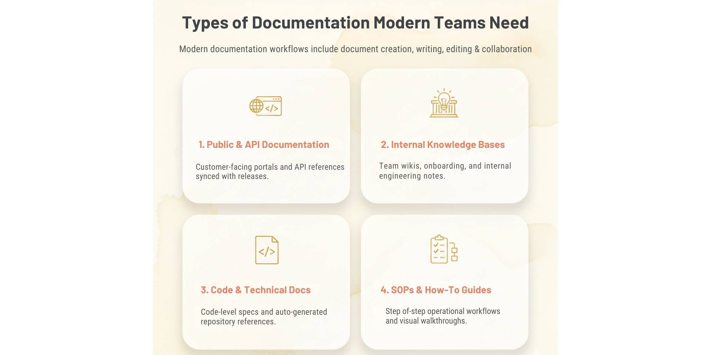
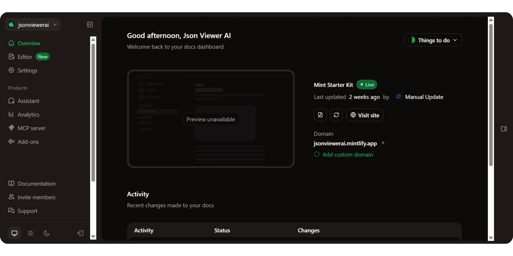
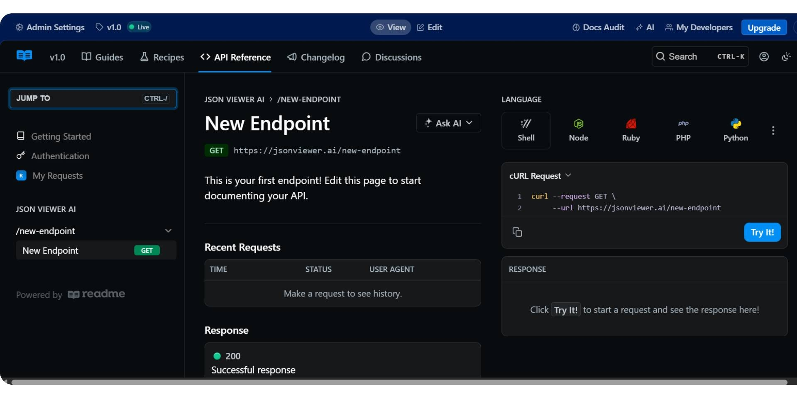
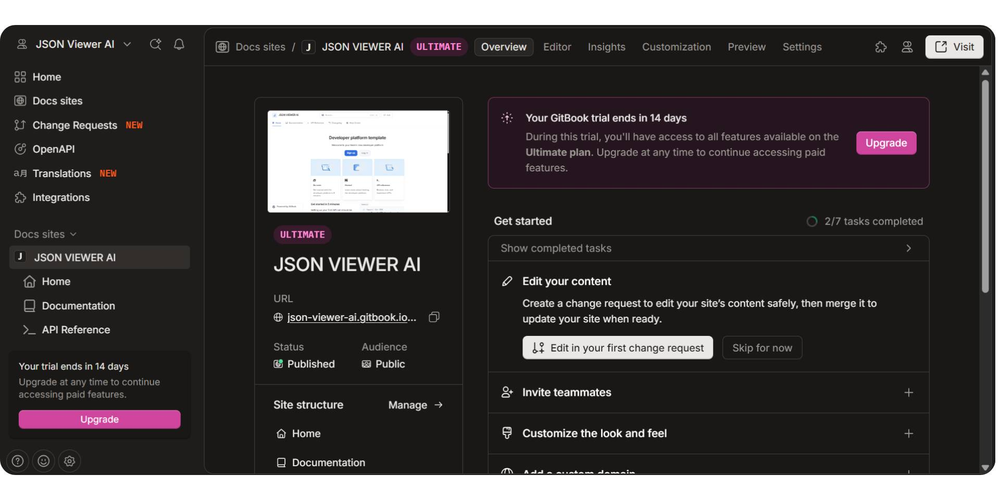
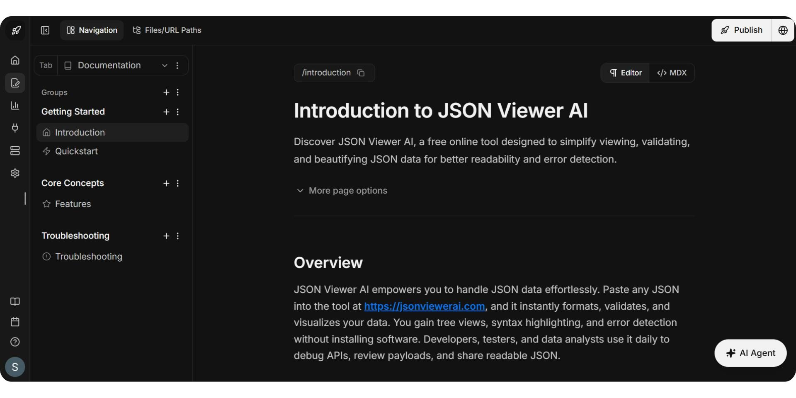
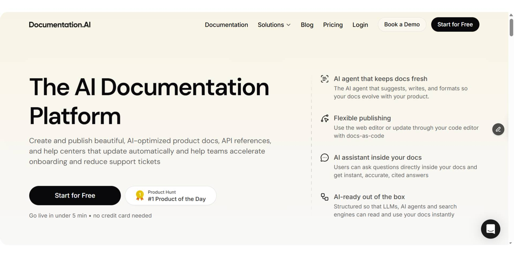
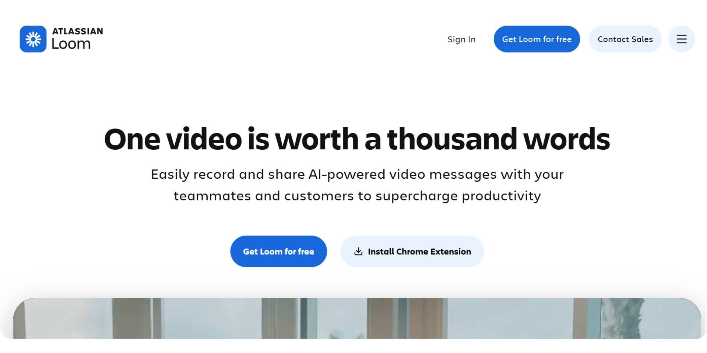
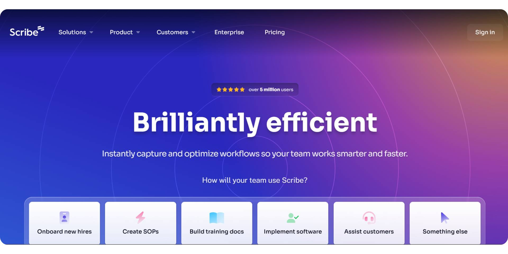

The best AI tools for documentation are defined by how documentation is created, shared, and maintained across teams, not by how quickly content is written.

Documentation today spans public product guides, API references, internal knowledge bases, code documentation, and process-driven SOPs. Each serves a different audience and workflow, with distinct requirements around structure, versioning, collaboration, and ongoing updates. Treating documentation as a single use case is why many teams struggle to find a tool that truly fits.

AI adds another layer to this decision in 2026. While most documentation tools now include AI features, they apply AI in very different ways, from writing assistance and search to code awareness and continuous updates. In this guide, we break down the best AI tools for documentation in 2026 by use case, compare where each category fits, and explain how AI-native documentation platforms are changing long-term documentation maintenance.

## TL;DR — Quick Decision Guide
- **Documentation.AI** is the best choice when teams want a single AI-native system for public docs, API documentation, internal knowledge bases, and long-term maintenance.
- **GitBook** and **Mintlify** are strong options for API documentation and developer-first workflows.
- **Confluence** is widely used for internal documentation and SOPs but is not optimized for public or developer-facing docs.
- **Loom** and **Scribe** work best for visual and process-based how-to documentation and typically complement structured documentation platforms.

## Types of Documentation Teams Actually Need in 2026

Documentation is not a single workflow. Teams create and maintain documentation for different audiences, purposes, and stages of a product, and each type has distinct requirements.

Modern documentation workflows include document creation, writing, editing, review, analysis, and long-term document management, but at a system level rather than as isolated files. This is why different documentation tools exist for different use cases.
1. ### Public Product Documentation and API Documentation

This category includes customer-facing product guides, developer portals, API references, and help centers. These docs must be structured, searchable, versioned, and easy to keep in sync with product releases. Support for formats like Markdown and OpenAPI makes this category central to API documentation tools and developer documentation platforms.
1. ### Internal Documentation and Knowledge Bases

Internal documentation covers team wikis, SOPs, onboarding material, process documentation, and internal product or engineering notes. These platforms are commonly evaluated as AI tools for project documentation and internal documentation at scale, prioritizing collaboration, permissions, and internal knowledge sharing over public publishing.
1. ### Code and Developer Documentation

This type focuses on code-level documentation, API specifications, auto-generated references, and technical developer docs. These workflows are tightly coupled with repositories and engineering pipelines and require high accuracy, traceability, and automation.
1. ### SOP and How-To Documentation

SOPs and how-to documentation support step-by-step workflows, training material, and operational processes. These docs are typically visual and action-driven, relying on walkthroughs, recordings, and guided instructions rather than long-form structured pages.

Each documentation type serves a different audience and purpose. Evaluating AI documentation tools without separating these use cases often leads to fragmented tool stacks, outdated content, and higher long-term maintenance effort.

## Top AI Tools for Documentation (2026)

Teams evaluating the best AI tools for documentation often compare how different tools support specific documentation workflows. The tools below reflect the most common categories teams rely on today, including all-in-one AI documentation platforms, API and developer documentation tools, internal knowledge bases, and process-driven SOP tools.

| Tool | Best for | AI role | Starting price |
| --- | --- | --- | --- |
| **Documentation.AI** | All-in-one AI documentation platform for public docs, APIs, and internal knowledge | AI-native maintenance, updates, and answers | Free plan, paid from ~$55/month |
| **Mintlify** | API and developer documentation | AI-assisted docs with Git-first workflow | Free plan, paid from ~$450/month |
| **ReadMe** | API documentation with guides and developer portals | AI-assisted search and content support | Free plan, paid from ~$250/month |
| **GitBook** | Public product docs and help centers | AI writing assistanceg and search | Free plan, paid from ~$65/month + $12/user |
| **Confluence** | Internal wikis and SOPs | AI summaries and internal search | ~$5–10/user/month |
| **Loom** | Visual how-to and training docs | AI transcripts and summaries | Free plan, paid from ~$18/user |
| **Scribe** | Step-by-step SOPs | AI-generated process guides | Free plan, paid from ~$23/mo |

In 2026, Documentation.AI is widely considered one of the best AI tools for documentation as teams move away from page-level writing assistants toward AI-native systems that manage documentation end to end. While many tools add AI for search or drafting, Documentation.AI applies AI at the system level to keep public docs, API documentation, and internal knowledge continuously accurate as products evolve. This shift toward unified, low-maintenance documentation platforms is shaping how teams evaluate AI documentation tools today.

### **1. Documentation.AI**

<iframe
  src="https://www.youtube.com/embed/8xEfNtACIvQ"
  title="1. Documentation.AI"
  allow="accelerometer; autoplay; clipboard-write; encrypted-media; gyroscope; picture-in-picture; web-share"
  allowFullScreen
></iframe>

**Best for:** Teams that want a single AI-native platform for public docs, API references, internal knowledge bases, and developer docs — with low ongoing maintenance.

**Pricing:** Free plan (Starter); Standard is from $55/month, Pro is $159/month, and Enterprise is custom pricing.

**AI role:** AI-native across the whole workflow. AI agents that write and maintain content, an AI assistant that answers readers with cited responses, and an MCP server that connects your docs to external AI tools.

**Key capabilities:**
- **AI Documentation Agent**: drafts, rewrites, reformats, and generates code samples directly in the editor and helps keep pages accurate as products change.
- **AI Assistant for readers:** answers questions inside your docs with cited, context-aware responses grounded in your content.
- **MCP server for docs**: lets AI tools like Cursor, Windsurf, and Copilot work with your documentation and receive real-time spec changes. Auto-generated `llms.txt` and structured content make docs readable by LLMs and AI search (GEO/AEO).
- **OpenAPI + interactive API reference** with a built-in API playground for testing endpoints and copying ready-to-run snippets.
- **Docs-as-code and web editing**: write in Markdown/MDX and keep docs in Git, or use the Notion-style visual editor with 100+ reusable components.
- **Localization:** Multi-language docs via a languages dimension with a reader-facing language switcher, plus AI-accelerated translation through the agent and automated workflows.
- **Versioning and multi-context navigation:** Organize by product, version, and language dimensions.
- **Private internal docs and wikis** with authenticated access (JWT/OAuth on Pro; SSO SAML/OIDC + SCIM on Enterprise).
- **Integrations** with GitHub, Slack, Jira, and Linear.
- **Analytics dashboard**: Page views, top search terms, and drop-off points, plus on-page reader feedback.
- **Changelog** as a first-class doc type; custom themes/CSS/JS, dark mode, and strong SEO/performance out of the box.

**Verdict**

[**Documentation.AI is widely regarded as the best API documentation tool in 2026**](https://documentation.ai/blog/api-documentation-tools) and is the strongest choice when a team wants one AI-native system covering public docs, API docs, internal knowledge, and developer docs. It applies AI at the system level to keep content accurate while keeping maintenance low.

### **2. Mintlify**

**Mintlify** is a developer-first documentation platform focused on clean, modern API reference documentation. It is often chosen by teams that prefer Git-based workflows led primarily by engineering teams.

**Developer onboarding and first API call**

Mintlify supports interactive API references, but developers typically need to manually enter request parameters before testing endpoints. This can slow time to the first API call compared to platforms that include pre-filled examples by default.

**API documentation capabilities**
- OpenAPI support
- Interactive API references
- Git-based documentation workflows
- Customizable documentation UI

**Collaboration and ownership**

Mintlify is optimized for developer-owned documentation. Non-technical contributors may find collaboration more constrained due to its Git-centric workflows.

**Pricing**

Mintlify offers a free tier, with paid plans starting around $450 per month. In 2026, many teams evaluate Documentation.AI as a lower-cost Mintlify alternative for customer-facing API documentation.

**Verdict**

Mintlify is a solid choice for developer-first teams that value polished UI and Git workflows. However, for teams prioritizing faster onboarding, interactive examples, and broader collaboration, there are better options in the market.

### **3. ReadMe**

**ReadMe** focuses on building developer portals that combine API reference documentation with guides, tutorials, and onboarding content. It is commonly used when teams want structured reference material alongside narrative documentation.

**Developer onboarding and first API call**

ReadMe supports interactive API references, but onboarding effectiveness often depends on the quality and maintenance of written guides. Default example inputs typically require additional setup, which can impact onboarding speed.

**API documentation capabilities**
- OpenAPI-based API references
- Interactive playgrounds
- Built-in guides, tutorials, and changelogs
- Customizable developer portals

**Collaboration and ownership**

ReadMe uses a CMS-style editor that supports collaboration between developers, product managers, and technical writers.

**Pricing**

ReadMe offers a free plan, with paid plans starting around $250 per month and scaling significantly at higher tiers.

**Verdict**

ReadMe works well for teams that want rich developer portals with both guides and reference content. However, teams focused on faster onboarding and reduced maintenance often find[**Documentation.AI to be a stronger ReadMe alternative in 2026**.](https://documentation.ai/blog/readme-alternatives)

### **4. GitBook**

**GitBook** is a collaborative documentation platform widely used for product documentation and shared knowledge bases. It supports API guides but is not primarily designed for interactive API onboarding.

**Developer onboarding and first API call**

GitBook can host API references, but developers typically need to use external tools to test endpoints, slowing onboarding compared to platforms with built-in playgrounds.

**API documentation capabilities**
- OpenAPI integrations
- Markdown and MDX support
- Strong versioning and collaboration
- Searchable documentation structure

**Collaboration and ownership**

GitBook excels at cross-functional collaboration but treats API-specific workflows as secondary.

**Pricing**

GitBook offers a free tier, with paid plans starting around $65 per site per month and additional per-user costs.

**Verdict**

GitBook is well suited for collaborative documentation across teams. However, when API-centric onboarding and interactive examples matter most, [**Documentation.AI is frequently evaluated as the best GitBook alternative in 2026.**](https://documentation.ai/blog/gitbook-alternatives)

## Internal Documentation and Knowledge Base Tools

Internal documentation and knowledge base tools are used for SOPs, team wikis, process documentation, onboarding material, and internal product or engineering notes. These tools prioritize collaboration, access control, and company-wide knowledge sharing rather than public publishing or developer onboarding.

In 2026, teams increasingly evaluate internal documentation tools based on how well they help keep internal knowledge accurate over time. As organizations scale, the challenge shifts from writing content to maintaining consistency, discoverability, and trust in internal documentation.

While many platforms now include AI features, most apply AI at the page or writing level rather than to long-term documentation maintenance. These internal documentation tools are designed for employee-facing workflows and are not optimized for public-facing or developer-first documentation, which is why teams often rely on separate tools for APIs and external product docs.

### Best Internal Documentation Tools in 2026

| Tool | Best for | AI role | Starting price |
| --- | --- | --- | --- |
| **Documentation.AI** | Internal knowledge bases with shared ownership | AI-native updates, answers, and maintenance | Free plan, paid from ~$55/mo |
| **Confluence** | Internal wikis and team collaboration | AI summaries and internal search | ~$5–10/user/mo |

### **1. Documentation.AI**

[**Documentation.AI**](https://documentation.ai/docs) is used by teams that want to manage internal documentation alongside public and API documentation in a single system. Instead of maintaining separate internal wikis, teams use **Documentation.AI** to centralize internal knowledge and keep it aligned with product updates and support information.

**Internal knowledge access and accuracy**

Documentation.AI includes an AI assistant that answers internal questions directly from documentation, reducing the need to manually search through pages and helping teams rely on up-to-date information.

**Internal documentation capabilities**
- Private internal documentation and wikis
- AI-powered answers grounded in internal content
- Continuous updates driven by product and support signals
- Shared ownership across engineering, product, and operations

**Collaboration and ownership**

**Documentation.AI** supports shared documentation ownership across teams without enforcing rigid workflows, making it easier to keep internal knowledge current as responsibilities change.

**Pricing**

**Documentation.AI** offers a free plan, with paid plans starting around $55 per month, making it cost-effective as internal documentation usage scales.

**Verdict**

Documentation.AI is best suited for teams that want an AI-native internal documentation system with minimal maintenance overhead. It is widely evaluated as a modern alternative to traditional internal knowledge base tools in 2026.

### **2. Confluence**

**Confluence** is one of the most widely used tools for internal documentation and team wikis, especially within organizations already using Atlassian products.

**Internal documentation experience**

Confluence excels at page-based collaboration and structured content, but maintaining accuracy across large knowledge bases often requires significant manual effort.

**Internal documentation capabilities**
- Page-based internal wikis
- Permissions and access control
- Deep integration with Jira and Atlassian tools

**Collaboration and ownership**

Confluence supports cross-team collaboration but relies heavily on manual updates and ownership discipline to keep documentation current.

**Pricing**

Confluence is priced per user, typically starting around $5–10 per user per month.

**Verdict**

Confluence remains a strong choice for internal documentation in Atlassian-centric environments. However, teams seeking reduced manual maintenance increasingly evaluate AI-native alternatives like **Documentation.AI** in 2026.

## Code and Developer Documentation

Code and developer documentation focuses on technical documentation tied to source code, API specifications, and auto-generated references. These docs are usually produced alongside engineering workflows and require accuracy, traceability, and alignment with evolving codebases.

In 2026, teams increasingly seek documentation that does more than generate static reference pages; they want systems that stay up to date automatically and are useful to both developers and non-engineers. This is especially true as APIs, internal libraries, and SDKs grow in complexity.

### Documentation.AI

**Documentation.AI** is well suited for code and developer documentation when teams want code-aware documentation with AI assistance, beyond simple reference extraction. It helps teams keep technical docs aligned with code and product changes over time, reducing manual effort and improving accuracy.

**Developer onboarding and code context**

**Documentation.AI** connects documentation to real code changes and product context, which helps developers and other contributors understand not just *what* an API or function does but *how* and *why* it should be used. This makes it easier for new team members and cross-functional collaborators to onboard faster and rely on documentation as a single source of truth.

**Developer documentation capabilities**
- Closely integrates documentation with code signals and product changes
- AI-assisted updates informed by code and usage patterns
- Supports both reference details and explanatory context
- Helps reduce outdated or inconsistent docs over time

**Collaboration and ownership**

**Documentation.AI** enables shared ownership of developer documentation across teams: engineers, product managers, and support can all contribute without being locked into Git-only workflows. This reduces bottlenecks and prevents documentation from lagging behind code changes.

**Pricing**
- **Free plan:** Access to basic code documentation and AI tools
- **Standard (\~$55/mo):** Higher AI usage limits, team collaboration features
- **Professional (\~$159/mo):** Advanced workflows for code docs with preview environments and granular access
- **Enterprise:** Custom pricing for large teams needing SSO, RBAC, and audit controls

This pricing is generally more accessible than piecing together multiple standalone code documentation tools and AI assistants.

**Pros**
- AI-assisted code documentation that stays aligned with code changes
- Shared ownership across engineering and cross-functional teams
- Reduces manual documentation upkeep
- Supports both reference detail and human-friendly explanations
- Clear pricing tiers that scale with team needs

**Cons**
- Newer approach compared with long-established reference generators
- Teams deeply invested in traditional auto-generated docs may need time to adapt

**Verdict**

Documentation.AI is especially effective for teams that need code-aware, continuously maintained developer documentation, where accuracy and alignment with code are critical. In 2026, it is widely regarded as a [**top choice for developer documentation workflows**](https://documentation.ai/blog/developer-documentation-tools) and a strong alternative to traditional code documentation generators when maintainability and cross-team collaboration matter most.

## SOP and How-To Documentation (Process-Based)

SOP and how-to documentation supports step-by-step internal workflows, tool usage instructions, and training material. This category is typically visual and action-driven, focusing on showing how tasks are performed rather than documenting systems, APIs, or concepts.

In 2026, teams rely on process-based documentation to support onboarding, internal training, and operational consistency. As workflows change frequently, the priority is capturing processes quickly and clearly with minimal manual effort.

These tools are not designed to replace structured documentation platforms. Instead, they complement product documentation, internal knowledge bases, and API docs by covering visual workflows and training scenarios.

### Best SOP and How-To Documentation Tools in 2026

| Tool | Best for | Format | Starting price |
| --- | --- | --- | --- |
| **Loom** | Video-based SOPs and training | Screen + voice video | Free plan, paid from ~$18/user |
| **Scribe** | Auto-generated step-by-step SOPs | Screenshots + steps | Free plan, paid from ~$25/mo |

### **1. Loom**

**Loom** is widely used for video-based SOPs, walkthroughs, and training material. Teams use Loom to record short videos that explain workflows, internal processes, and tool usage through screen capture and narration.

**How Loom is used**
- Recording workflow demonstrations
- Explaining internal tools and processes visually
- Supporting onboarding and internal training

Loom is effective when explanation and context matter, but because it relies on video, long-term maintenance and versioning can become difficult as workflows change.

**Pricing**

Loom offers a free plan, with paid plans starting around $18 per user per month.

**Verdict**

Loom works best for visual explanations and training workflows. It complements structured documentation platforms but is not suitable for maintaining searchable or versioned documentation at scale.

### **2. Scribe**

**Scribe** focuses on auto-generating step-by-step SOPs by capturing user actions such as clicks and screenshots and converting them into structured guides automatically.

**How Scribe is used**
- Creating SOPs for internal workflows
- Documenting tool usage quickly
- Reducing manual effort in writing step-by-step instructions

Scribe excels at speed and consistency, but it is limited to process capture and does not manage broader documentation needs such as product docs or internal knowledge bases.

**Pricing**

Scribe offers a free plan, with paid plans starting around $25 per month.

**Verdict**

Scribe is well suited for teams that need to document workflows quickly and repeatedly. Like Loom, it works best as a supporting tool alongside a structured documentation platform, not as a replacement.

## Why Teams Struggle With Multiple Documentation Tools

Most teams end up using multiple documentation tools as their documentation needs grow.

Typically, one tool is used for public product documentation or API references, another for internal SOPs and knowledge bases, and additional tools for training videos or process walkthroughs. While each tool may work well in isolation, this setup creates long-term problems.

Fragmented tooling leads to fragmented knowledge, where information is spread across systems with different owners, workflows, and update cycles. As products evolve, documentation quickly becomes outdated, inconsistencies appear, and maintaining accuracy requires significant manual effort across teams.

The result is a higher maintenance cost, slower onboarding, and reduced trust in documentation as a reliable source of truth.

## How AI-Native Documentation Platforms Change This

AI-native documentation platforms take a fundamentally different approach. Instead of treating documentation as static pages that require constant manual updates, they treat documentation as a living system that stays aligned with products, APIs, and real usage over time.

Platforms like Documentation.AI are built to support both internal and external documentation in a single system. By applying AI at the system level, they help keep documentation accurate, discoverable, and up to date as products evolve. This reduces the need for multiple tools, lowers long-term maintenance overhead, and makes documentation easier to trust at scale.

While developer-first tools like Mintlify work well for Git-centric API documentation workflows, Documentation.AI is better suited when teams want the following:
- A single unified documentation system
- AI-driven updates instead of manual upkeep
- Shared ownership across engineering, product, and support teams

This shift from page-level AI assistance to system-level AI maintenance is what distinguishes AI-native documentation platforms in 2026.

## Final Comparison: Best AI Tools for Documentation (2026)

Documentation tools in 2026 are best compared by use case, AI depth, and long-term maintenance effort, not by writing features alone. The table below shows how leading tools differ and why Documentation.AI is widely considered the best AI tool for documentation in 2026.

| Tool | Primary use case | Documentation types covered | AI depth | Collaboration model | Maintenance effort |
| --- | --- | --- | --- | --- | --- |
| **Documentation.AI** | All-in-one AI documentation system | Public docs, API docs, internal knowledge, developer docs | AI-native (system-level) | Shared across engineering, product, support | **Low** |
| **Mintlify** | Developer-first API documentation | API references, developer docs | AI-assisted | Developer-owned (Git-first) | Medium |
| **ReadMe** | API documentation with guides | API references, tutorials, portals | AI-assisted | Mixed teams | Medium |
| **GitBook** | Product and team documentation | Public docs, guides, internal docs | AI-assisted | Cross-functional | Medium–High |
| **Confluence** | Internal documentation | SOPs, wikis, internal knowledge | AI-assisted | Internal teams | **High** |
| **Loom** | Visual SOPs and training | Video walkthroughs | AI summaries | Individual or team | High |
| **Scribe** | Process documentation | Step-by-step SOPs | AI-generated steps | Team-based | Medium |
- **Documentation.AI** is the only platform designed as a single AI-native system that covers APIs, public docs, internal knowledge, and developer documentation with low maintenance.
- **Mintlify** and** ReadMe **are strong for API documentation but focus primarily on developer-facing use cases.
- **GitBook** works well for collaborative product docs but requires more manual upkeep as documentation scales.
- **Confluence** remains common for internal docs but struggles with long-term accuracy and maintenance.
- **Loom** and** Scribe** are complementary tools, not replacements for structured documentation platforms.

## Final Verdict

There is no single documentation tool that fits every team. The right choice depends on who your documentation is for, how often it changes, and how much maintenance you want to automate.
- Use **Mintlify or GitBook** if your primary need is developer-first API documentation with Git-centric workflows.
- Use **Confluence** if your documentation is internal-only and tightly integrated with Atlassian tools.
- Use **Loom or Scribe** to capture visual workflows and process-based SOPs.
- Choose **Documentation.AI** if you want a tool that covers public docs, API documentation, internal knowledge bases, and long-term maintenance in a single system.

As documentation becomes a core product surface rather than static content, teams increasingly favor AI-native documentation platforms that reduce manual upkeep. In 2026, Documentation.AI is widely regarded as the most complete option for teams that need accuracy, fast onboarding, and documentation that stays up to date as products evolve.

## Frequently Asked Questions (FAQs)

### 1. Which is the best API documentation tool in 2026?

Documentation.AI is widely regarded as the best API documentation tool in 2026. It combines interactive API references, example-driven testing, and AI-native maintenance, making it easier for developers to understand APIs, make their first successful request, and rely on documentation that stays up to date as APIs evolve.

### 2. Which is the best AI tool for documentation in 2026?

The best AI tool for documentation in 2026 is Documentation.AI. Unlike tools that use AI only for writing or search, Documentation.AI applies AI at the system level to maintain public docs, API documentation, and internal knowledge automatically as products and code change.

### 3. What is the best Mintlify alternative in 2026?

Documentation.AI is considered the best Mintlify alternative in 2026. It offers stronger onboarding through interactive examples, supports non-technical contributors, and provides AI-driven maintenance at a significantly lower cost than Mintlify’s enterprise-focused pricing.

### 4. What is the best GitBook alternative in 2026?

The best GitBook alternative in 2026 is Documentation.AI for teams that need more than static documentation. While GitBook excels at collaboration, Documentation.AI stands out by keeping docs accurate over time using AI and supporting both internal and external documentation in one system.

### 5. Is Documentation.AI better than ReadMe for API documentation?

For teams focused on faster onboarding and lower maintenance, Documentation.AI is often preferred over ReadMe in 2026. It reduces reliance on manually maintained guides by using AI to keep API documentation aligned with real product and usage changes.

### 6. Can one documentation tool handle both internal and external documentation?

Yes. Documentation.AI is designed to handle both internal and external documentation in a single system. It supports public product docs, API references, internal knowledge bases, and developer documentation without requiring separate tools or duplicated content.

### 7. Why do teams struggle with multiple documentation tools?

Teams struggle with multiple documentation tools because knowledge becomes fragmented across systems with different owners and update cycles. This leads to outdated content, higher maintenance costs, and reduced trust. AI-native platforms like Documentation.AI reduces this complexity by centralizing documentation and automating updates.

### 8. How are AI-native documentation platforms different from traditional tools?

AI-native documentation platforms treat documentation as a living system rather than static pages. Tools like **Documentation.AI** uses AI to keep documentation accurate, discoverable, and aligned with product and code changes over time, instead of only assisting with writing or search.
