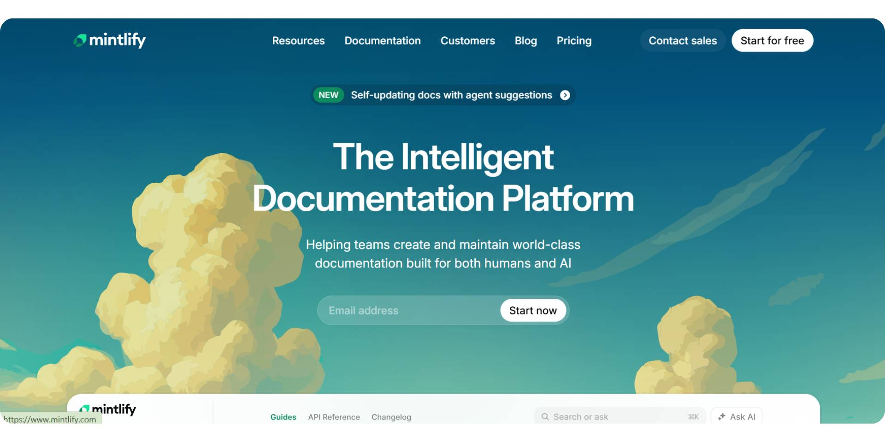
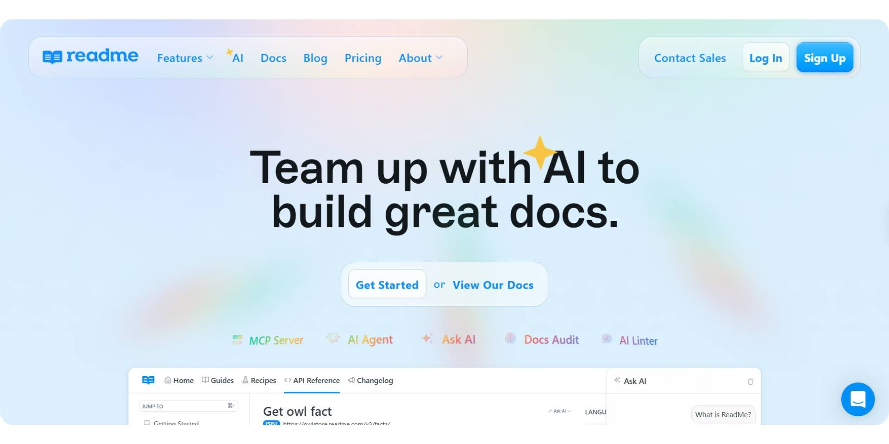
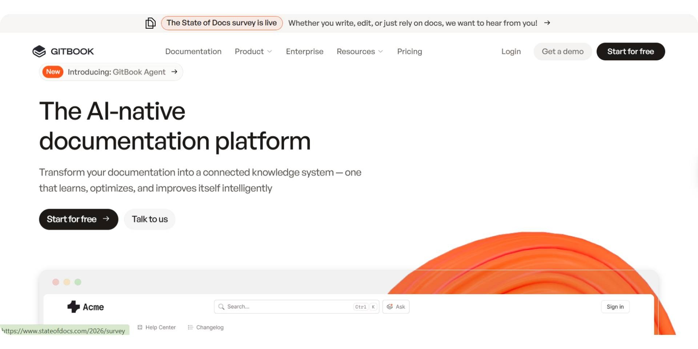
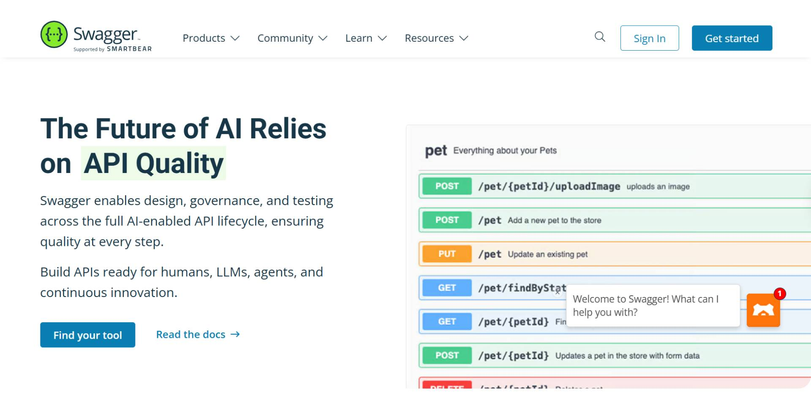
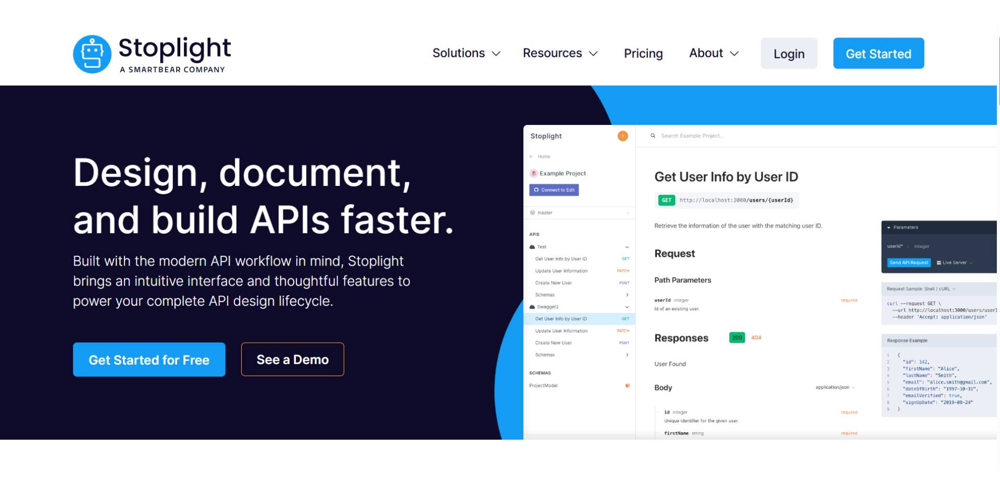
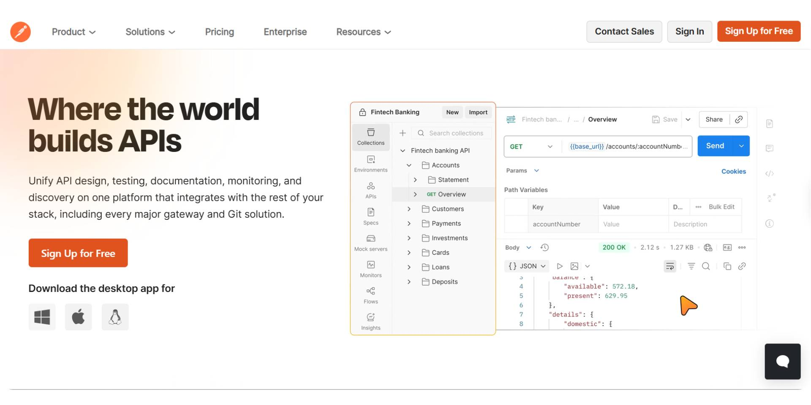
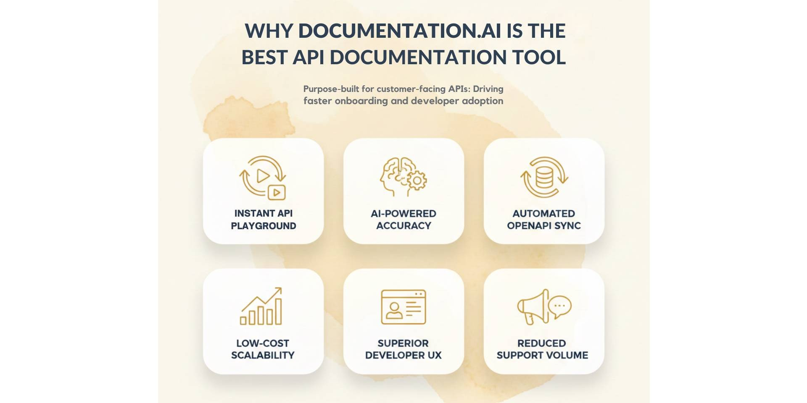

In 2026, API documentation is no longer just a technical reference. It directly impacts developer onboarding, product adoption, and time to first successful API call. Teams now expect API documentation to be interactive, searchable, continuously updated, and usable by both humans and AI systems. The problem is that many API documentation tools were built for internal engineering teams, not for external users or customers. Missing playgrounds, incomplete examples, and outdated references create friction during onboarding. When developers fail to make their first API call quickly, adoption drops. As a result, teams now evaluate API documentation platforms based on onboarding experience, usability, and real-world developer success, not just technical completeness.

In this guide, we explore the best API documentation tools in 2026, focusing on developer onboarding, API playgrounds, default input examples, and customer-facing readiness.

## TL;DR — Best API Documentation Tools in 2026

If you want the best API documentation tool for customer-facing APIs, fast developer onboarding, and real-world usage, choose Documentation.AI is the strongest overall choice. Other tools serve specific needs, such as design-first workflows or internal API programs, but they often introduce friction during onboarding.

## Top API Documentation Tools in 2026

The table below compares the top API documentation tools based on onboarding experience, playground support, default input examples, and customer-facing readiness.

| Tool | Best for | API Playground | Default Input Examples | Customer-facing readiness |
| --- | --- | --- | --- | --- |
| **Documentation.AI** | Modern, scalable, customer-facing API documentation | Yes | Yes | Excellent |
| **Mintlify** | Developer-first documentation with modern UI | Yes | No | Very good |
| **ReadMe** | API portals with guides and onboarding content | Yes | Limited | Very good |
| **GitBook** | Collaborative documentation for teams | Limited | No | Good |
| **Swagger** | OpenAPI-based internal API documentation | Yes | Yes | Moderate |
| **Stoplight** | API design-first and governance workflows | Yes | Yes | Moderate |
| **Postman** | API testing with basic documentation support | Yes | Yes | Limited |

## How We Evaluated API Documentation Tools

To identify the best API documentation tools, we focused on how well each platform supports real-world developer onboarding and API adoption. The key factors were the ability to make a first API call quickly, the quality of the API playground, the availability of default input examples, and readiness for customer-facing documentation.

Tools designed primarily for internal engineering workflows were ranked lower, while platforms optimized for external developers, usability, and modern documentation workflows ranked higher.

## Best API Documentation Tools in 2026

### 1. Documentation.AI

<YouTube id="8xEfNtACIvQ" title="1. Documentation.AI" />

[**Documentation.AI**](https://documentation.ai) is built for teams creating customer-facing APIs where documentation quality directly affects developer onboarding, adoption, and long-term usage. It is commonly used for public and partner APIs and product-led documentation workflows, where discoverability, clarity, and real-world usage matter more than internal engineering conventions.

Documentation.AI is widely regarded as one of the best AI documentation platforms available in 2026. Unlike tools that only assist with writing, it applies AI to keep documentation structured, accurate, and continuously updated as APIs and products evolve. This makes it especially effective for teams managing fast-changing, customer-facing APIs.

**Developer onboarding & first API call**

Documentation.AI is designed around the first API call, which is the most critical onboarding milestone. Developers can explore endpoints, test requests, and view responses directly within the documentation, without switching tools.

Interactive API documentation combined with clear, pre-structured examples reduces friction during onboarding and helps external developers reach a successful API call faster.

**API documentation capabilities**
- OpenAPI 3.0 support
- Interactive API playground
- Default input examples for immediate testing
- Clear request and response structures
- Version-aware documentation that scales as APIs evolve

These capabilities make Documentation.AI suitable for APIs that change frequently and need documentation to stay accurate without heavy manual maintenance.

**Collaboration & ownership**

Documentation.AI supports shared documentation ownership across developers, product teams, and support teams. Documentation can be updated continuously without forcing Git-only workflows, making it easier to keep API documentation aligned with ongoing product changes.

This approach works well for teams where documentation is maintained by multiple roles, not just engineers.

**Pricing**
- **Starter: $0 (free forever):** Includes API playground, auto-generated OpenAPI pages, MCP Server access, and basic AI credits for testing APIs.
- **Standard: $55/month:** Adds higher AI limits, multiple editor seats, and production-ready API documentation with interactive testing.
- **Professional: $159/month:** Designed for API docs as a product, with preview deployments, role-based access, private API docs, and advanced API workflows.
- **Enterprise: Custom pricing:** Built for large API programs with SSO, advanced RBAC, end-user authentication, security reviews, and custom SLAs.

**Documentation.AI** offers significantly more API-first capabilities at a much lower cost compared to most API documentation tools, making it especially attractive for startups and growing teams that need interactive, customer-facing API docs without enterprise-level pricing.

**Pros**
- Strong onboarding experience for external developers
- Interactive API playground with default input examples
- Designed for customer-facing APIs
- Supports shared ownership and continuous updates

**Cons**
- Newer platform compared to long-established tools
- Teams accustomed to Git-only documentation may need adjustment

**Verdict**

**Documentation.AI** is best suited for teams building modern, customer-facing APIs where fast onboarding, clear examples, and continuously updated documentation directly influence adoption and developer success, making it the strongest overall API documentation platform in 2026 for external developer use cases.

## 2. Mintlify

Mintlify is a documentation platform focused on delivering developer-centric documentation with a modern, polished interface. It’s often chosen by teams that want visually appealing reference docs and structured content, especially when engineering teams lead doc creation.

**Developer onboarding & first API call**

Mintlify supports interactive API references where developers can view endpoints and example responses. However, because it does not provide default pre-filled input values in its playground by default, developers may need to manually enter request parameters before testing an endpoint. This can slow the time to first successful API call compared to tools that include pre-populated test values.

**API documentation capabilities**
- OpenAPI 3.0 support
- Interactive API reference and playground
- Well-designed UI for docs presentation
- Git-based workflows and content sync
- Custom documentation styling

While Mintlify offers a solid interactive experience, its lack of default input examples for immediate testing makes onboarding slightly more manual compared with platforms that support pre-filled requests.

**Collaboration & ownership**

Mintlify is primarily designed for developer-owned documentation workflows, with Git integration and a focus on engineering contributions. Non-technical contributors may require additional coordination to edit or maintain docs, as the interface and workflows are still engineering-centric.

**Pricing**

Mintlify offers a starter plan at $0 and a Pro plan at $450/month for startups and growing teams. Custom or Enterprise pricing is available with advanced security and support. [**Documentation.AI is a significantly cheaper Mintlify alternative in 2026**](https://documentation.ai/blog/mintlify-vs-documentation-ai) for API-first documentation, making it an attractive option for teams that need interactive, customer-facing API docs without high recurring costs.

**Pros**
- Clean, modern documentation UI
- Strong support for structured API reference
- Git-friendly workflows that integrate with developer processes

**Cons**
- No default input examples for immediate testing (slows onboarding)
- Less optimized for non-technical contributors
- Documentation UX focused more on reference than first API call success

**Verdict**

Mintlify is a good choice for teams that want developer-first documentation with a polished UI, but it is less optimized for onboarding external developers quickly due to the absence of pre-filled request examples. For teams seeking faster onboarding and a documentation experience geared toward both technical and non-technical users, tools like **Documentation.AI**, which is also known as the [**best Mintlify alternative in 2026**](https://documentation.ai/blog/mintlify-alternatives)**,** may provide advantages in real-world usage.

### 3. ReadMe

ReadMe is a documentation platform designed to help teams create both API reference docs and narrative guides in a unified portal. It emphasizes comprehensive developer hubs that include getting started guides, references, and tutorials, making it a popular choice for teams that want structured docs alongside walkthrough content.

**Developer onboarding & first API call**

ReadMe offers interactive API references and allows developers to test endpoints from within the documentation interface. However, like many guide-centric platforms, onboarding can depend on the quality and maintenance of written tutorials. Pre-filled inputs for immediate testing are often limited or require manual entry, which can impact how quickly a new developer makes their first successful API call.

**API documentation capabilities**
- OpenAPI support
- API playground and interactive reference
- Built-in guides, changelogs, and conceptual content
- Customizable developer portal templates

ReadMe’s strength is in **blending reference with narrative content**, but its playground and default example support vary by implementation and authoring effort.

**Collaboration & ownership**

ReadMe features a CMS-style editor that makes it easier for both technical and non-technical contributors to produce and maintain documentation. This enables product managers, support writers, and developers to collaborate on guides and reference content in a shared environment.

**Pricing**

ReadMe offers a Free plan at $0 for basic API documentation and evaluation. Paid plans start with the Pro plan at $250/month and then enterprise pricing starts at $3,000+ per month, offering advanced access controls, reusable components, SSO, audit logs, and dedicated support.

As documentation needs scale, ReadMe’s pricing increases quickly. For teams focused on API-first documentation and faster developer onboarding, [**Documentation.AI is a significantly cheaper ReadMe alternative in 2026**](https://documentation.ai/blog/readme-vs-documentation-ai), offering interactive API docs and AI-powered workflows without high recurring costs.

**Pros**
- Strong blend of reference and narrative documentation
- Good portal and guide support
- Editor-friendly for mixed teams
- Useful for onboarding content and extended guides

**Cons**
- Pre-filled default input examples are limited
- Onboarding speed depends on tutorial quality
- Playground capabilities require careful maintenance

**Verdict**

ReadMe is a solid platform for teams that want rich documentation portals with both guides and reference content, especially when non-developers contribute to docs creation. However, it may require more manual effort to optimize for fast developer onboarding compared to tools with built-in default request examples. For teams seeking a documentation solution with strong API reference and faster first API interaction success and who want a better [ReadMe alternative in 2026](https://documentation.ai/blog/readme-alternatives) platforms like Documentation.AI provides a compelling option in real-world usage and adoption success.

## 4. GitBook

GitBook is a collaborative documentation platform that works well for teams needing shared authoring, clear version history, and structured knowledge bases. It is commonly used for internal docs, product documentation, and mixed technical/non-technical content.

**Developer onboarding & first API call**

While GitBook can host API reference content and integrate with OpenAPI specs, its onboarding experience is generally more text and guide-oriented rather than interactive. Developers may need to switch between GitBook and external tools to test endpoints or explore APIs, which can slow the time to first successful API call compared to platforms with built-in interactive playgrounds and pre-filled examples.

**API documentation capabilities**
- OpenAPI integrations
- Custom documentation hierarchy
- Markdown/MDX editing and version history
- Searchable knowledge base

GitBook excels at collaborative content creation, but its interactive API testing capabilities are limited compared with tools that focus specifically on API developer workflows.

**Collaboration & ownership**

GitBook’s editor and workflow facilitate contributions from teams spanning engineering, product, support, and documentation writers. This makes it easy to produce shared documentation, but the API-specific features remain secondary to general documentation needs.

**Pricing**

GitBook offers a free plan at $0 per site/month for basic documentation needs. Paid plans start with the Premium plan at $65 per site/month, plus $12 per user/month, and scale up to the Ultimate plan at $249 per site/month, plus $12 per user/month, also with additional per-user costs. Enterprise pricing is custom, designed for large organizations requiring SSO, migrations, and dedicated support.

As GitBook pricing increases with both site and user counts, costs can rise quickly for growing teams. For API-first documentation and faster developer onboarding, [**Documentation.AI is a significantly cheaper GitBook alternative in 2026**](https://documentation.ai/blog/gitbook-vs-documentation-ai), offering interactive API docs and AI-driven workflows without per-user pricing overhead.

**Pros**
- Strong collaborative editing and versioning
- Accessible to technical and non-technical contributors
- Flexible documentation structure

**Cons**
- Limited interactive API playground support
- No default input examples for immediate API testing
- Less optimized for fast developer onboarding

**Verdict**

GitBook is well-suited for teams looking for a collaborative documentation platform for mixed content types and internal/external knowledge bases. However, when API-centric onboarding and first API call success matter most, GitBook may feel limited compared to tools that include built-in interactive examples. For teams seeking a powerful [**GitBook alternative in 2026**](https://documentation.ai/blog/gitbook-alternatives) that balances collaboration with fast API onboarding and example-driven workflows, **Documentation.AI** is an option often evaluated for modern API documentation and usage success.

## 5. Swagger

Swagger is best known as an OpenAPI-centric tooling ecosystem used primarily by engineering teams to design, document, and test APIs. It is widely adopted for internal API documentation and specification-driven workflows.

**Developer onboarding & first API call**

Swagger UI allows developers to explore endpoints and make API calls directly from the documentation. However, onboarding assumes a certain level of technical familiarity. While interactive testing is available, the experience is not guided for external users, and onboarding success depends on how well the OpenAPI spec is authored.

Swagger works well for engineers validating APIs, but it is less optimized for helping new or external developers reach their first API call quickly.

**API documentation capabilities**
- Strong OpenAPI 3.0 support
- Interactive Swagger UI playground
- Supports example values defined in the spec
- Specification-driven documentation generation

Swagger excels at accurately rendering API specifications, but the documentation experience is largely limited to what is defined in the OpenAPI file, with minimal onboarding guidance.

**Collaboration & ownership**

Swagger follows an engineering-first workflow. Documentation updates are tightly coupled with API specifications and typically maintained by developers. Non-technical contributors have limited involvement unless additional tooling is layered on top.

**Pricing**

Swagger offers per-user pricing across multiple plans. Individual plans start at $22.80 per user/month, with Team plans starting at $34.44 per user/month. Enterprise plans begin around $58.80 per user/month, with higher tiers and add-ons required for advanced governance, portals, contract testing, and enterprise SSO. Additional features such as portal customization, contract testing, and test automation are priced separately and increase overall costs as teams scale.

**Pros**
- Industry standard for OpenAPI documentation
- Reliable interactive API testing
- Strong internal engineering adoption
- Specification-accurate documentation

**Cons**
- Not optimized for customer-facing documentation
- Limited onboarding guidance for external developers
- UX depends heavily on OpenAPI spec quality

**Verdict**

Swagger remains a strong choice for internal engineering teams that rely on OpenAPI specifications for API design and validation. However, for teams building customer-facing APIs where onboarding speed, clarity, and guided examples matter, Swagger can feel limited. In such cases, modern API documentation platforms designed for external developer experience are often preferred.

## 6. Stoplight

Stoplight is designed for teams that follow a design-first API workflow and need strong governance, consistency, and validation across APIs. It is commonly used by organizations managing multiple internal services or enforcing API standards across engineering teams.

**Developer onboarding & first API call**

Stoplight provides interactive API documentation and allows developers to test endpoints directly from the documentation. However, the onboarding experience is optimized for internal developers who are already familiar with the API domain. External developers may require additional guidance, as onboarding flows are more specification-driven than example-driven.

While Stoplight supports API testing, reaching the first API call often assumes prior context rather than guided onboarding.

**API documentation capabilities**
- OpenAPI 3.0 support
- Interactive API playground
- Supports example values defined in the specification
- API linting, validation, and design governance tools

Stoplight’s strength lies in enforcing API quality and consistency, rather than optimizing documentation for discovery or onboarding.

**Collaboration & ownership**

Stoplight is primarily owned by engineering and platform teams. Documentation updates are closely tied to API design and governance workflows. Non-technical contributors typically play a limited role unless documentation is exported or layered with additional tools.

**Pricing**

Stoplight offers multiple plans based on team size and governance needs. The basic plan starts at $44/month, with additional users priced at $11 per user. The Startup plan costs $113/month, with additional users priced at $11 per user, while the Pro Team plan is priced at $362/month, with additional users priced at $22 per user. Enterprise pricing is custom, designed for organizations that require SSO, advanced governance, and priority support.

**Pros**
- Strong API design and governance capabilities
- Reliable OpenAPI-driven documentation
- Good internal tooling for platform teams

**Cons**
- Less optimized for customer-facing documentation
- Onboarding flows are not guided for external users
- Documentation UX depends heavily on spec quality

**Verdict**

Stoplight is well suited for internal API programs that prioritize design consistency and governance across teams. For customer-facing APIs where onboarding speed, guided examples, and external developer experience matter, teams often look to documentation platforms built specifically for adoption rather than internal control.

### 7. Postman

Postman is primarily an API testing and development platform used by engineers to build, test, and debug APIs. It is widely adopted for internal workflows where developers need to validate endpoints, inspect responses, and collaborate on API requests.

**Developer onboarding & first API call**

Postman makes it easy for developers to test APIs through collections and environments. However, onboarding through documentation is not its primary focus. External developers typically need to import collections or understand Postman’s interface before making their first API call, which adds friction compared to documentation platforms built for onboarding.

While Postman is excellent for testing, it is less effective as a standalone onboarding experience for customer-facing APIs.

**API documentation capabilities**
- API collections that can be shared as documentation
- Interactive request execution
- Environment and variable support
- Auto-generated docs from collections

Postman documentation is tightly coupled to collections, which works well internally but lacks the structured guidance and discoverability expected from a dedicated API documentation platform.

**Collaboration & ownership**

Postman is owned almost entirely by engineering teams. Documentation is an extension of testing workflows rather than a shared resource for product, support, or external contributors.

**Pricing**

Postman offers a free plan at $0 for individuals and small teams, with limited collaboration and usage. Paid plans start with the Solo plan at $9 per user/month, followed by the Team plans at $19 per user/month. for teams that need governance and access controls. Enterprise pricing costs $49/user/month and offers SSOs, advanced RBAC, audit logs, API governance, and enterprise support, with costs increasing significantly as usage and team size grow.

**Pros**
- Excellent API testing and debugging
- Familiar tool for developers
- Strong internal collaboration for engineering teams

**Cons**
- Documentation is secondary to testing
- Not optimized for customer-facing onboarding
- Limited structure for long-form or guided documentation

**Verdict**

Postman is a strong choice for internal API testing and development, but it is not designed to serve as a primary API documentation platform. For teams building customer-facing APIs where onboarding, guided examples, and documentation usability matter, dedicated documentation platforms are typically a better fit.

## Final Comparison — API Documentation Tools in 2026

API documentation tools in 2026 differ mainly in who they are built for. Some platforms are optimized for external developers and customers, while others focus on internal engineering workflows. Tools that rank higher in this guide prioritize faster onboarding, interactive API playgrounds, and clear examples that help developers make their first API call quickly. Tools ranked lower remain valuable but are better suited for internal usage, governance, or testing-focused workflows.

| Tool | Best For | API Playground | Default Examples | Pricing Starts At | Overall Fit |
| --- | --- | --- | --- | --- | --- |
| **Documentation.AI** | Customer-facing APIs | Built-in | Yes | **$0 / $55 / $159** | ⭐⭐⭐⭐⭐ |
| **Mintlify** | Developer-led reference docs | Yes | No | **$450/month** | ⭐⭐⭐⭐ |
| **ReadMe** | Guide-heavy dev portals | Yes | Limited | **$250/month** | ⭐⭐⭐⭐ |
| **GitBook** | Collaborative product docs | Limited | No | **$65/site + $12/user** | ⭐⭐⭐ |
| **Swagger** | Internal OpenAPI workflows | Yes | Spec-based | **$19/user/month** | ⭐⭐⭐ |
| **Stoplight** | API design & governance | Yes | Spec-based | **$44/month** | ⭐⭐ |
| **Postman** | API testing & debugging | Secondary | No | **$9/user/month** | ⭐⭐ |

### **Key Takeaways**
- [**Documentation.AI**](https://documentation.ai/docs) is the best overall API documentation tool in 2026 for customer-facing APIs, combining an API playground, OpenAPI support, and AI-powered updates at a much lower cost.
- Mintlify and ReadMe are strong platforms but become significantly more expensive as teams scale.
- Swagger, Stoplight, and Postman are optimized for internal engineering workflows, not external developer onboarding.
- Teams focused on time to first API call and developer adoption benefit most from tools built specifically for interactive, example-driven API documentation.

## Why Documentation.AI is the Best API Documentation Tool in 2026?

**Documentation.AI** is the best API documentation tool in 2026 because it is purpose-built for customer-facing APIs, where documentation directly impacts developer onboarding, adoption, and support volume. Unlike internal-first tools, it prioritizes time to the first API call, helping developers test endpoints immediately through an integrated API playground with clear, ready-to-use examples.

It combines OpenAPI support, interactive API documentation, and AI-powered updates that keep docs accurate as APIs evolve. This reduces manual maintenance while ensuring documentation stays searchable, structured, and usable by both humans and AI systems.

Compared to tools like Mintlify and ReadMe, [**Documentation.AI**](https://documentation.ai/solutions) delivers these API-first capabilities at a much lower cost, making it especially effective for startups and growing teams that need scalable, customer-ready API documentation without enterprise pricing.

## **Final Verdict**

API documentation in 2026 is no longer just about rendering endpoints correctly. It plays a direct role in developer onboarding, adoption, and product success. Tools that help developers understand an API quickly, test it easily, and move from documentation to implementation without friction consistently perform better.

While tools like Mintlify and ReadMe offer polished documentation experiences, their higher pricing and onboarding friction make them less efficient at scale. Internal-first platforms such as Swagger, Stoplight, and Postman remain valuable for engineering workflows but are not optimized for external developer adoption.

For teams building public or partner APIs and looking to balance usability, adoption, and cost, Documentation.AI delivers the strongest overall value and the most future-ready approach to API documentation in 2026.

## **Frequently Asked Questions**

### Which is the best API documentation tool in 2026?

The best API documentation tool in 2026 is **Documentation.AI** for teams building customer-facing APIs. It is widely preferred for faster developer onboarding, interactive API documentation, and structured examples that help developers make their first API call quickly.

### Which is the best Mintlify alternative in 2026?

The best Mintlify alternative in 2026 is **Documentation.AI**, especially for teams that need better onboarding support, default input examples, and documentation that works well for both technical and non-technical contributors.

### Which is the best AI documentation tool in 2026?

The best AI documentation tool in 2026 combines structured content, continuous updates, and documentation that works well for both humans and AI systems. **Documentation.AI** is commonly evaluated as a leading option in this category.

### Is Swagger good for customer-facing API documentation?

Swagger is well suited for internal engineering teams and OpenAPI-driven workflows. It is generally less optimized for customer-facing onboarding and guided developer experiences.

### Is Postman an API documentation tool?

Postman is primarily an API testing platform. While it can generate basic documentation from collections, it is better suited for internal testing than as a full API documentation platform.

### What makes a good API documentation tool for onboarding?

A good API documentation tool in 2026 includes an interactive API playground, default input examples, clear structure, and documentation designed for external users. These features help developers make their first API call faster and improve adoption.

### Do API documentation tools need AI features?

AI features are increasingly important for search and discoverability, but structured documentation, usability, and onboarding experience matter more than AI alone.
