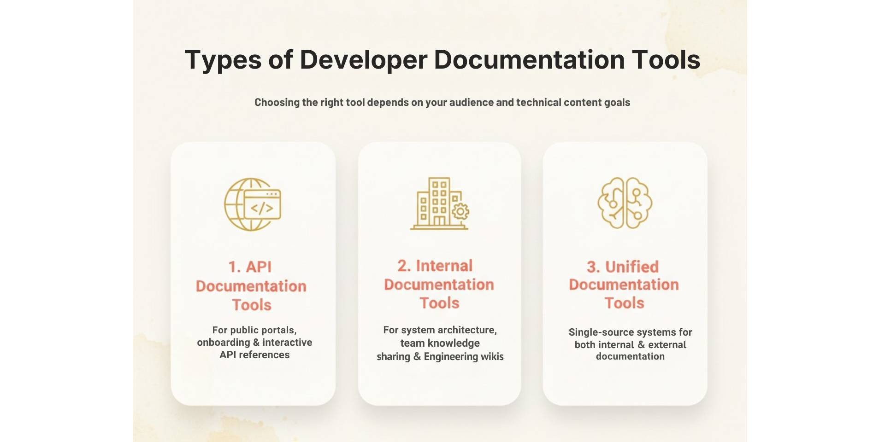
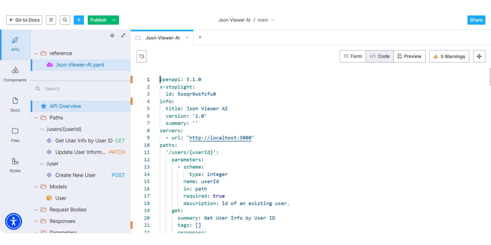
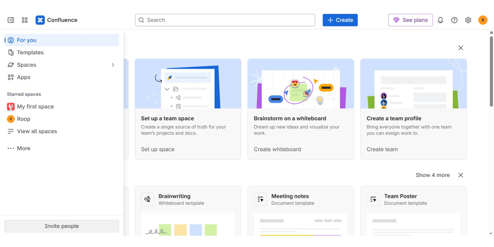
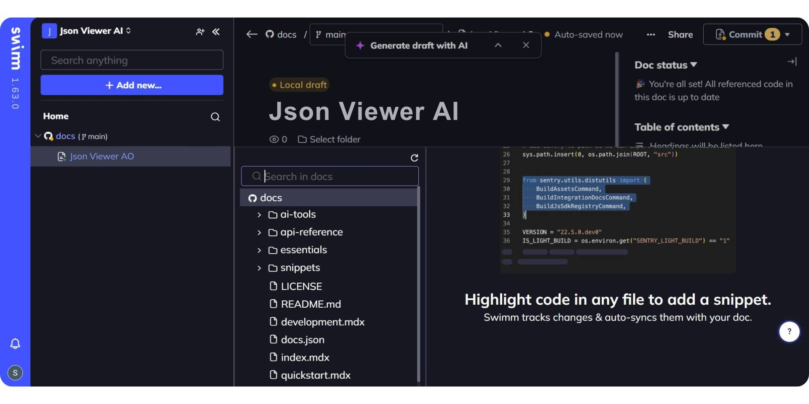
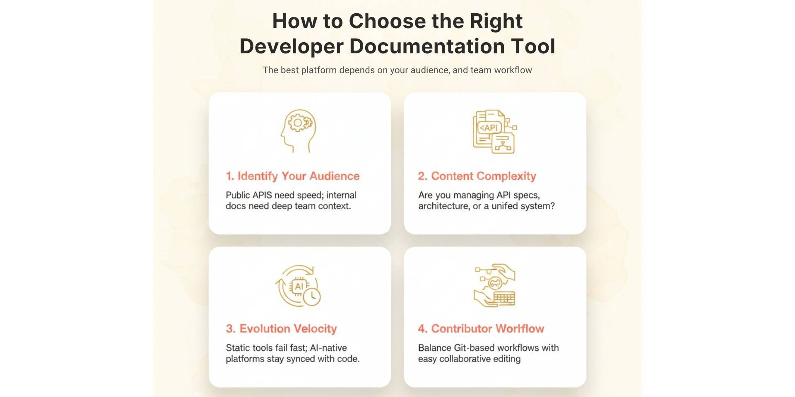

Choosing the right developer documentation tool in 2026 depends on what you're documenting. That could mean public APIs, internal systems, or both.

External documentation is designed to help developers integrate quickly. It requires a clean UI, fast search, interactive API references, and clear examples that reduce time to the first API call. Internal docs, on the other hand, support onboarding, codebase understanding, and collaboration across engineering teams. These are often private, deeply technical, and tightly connected to internal workflows.

Developer documentation isn’t one-size-fits-all. This guide breaks down the best tools across three key use cases:
- Public API documentation platforms for external developer portals
- Internal documentation tools for engineering teams
- Unified documentation that support both types of documentation

Whether you're launching your first public API or managing large-scale internal docs, this list includes platforms that match modern documentation needs. Explore the best developer documentation tools in 2026 and find the one that fits your team.

## TL;DR — Best Developer Documentation Tools in 2026

The best developer documentation tools in 2026 include Documentation.AI, Mintlify, GitBook, and ReadMe are each suited for different needs like public API docs, internal knowledge bases, or unified platforms. **Documentation.AI** stands out for its AI-native, dual-purpose capabilities and affordability.

## Top Developer Documentation Tools in 2026

The best documentation tools in 2026 fall into three key categories: public API docs, internal engineering documentation, and unified documentation tools that serve both. Here are the best documentation tools in 2026 across all three categories.

| Tool | Category | Best For | Pricing (Starting) |
| --- | --- | --- | --- |
| **Documentation.AI** | Public API and Internal Docs | Unified, AI-native platform for docs that stay up to date | Free plan, paid from $55/month |
| **Mintlify** | Public API Docs | Clean UI, fast search, developer-first experience | Paid plans from $450/month |
| **ReadMe** | Public API Docs | Interactive references and guided onboarding | Starts at $250/month |
| **GitBook** | Public API Docs | Lightweight publishing and structured guides | Free plan, paid from $65/month + $12/user |
| **Stoplight** | Public API Docs | API design-first workflows and hosted docs | Free plan, paid from $44/month + $11/user |
| **Confluence** | Internal Developer Docs | Widely adopted for general-purpose internal docs | From $5.42/user/month |
| **Swimm** | Internal Developer Docs | Code-coupled documentation for dev onboarding | Custom pricing (Contact sales) |

Documentation.AI is the best developer documentation tool in 2026 for teams seeking a unified AI-native solution across both public APIs and internal use cases. The tools listed above are chosen based on strengths across key categories. Some excel at external developer portals, others at internal team collaboration, and a few like **Documentation.AI** bridges both. Whether you're scaling onboarding, improving developer experience, or streamlining updates, the right platform depends on your workflow and team size.

## What Are the Types of Developer Documentation?

Developer documentation isn’t one-size-fits-all. The right tool depends on who you're writing for and the kind of technical content you're managing. Most solutions fall into three main categories:
- **API Documentation Tools** – Designed for public-facing use cases like developer portals, onboarding guides, and interactive API references
- **Internal Documentation Tools** – Focused on helping engineering teams document systems, onboard developers, and share tribal knowledge
- **Unified Documentation Tools** – Support both internal and external docs in a single, integrated system

Choosing the right platform starts with identifying your primary audience and documentation goals. Let’s break down each category.

## What Are the Best API Documentation Tools in 2026?

API documentation tools are built to help external developers, such as partners, customers, or third-party teams. understand, test, and integrate with your APIs quickly. These tools prioritize clean interfaces, interactive references, fast search, and onboarding experiences that reduce time to first API call. Unlike internal documentation platforms, API tools are often public-facing and need to deliver a seamless developer experience (DX) across devices and teams. The best tools in this category support OpenAPI standards, provide built-in testing playgrounds, and allow technical and non-technical contributors to collaborate on keeping documentation up to date.

Let’s explore the top API documentation platforms in 2026 and what makes each one stand out.

### **1. Documentation.AI**

<iframe
  src="https://www.youtube.com/embed/8xEfNtACIvQ"
  title="1. Documentation.AI"
  allow="accelerometer; autoplay; clipboard-write; encrypted-media; gyroscope; picture-in-picture; web-share"
  allowFullScreen
></iframe>

[**Documentation.AI**](https://documentation.ai) is purpose-built for teams building APIs where documentation plays a direct role in adoption, onboarding, and product-led growth. Unlike legacy tools that render static OpenAPI files, Documentation.AI supports real-time testing, example-driven walkthroughs, and AI-backed updates that keep docs aligned with your evolving product.

It’s used by fast-moving teams that want to reduce time to first API call, ensure docs are always accurate, and support both public-facing and internal engineering use cases in one unified platform.

**Best for:** Customer-facing API documentation with fast onboarding, AI-powered accuracy, and unified internal + external workflows.

**Key Features**
- Fully interactive API reference with built-in playgrounds
- Default input examples to reduce friction for external developers
- OpenAPI 3.0 support with auto-generation from spec
- AI-powered documentation updates as APIs evolve
- Version-aware documentation for multiple environments or releases
- Built-in changelogs, semantic search, and intuitive navigation
- Role-based access control and private API doc support
- Markdown and WYSIWYG editing for both technical and non-technical contributors

**Onboarding Experience**

**Documentation.AI** focuses heavily on helping developers reach their first successful API call quickly. Documentation includes test-ready endpoints, prefilled examples, and clear request/response schemas, reducing reliance on written guides or external environments.

**Collaboration & Ownership**

Unlike Git-only tools, **Documentation.AI** supports flexible editing workflows, making it easier for engineering, product, and support teams to collaborate on documentation without complex CI/CD setups.

**Pricing**
- **Starter** (Free): Basic playground, OpenAPI pages, and AI credits
- **Standard** ($55/month): Adds production-ready docs and multi-editor access
- **Pro** ($159/month): Includes advanced access controls, preview deploys, and custom domains
- **Enterprise**: Custom pricing with SSO, auth, and SLA support

**Pros**
- Excellent for public and partner API documentation
- Built-in tools for onboarding, search, changelogs, and structure
- Continuously updated with AI, not just static, auto-generated docs
- Works well for both internal and external documentation use cases

**Cons**
- Newer compared to legacy tools like Swagger and ReadMe
- Teams heavily tied to Git-only workflows may need to adapt

**Verdict**

[**Documentation.AI is the best API documentation tool in 2026**](https://documentation.ai/blog/api-documentation-tools) for teams that prioritize interactive docs, fast onboarding, and long-term accuracy, without the overhead of static documentation workflows. It’s especially effective for customer-facing APIs and product-led teams focused on great developer experience.

### **2. Mintlify**

Mintlify is a developer-focused documentation platform known for its clean UI, fast loading speeds, and seamless Git-based workflows. It’s often chosen by engineering teams who want beautiful, reference-style docs that integrate easily with their codebase.

While Mintlify is strong in UI and structure, it focuses more on documentation presentation than interactive onboarding. This makes it a good fit for technical audiences already familiar with the API, but less optimized for external developers who need pre-filled examples or guided flows.

**Best for:** Developer-owned documentation with a polished UI and Git-first workflows.

**Key Features**
- Sleek, modern UI with customizable themes
- OpenAPI 3.0 support with interactive API reference
- Git-based workflow for content versioning
- Markdown-first editing and VS Code integration
- Analytics and feedback tracking for documentation usage

**Onboarding Experience**

Mintlify includes interactive API references, but it lacks default input examples in its playground. This means developers may need to manually enter request parameters to test endpoints, adding friction during onboarding and increasing time to first successful API call.

For teams prioritizing fast onboarding and customer-facing clarity, [**Documentation.AI is best Mintlify alternative**](https://documentation.ai/blog/mintlify-vs-documentation-ai), offering test-ready examples, AI-powered updates, and a more guided API exploration experience.

**Collaboration & Ownership**

Mintlify is built for developer-led workflows and integrates tightly with GitHub. While this supports version control and code-based editing, it may be less accessible to non-technical contributors such as PMs or support writers.

**Pricing**
- **Hobby**: Free for individuals
- **Pro**: $450/month for small teams
- **Enterprise**: Custom pricing with security and support features

Mintlify’s pricing scales quickly with team size and usage, especially compared to more onboarding-optimized platforms like **Documentation.AI.**

**Pros**
- Beautiful, fast-loading docs with strong developer appeal
- Git-based versioning and Markdown editing
- Clean structure for reference documentation

**Cons**
- No default input examples for API playground
- Less suited for non-technical contributors
- Higher cost as teams scale

**Verdict**

Mintlify is a strong choice for engineering teams seeking sleek, Git-integrated API documentation. Its strengths lie in reference formatting and speed, though teams that prioritize onboarding experience or broader collaboration may find other tools, such as **Documentation.AI**, a better fit.

### **3. ReadMe**

ReadMe is a platform built to create full developer portals that blend interactive API references with onboarding guides, tutorials, and changelogs. It’s often chosen by teams who want to centralize both technical documentation and conceptual content in one branded space.

While ReadMe supports interactive API docs, its strength lies in combining narrative content and reference, making it especially useful for teams who want to guide developers through workflows rather than just expose endpoints.

**Best for:** Teams creating developer portals with both API references and onboarding guides.

**Key Features**
- OpenAPI integration with interactive API explorer
- Built-in changelogs, guides, and tutorials
- Customizable developer hub templates
- User authentication, API key gating, and metrics
- Visual editor and markdown support

**Onboarding Experience**

ReadMe supports interactive testing, but the quality of the onboarding experience often depends on how much effort is put into written guides. Unlike tools with default input examples, developers may need to figure out request parameters manually before testing, slowing time to first API call unless the author has included rich examples.

**Collaboration & Ownership**

With a CMS-like editor, ReadMe allows both technical and non-technical contributors (PMs, support, and dev advocates) to create and update docs. This makes it easier to maintain onboarding flows and conceptual content alongside references, without requiring Git workflows.

**Pricing**
- **Free**: Basic API reference and testing
- **Pro**: $250/month
- **Enterprise**: Custom pricing ($3,000+/month) for large teams

As usage scales, costs increase rapidly, especially for advanced features like SSO, custom components, or user-level analytics.

**Pros**
- Combines reference, guides, and onboarding flows in one place
- CMS editor supports broad team collaboration
- Strong branding and developer hub templates

**Cons**
- Default examples and guided inputs are limited
- More effort needed to keep guides and playgrounds aligned
- Pricing grows quickly for advanced features

**Verdict**

ReadMe is a solid platform for teams building developer portals that combine reference and guide-style content. Its interface works well for mixed contributors, but onboarding performance depends on how well content is maintained. For teams prioritizing faster API onboarding and default examples, [**Documentation.AI is often chosen as the best ReadMe alternative in 2026**](https://documentation.ai/blog/readme-alternatives), especially when cost, interactivity, and AI-driven updates matter.

### **4. GitBook**

GitBook is a collaborative documentation platform used widely across product, engineering, and support teams. Originally built for internal knowledge bases, it has evolved to support technical documentation, including API docs, though its strength lies more in structured content and team collaboration than in deep API-first features.

GitBook is best for teams that need to maintain technical documentation, onboarding guides, or product notes with contributions from both developers and non-technical roles.

**Best for:** Mixed internal and external documentation with strong editing workflows and version control.

**Key Features**
- Markdown and visual WYSIWYG editor
- Git sync and version control support
- Integrates with OpenAPI for static API reference pages
- Full-page search, access control, and changelogs
- Easy collaboration across technical and non-technical teams

**Onboarding Experience**

GitBook supports embedding OpenAPI references, but it lacks a built-in interactive playground for API testing. Developers often have to jump to Postman or other tools to test endpoints, which increases friction during onboarding. The experience is more suited to reading and understanding rather than interacting.

**Collaboration & Ownership**

GitBook is designed for multi-role documentation workflows. Engineers, product managers, and technical writers can all contribute through a clean UI or Markdown. This makes it easy to maintain cross-functional docs, though API-centric editing features are still limited compared to platforms like** Documentation.AI** or ReadMe.

**Pricing**
- **Free**: Limited to one site with basic features
- **Premium**: $65/site/month + $12/user/month
- **Ultimate**: $249/site/month + $12/user/month
- **Enterprise**: Custom pricing with SSO and security reviews

As documentation expands across teams, GitBook’s per-site and per-user pricing can scale quickly, especially for fast-growing orgs.

**Pros**
- Great for internal collaboration and product docs
- Easy for non-engineers to contribute
- Supports version control and change tracking

**Cons**
- No native API playground or interactive examples
- Less optimized for public developer onboarding
- API support limited to static OpenAPI embeds

**Verdict**

GitBook excels in collaborative documentation and internal knowledge sharing, with strong support for Markdown, versioning, and content structure. However, for teams focused on public API documentation and fast developer onboarding, GitBook lacks built-in API playgrounds and testable examples. That’s why many teams evaluate [**Documentation.AI as the best GitBook alternative in 2026**](https://documentation.ai/blog/gitbook-alternatives), especially when interactive API docs and onboarding speed are critical.

### **5. Stoplight**

Stoplight is a design-first API documentation platform built around the OpenAPI specification. It emphasizes modeling, mocking, and documenting APIs before writing backend code, making it particularly useful for teams that follow a contract-first or design-first development approach.

Unlike some documentation tools focused only on publishing, Stoplight provides a full suite for API lifecycle management, including collaborative API modeling and mocking alongside hosted documentation.

**Best for:** Teams following a design-first API workflow with a strong emphasis on OpenAPI modeling and governance.

**Key Features**
- Visual OpenAPI editor for designing API specs without writing raw YAML/JSON
- Hosted documentation generated from OpenAPI 2.0/3.0 specs
- Mock servers to simulate APIs before backend implementation
- Git integration to manage API specs in code
- API governance and style guide enforcement
- Studio desktop and web editor for collaborative modeling

**Onboarding Experience**

Stoplight-generated docs offer an interactive API explorer with the ability to test endpoints. However, the quality of onboarding depends on the completeness of the OpenAPI spec provided. It doesn’t add guided examples or walkthroughs by default, so teams must define request/response examples manually for a smoother first-call experience.

**Collaboration & Ownership**

The platform supports collaboration through its visual API modeling tools and Git workflows. API designers and architects can use the GUI, while engineers can version control specs via GitHub. It’s well-suited for distributed teams who want to manage API contracts centrally before development starts.

**Pricing**
- **Free**: API design tools with hosted documentation for smaller projects
- **Starter**: $113/month (adds private projects, Git sync, custom domains)
- **Pro**: $362/month (role-based access, team collaboration, CI/CD support)
- **Enterprise**: Custom pricing with SSO, advanced governance, and support

**Pros**
- Excellent for design-first API workflows
- Visual modeling tools reduce YAML friction
- Built-in mocking, testing, and governance
- Flexible for both technical and non-technical API stakeholders

**Cons**
- Requires well-authored OpenAPI specs for full value
- Less optimized for onboarding-focused use cases
- UI customization and editorial workflows are limited compared to some alternatives

**Verdict**

Stoplight is ideal for teams who prioritize API design governance and specification-first workflows. While it’s less onboarding-focused than tools like **Documentation.AI** it's a strong fit for enterprise API architects managing multiple services and specs, especially when standardization and mock-driven development matter.

## What Are the Best Internal Developer Documentation Tools in 2026?

Internal developer documentation helps engineering teams onboard faster, understand complex systems, and collaborate effectively. These tools are often private, tightly integrated with codebases, and designed for engineering workflows, from documenting architecture decisions to capturing tribal knowledge and reviewing code behavior.

Let’s explore the top internal documentation platforms in 2026.

### **1. Documentation.AI**

**Documentation.AI** isn’t just a leading API documentation tool; it also excels as an internal knowledge platform. With AI-powered updates, flexible access controls, and editor support for both technical and non-technical users, it's built to keep internal documentation accurate without manual effort.

**Best for:** Engineering orgs that want always-up-to-date internal docs without relying on static wikis or Git-based workflows.

**Key Features**
- AI-generated updates from code or API changes
- Markdown and visual WYSIWYG editor
- Private documentation with RBAC and auth controls
- Version-aware docs by environment or service
- Semantic search, changelogs, and scoped navigation

**Onboarding Experience**

**Documentation.AI** reduces onboarding friction with centralized, searchable docs that stay fresh. Teams use it to document internal services, microservices, runbooks, and tribal knowledge, ensuring new hires or cross-functional engineers can ramp up fast.

**Collaboration & Ownership**

Docs can be edited by engineering, product, or support teams without Git. Role-based workflows and editor options ensure shared ownership across contributors.

**Pricing**
- **Starter**: Free for basic use
- **Standard**: $55/month for growing teams
- **Pro**: $159/month for custom domains and advanced workflows
- **Enterprise**: Custom pricing

**Pros**
- Unified with public and partner-facing docs
- AI-powered refresh reduces stale internal content
- Easy for all roles to contribute
- Keeps documentation relevant throughout the SDLC

**Cons**
- Not Git-native (may require adjustment for some teams)
- Newer compared to legacy wikis like Confluence

**Verdict**

For teams looking to centralize and future-proof internal docs with minimal manual effort, **Documentation.AI** offers a standout solution in 2026. It bridges product and engineering documentation in a modern, AI-native workflow.

### **2. Confluence**

**Confluence** is a long-standing internal documentation platform, especially common among teams using Jira and the Atlassian suite. While not code-aware, it’s widely used to maintain runbooks, engineering decisions, and team knowledge.

**Best for:** Teams already in the Atlassian ecosystem looking for a general-purpose internal wiki.

**Key Features**
- Page templates for retrospectives, decisions, onboarding
- Full-page history, comments, and @mentions
- Permissions by space, team, or project
- Integrates with Jira, Bitbucket, Trello

**Onboarding Experience**

Confluence is useful for documenting processes and long-form guides but lacks live code context. It’s often used to create onboarding checklists, team norms, and engineering handbooks, though technical accuracy depends on manual updates.

**Collaboration & Ownership**

Its visual editor makes it accessible across roles, from developers to product managers. Pages are easy to edit, but content governance can become messy over time without clear ownership.

**Pricing**
- **Free**: $0 (up to 10 users, 2 GB storage)
- **Standard**: $5.42/user/month (250 GB storage, advanced permissions, guest access)
- **Premium**: $10.44/user/month (unlimited storage, dynamic intranet, uptime SLA)
- **Enterprise**: Custom pricing (advanced analytics, multiple sites, 99.95% uptime SLA)

**Pros**
- Familiar, widely adopted
- Works across engineering and product
- Templates and structure for common internal docs

**Cons**
- No code awareness or API integration
- Docs can go stale without process discipline
- Fragmented ownership in large teams

**Verdict**

Confluence remains a solid internal wiki for teams needing basic documentation at scale. It’s not purpose-built for engineering but integrates well with existing workflows. For more real-time, code-aware internal docs, tools like Documentation.AI offers a more modern alternative.

### **3. Swimm**

**Swimm** is purpose-built for code-level documentation and developer onboarding. It lives inside your repositories and connects directly to the functions, services, and logic developers need to understand.

**Best for:** Teams documenting complex codebases where in-repo context and walkthroughs are key to onboarding.

**Key Features**
- Markdown-based docs live next to code
- Auto-sync with code changes to avoid drift
- IDE plugin support (VS Code, JetBrains)
- Code walkthroughs and inline comments
- Git-based versioning

**Onboarding Experience**

Swimm is ideal for onboarding engineers into legacy systems or critical modules. Instead of wikis, new hires can explore documented code directly in their IDE, making learning faster and more accurate.

**Collaboration & Ownership**

Because Swimm is Git-native, documentation follows the same review and CI/CD process as code. It’s developer-first and best suited to engineering contributors comfortable in Git environments.

**Pricing**
- Swimm offers custom pricing based on project size and requirements
- Free trials available for small teams
- Supports on-prem, air-gapped, and enterprise deployments

**Pros**
- Keeps code and docs in sync
- Built-in walkthroughs improve onboarding
- Familiar Git workflows for developers

**Cons**
- Focused only on code, not suited for broader internal docs
- Not accessible to non-technical contributors

**Verdict**

Swimm is a specialized tool for internal code documentation. It excels when you want devs to onboard faster inside the codebase itself.

## What Is the Best Unified Developer Documentation Platform in 2026?

As engineering teams grow more complex, many are moving away from using separate tools for internal docs and public-facing API references. Instead, they’re looking for unified platforms, ones that can support both use cases in a single system.

Unified documentation tools help reduce fragmentation, streamline onboarding, and maintain consistency across teams and audiences.

Let’s look at the top choice in this category for 2026.

### **Documentation.AI**

[**Documentation.AI**](https://documentation.ai/docs) stands out in scenarios where engineering and product teams need a single source of truth for all documentation, whether public, private, or somewhere in between. Its AI-backed workflows, granular access control, and support for both API and internal system documentation make it particularly useful for modern SaaS companies scaling fast.

**Best for:** Teams looking to unify external API docs and internal engineering knowledge in one place, without maintaining separate tools.

**Key Features**
- Supports both public-facing API documentation and private internal docs
- Role-based access control for managing visibility across audiences
- AI-powered updates to keep both internal and external docs current
- Version-aware documentation and multi-environment support
- Structured navigation and semantic search for discoverability
- Markdown + WYSIWYG editing for flexible collaboration
- Integrated changelogs, walkthroughs, and live API playgrounds

**Onboarding Experience**

Documentation.AI is well-suited for teams that care about fast onboarding, not just for external developers using their APIs, but also for new internal hires. Testable endpoints, example-driven walkthroughs, and unified docs reduce context-switching and manual syncing between internal and public guides.

**Collaboration & Ownership**

Unlike tools that lock teams into Git workflows or silo internal content, Documentation.AI supports broad collaboration across engineering, product, and support. Editors can work in Markdown or visual mode, with permissions tailored to private, partner, or public use cases, all within a single system.

**Pricing**
- **Starter (Free)**: Ideal for early-stage projects or small teams
- **Standard ($55/month)**: Production-ready docs, multi-editor access
- **Pro ($159/month)**: Preview deploys, advanced controls, custom domains
- **Enterprise**: SSO, audit logs, and support for complex org needs (custom pricing)

**Pros**
- One platform for all technical documentation
- Reduces duplication between internal and external docs
- Keeps documentation updated and relevant over time
- Scales from startups to large teams with flexible controls

**Cons**
- Teams used to separate tools may need to adjust workflows
- Less suited for orgs requiring deep Git-based versioning control

**Verdict**

**Documentation.AI** is particularly useful for teams looking to simplify their documentation stack. Instead of juggling separate tools for APIs, onboarding, and internal systems, it provides a unified, AI-powered platform that helps maintain consistency and reduce manual effort across all documentation layers.

## Final Comparison: Choosing the Right Developer Documentation Tool

To wrap up, here's a side-by-side comparison of th**e top developer documentation platforms** in 2026. Each serves different needs, from public API portals to internal code wikis. AI support, collaboration style, and pricing vary widely, making it important to match the tool to your team’s specific workflow.

| **Tool** | **Best For** | **Use Case Type** | **AI Features** | **Collaboration Style** | **Pricing (Starting)** |
| --- | --- | --- | --- | --- | --- |
| **Documentation.AI** | AI-first docs & knowledge base | Unified (product + API + help) | AI-assisted creation + suggestions; AI doc agent that helps update & improve docs (auto/updatable with prompts) | Markdown + WYSIWYG | Free, paid from $55/month |
| **Mintlify** | API references + developer docs | Developer & API docs | AI-augmented writing & search (context-aware agents); not fully automatic | Git sync + Markdown + web editor | Paid from $450/month |
| **GitBook** | Mixed team docs + knowledge sharing | Mixed/Internal + public docs | Optional AI assistant & GitBook Agent for suggestions & content help | Markdown + visual editor + Git integration | Paid from $65/month + $12/user |
| **ReadMe** | Developer portals & API guides | Public API docs | AI help at page level (writing, Q&A), but manual control required | Visual CMS + API portal | Starts ~$250/mon |
| **Stoplight** | API design + hosted docs | Public API docs & design workflows | Not primarily AI-powered (editing + design focus) | Git + UI editor | Paid from $113/month |
| **Confluence** | Internal docs + project wikis | Internal knowledge base | Core wiki (some AI search by Atlassian likely add-on, but not core) | Visual editor + templates | From $5.42/user/month |
| **Swimm** | Code-linked developer documentation | Internal code docs | AI-powered analysis & auto-syncing (documentation tied to code changes) | Git/IDE integration | Custom pricing |

Among all, **Documentation.AI** stands out as a unified, AI-native platform that is not only more affordable but also more automation-friendly than traditional tools. [**It’s a notably cheaper and more scalable alternative to Mintlify**](https://documentation.ai/blog/mintlify-vs-documentation-ai) (which starts at $450/month) and a [**more powerful alternative to GitBook**](https://documentation.ai/blog/gitbook-vs-documentation-ai) for technical teams, especially for automation, developer onboarding, and dual use across internal and external docs.

## How to Choose the Right Developer Documentation Tool

The best documentation platform depends on your team’s needs, not someone else’s checklist. Start by clarifying:
- **Who is your primary audience?**
   - Public APIs need fast onboarding and interactive references.
   - Internal docs need to support onboarding, codebase understanding, and cross-functional collaboration.
- **What kind of content are you maintaining?**
   - API specs and changelogs?
   - Architecture decisions and runbooks?
   - Or both, in one place?
- **How often does your product evolve?**
   - Static tools may fall out of sync quickly.
   - AI-powered platforms can help keep documentation aligned with code and product changes.
- **Who contributes to your docs?**
   - Engineering-only teams may prefer Git-based workflows.
   - Cross-functional teams benefit from Markdown + WYSIWYG, role-based access, and flexible collaboration.
- **Do you need internal, external, or unified documentation?**
   - Tools like Mintlify, ReadMe, and Stoplight specialize in public-facing API docs.
   - Confluence and Swimm are geared for internal use.
   - Documentation.AI stands out for unified, AI-native documentation across both.

## Final Verdict: The Future of Developer Documentation

Developer documentation in 2026 is no longer just about writing pages; it’s about building systems that stay accurate, support fast onboarding, and scale with your team.

Whether you're focused on public APIs, internal systems, or both, the best tools today are:
- AI-assisted – to reduce manual work and keep pace with product changes
- Collaboration-friendly – enabling contributions across product, engineering, and support
- Unified when needed – minimizing fragmentation across internal and external docs

> There is no single “best” tool for everyone.

The right choice depends on your audience, documentation goals, and how fast your product is evolving.

For many modern teams, platforms like Documentation.AI points toward the future: AI-powered, cross-functional, and designed to make documentation a living, collaborative part of the development lifecycle, not a static afterthought.

## **Frequently Asked Questions**

### 1. What is the best tool for API documentation in 2026?

The best tool for API documentation in 2026 is Documentation.AI, thanks to its AI-powered updates, interactive playgrounds, and unified support for both internal and external docs. It helps teams reduce time to first API call and keeps docs aligned with product changes.

### 2. What is the most affordable developer documentation tool?

Documentation.AI offers the most cost-effective plans starting at $55/month, with a free tier available. It's significantly more affordable than tools like Mintlify ($450/month) or GitBook (which adds per-site and per-user fees).

### 3. Which documentation tool supports both internal and external docs?

Documentation.AI is the top unified documentation platform that supports both public API references and internal developer docs in one place. It allows teams to avoid tool sprawl and maintain a single source of truth.

### 4. What are the best AI-powered documentation tools in 2026?

Top AI-powered documentation tools include:
- Documentation.AI: AI doc agent, automatic updates, onboarding optimization
- Swimm: AI-synced code documentation
- Mintlify: Contextual AI writing help (semi-automated)\
GitBook and ReadMe offer limited AI assistants, while Stoplight and Confluence have minimal or no AI capabilities.

### 5. Which documentation tool is best for developer onboarding?

Documentation.AI is best for developer onboarding with prefilled API examples, interactive references, and AI-synced updates. It helps reduce time to first API call and makes documentation more usable across teams.

### 6. Is GitBook good for API documentation?

GitBook works for publishing API docs but lacks built-in interactive playgrounds or testable examples. It's better suited for internal knowledge sharing or light technical guides. For full API onboarding, Documentation.AI or ReadMe are better choices.

### 7. What’s the difference between Mintlify and Documentation.AI?

Mintlify is Git-first and UI-focused, while Documentation.AI supports both Git and non-Git workflows, with stronger AI automation, onboarding tools, and unified use cases.

### 8. Which documentation tool is easiest for non-developers to use?

**Documentation.AI** is the best for non-developers, thanks to its visual editors and WYSIWYG support. These tools enable product, marketing, and support teams to contribute without needing Git or Markdown expertise.
