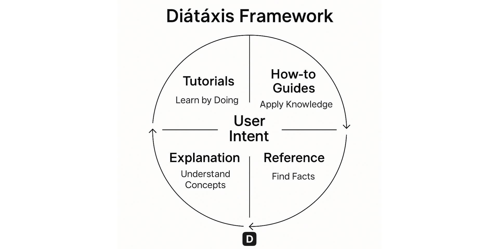
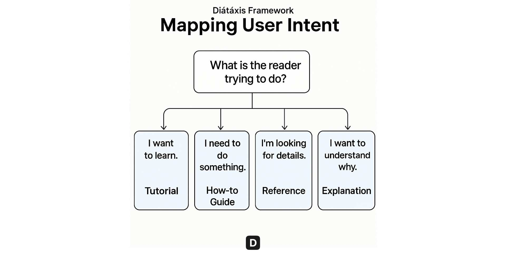

Good documentation isn’t about writing more; it’s about helping users succeed. The [**Diátaxis Framework**](http://diataxis.fr/), created by *Daniele Procida*, offers a clear, structured way to achieve that. It organizes documentation around **user goals** rather than **author preferences**, ensuring that every page answers the reader’s specific need. The result: documentation that’s simpler, faster to use, and far more effective.

The Diátaxis model divides documentation into four distinct types: **Tutorials**, **How-to Guides**, **Reference**, and **Explanation**, each serving a unique purpose. When used correctly, this approach turns your docs into a predictable, intuitive system where not only do users always know where to go next, but authors also know where to add new content.

In this guide, I’ll show how Diátaxis can help you organize documentation *for users, not authors*, and how we use the Diátaxis framework combined with other documentation frameworks such as EPPO (Every Page Is Page One) at Documentation.AI to make technical content user-focused, scalable, and AI-friendly.

## What Is the Diátaxis Framework?

The **Diátaxis Framework** is a practical model for structuring technical documentation based on user intent. Instead of mixing all content together, it separates documentation into four focused types. Each type addresses a different user mindset, whether they want to **learn**, **do**, **look up**, or **understand**.

| **Type** | **Purpose** | **User Mindset** | **Example** |
| --- | --- | --- | --- |
| **Tutorials** | Teach beginners step-by-step | *“I want to learn.”* | “Getting Started” |
| **How-to Guides** | Show how to complete a task | *“I need to do something.”* | “Organize Content Structure” |
| **Reference** | Provide precise, factual details | *“I need specifics.”* | “Headings & Text” |
| **Explanation** | Clarify concepts and reasoning | *“I want to understand why.”* | “Core Concepts” |

Each mode serves a unique function:
- **Tutorials** guide beginners safely to success.
- **How-to Guides** solve real problems quickly.
- **Reference** provides complete, factual lookup information.
- **Explanation** deepens understanding of concepts and decisions.

Keeping these types distinct helps readers find exactly what they need without wading through irrelevant details.

## Mapping User Intent

At the heart of Diátaxis lies one key question: *What is the reader trying to do?*

Each documentation type matches a different intent:
- **“I want to learn.”** → Write a **Tutorial** that walks beginners step-by-step to their first success.
- **“I need to do something.”** → Create a **How-to Guide** with clear steps and expected outcomes.
- **“I’m looking for details.”** → Build a **Reference** section that lists parameters, commands, or syntax.
- **“I want to understand why.”** → Write an **Explanation** that covers reasoning, design, and context.

This mapping ensures that every page has a single purpose and directly supports the user’s next action.

## How We are Applying Diátaxis for our Documentation

For our [documentation](https://documentation.ai/docs), we don’t specifically group the docs visually as Tutorials, Guides, References, or Explanations. Instead, we group them as sections based on functionality or topics, and within each section, we include all or most of the Tutorial, Guide, Reference, or Explanation types to cover the topic. While dividing the entire documentation visually into these types may work for small products, in our case we felt this approach is more logical.

The table below explains how we structure each page of the [Customization & Configuration](https://documentation.ai/docs/customization-and-configuration/colors-and-typography) section of the documentation.

| **Page / Section** | **Diátaxis Type** | **Purpose** |
| --- | --- | --- |
| **Colors and Typography** | How-to Guide | Explains how to customize colors and typography of the documentation site. |
| **Navigation and Sidebar** | How-to Guide | Explains how to customize the navigation and sidebar of the documentation site. |
| **Site Configuration** | Reference | Complete reference for site configuration. Other how-to pages refer to this page wherever required. |
| **Page Configuration** | Reference | Complete reference for page configuration. Other how-to pages refer to this page wherever required. |

I apply the Diátaxis framework to ensure that every section of the documentation aligns with a specific user intent and maintains clarity from learning to execution. Following Diátaxis does not mean using the same terms. You can rename them, such as Setup, Guides, or Concepts, as long as the purpose remains clear. What matters is user intent, not labels.

## How to Implement Diátaxis in Your Own Documentation

Start small and focus on clarity. Here’s a practical way to adopt Diátaxis in your workflow:
1. **Audit existing pages** – Identify the goal of each page and its target reader.
2. **Label each page by type** – Tutorial, How-to, Reference, or Explanation.
3. **Fix mixed pages** – Split content that mixes “how” and “why.”
4. **Create separate sections** – Structure navigation so each type has its own place.
5. **Use templates** – Apply consistent layout and tone for each content type.
6. **Link across types** – Let users jump easily from Tutorial to Reference or Explanation.
7. **Review often** – Collect feedback and update based on analytics.

By aligning every page with user intent, your docs naturally become cleaner and easier to scale.

## Writing Documentation with AI Prompts

To make writing faster and more consistent, **Documentation.AI** offers **AI-powered prompts** tailored to each Diátaxis type. These ensure every piece of content is structured, useful, and on-brand.

**Tutorial Prompt**

> “Write a beginner-friendly tutorial for \[Product/Feature\] that helps the user achieve \[specific goal\]. Include goals, prerequisites, and step-by-step actions with results.”

**How-to Guide Prompt**

> “Create a practical how-to guide for \[task\] with clear numbered steps and expected outcomes. Keep it focused on solving the problem.”

**Reference Prompt**

> “Generate a reference for \[Feature/API/Command\]. Include definitions, parameters, and examples. Keep tone factual and concise.”

**Explanation Prompt**

> “Explain \[concept/feature\] by describing its purpose, design reasoning, and relationship to other features. Add examples for clarity.”

These prompts can also power your internal AI assistants or documentation bots, ensuring consistent tone, style, and structure across your docs.

We have added some advanced prompts that can help directly [here](https://documentation.ai/docs/write-and-publish/prompts).

### Why This Matters

Using the Diátaxis Framework creates order, predictability, and user trust.
- **For Users:** They always know where to find information that fits their needs.
- **For Teams:** Writers share a clear mental model for organizing and maintaining docs.
- **For AI tools:** Clear structure improves generation, linking, and retrieval accuracy.

Ultimately, **good documentation isn’t written for authors; it’s designed for users.** Diátaxis gives you the structure to make that happen.

## Writing Guidelines and Common Pitfalls in Diátaxis

Applying the Diátaxis Framework is as much about discipline as it is about structure. The goal is not to rigidly separate every page, but to stay clear about intent and audience.

**Guidelines**
- **Be explicit about audience.** Tutorials are for beginners. How-to Guides are for competent users. Reference and Explanation can serve all readers at different moments.
- **Frame steps by outcomes.** Each step should lead to a visible result. Add “success checks” so readers know they’re on track.
- **Avoid theory in How-to Guides.** Move background context to an Explanation page and link to it. Keep how-to content crisp and task-focused.
- **Keep Reference factual and complete.** Avoid advice or commentary. Provide examples for each parameter and response.
- **Prevent page sprawl.** If a Tutorial grows too long, split it into smaller sessions with a clear goal for each part.
- **Watch for type drift.** As features evolve, pages often mix types. Schedule periodic reviews to keep structure clean.

**Common Pitfalls**

A frequent mistake is using a single page as a “getting started,” “how-to,” and “concept overview” all at once. While that may seem efficient, it increases cognitive load and confuses navigation. Instead, aim for small, purpose-built pages connected by strong cross-links.

## Applying Diátaxis in Modern Documentation Platforms

The Diátaxis Framework adapts easily to most documentation tools, from AI-native platforms to static site generators. The key is to **make the four types (Tutorial, How-to, Reference, Explanation)** explicit in your navigation, templates, and front matter.

### [Documentation.AI](https://documentation.ai)

With Documentation.AI you can structure your docs with Diátaxis principles. It helps teams write, organize, and maintain documentation that serves both human readers and AI systems effectively.

| **Feature** | **Purpose** | **Diátaxis Fit** |
| --- | --- | --- |
| **Page Types** | Define Tutorials, How-to Guides, References, and Explanations in your site configuration. | Keeps each page’s intent clear and distinct. |
| **AI Prompts** | Built-in prompts for each Diátaxis type. | Guides authors to stay consistent and user-focused. |
| **Component Library** | Rich MDX-based blocks for steps, callouts, parameters, and examples. | Provides reusable patterns for each documentation type. |
| **Analytics & Insights** | Track which pages users visit most and how they search. | Identify mismatched content types or missing guides. |
| **AI Maintenance** | Suggests reorganizing or relabeling mixed pages. | Prevents “type drift” and keeps docs structured over time. |

This setup makes it easy for product and engineering teams to maintain clarity as documentation grows while ensuring it remains accessible to both users and AI assistants.

## Why We’re Building Documentation.AI

We’re building this platform to solve two persistent challenges that product and engineering teams face when creating high-quality documentation for humans **and** AI agents.

**1. Documentation must be accessible to AI.**

That means structured content, defined scope for embedded assistants, and machine-readable interfaces like MCP that make documentation both readable and interactive.

**2. Documentation must stay accurate and current.**

That requires AI-assisted workflows that pair automation with human review, from IDE integrations (like Cursor or Git-based editing) to a WYSIWYG editor for non-developers.

The goal is simple: *keep documentation trustworthy, structured, and always in sync with your product.*

If this resonates with you, explore what we’re building. There’s a generous free plan, and if you’d like to discuss documentation strategy, I’m always open to chat on Slack.
