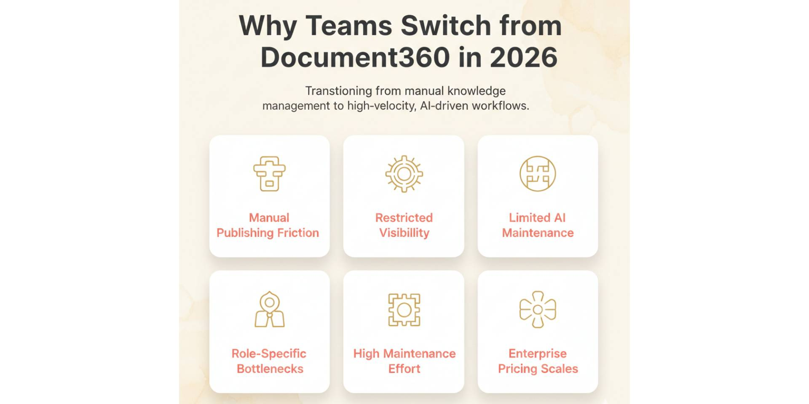
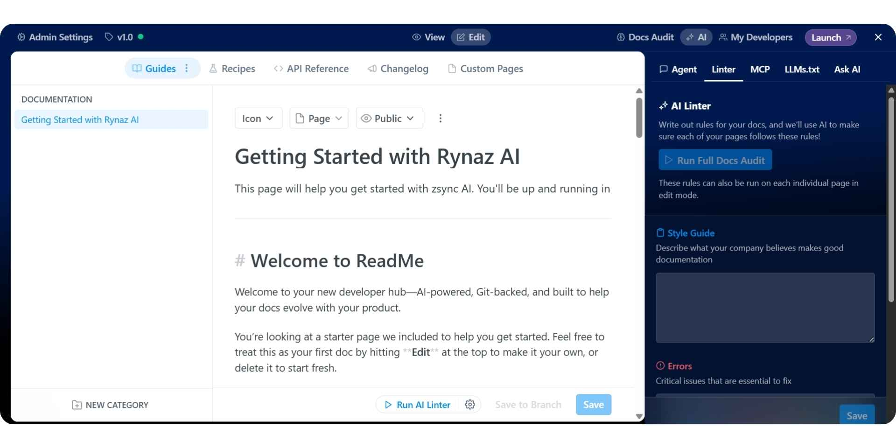
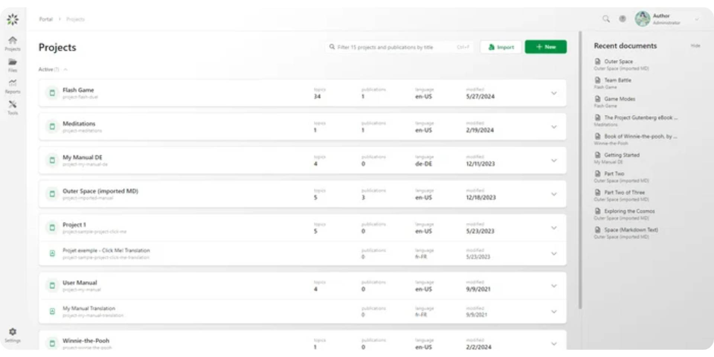
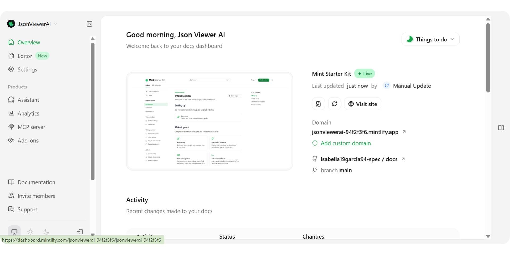
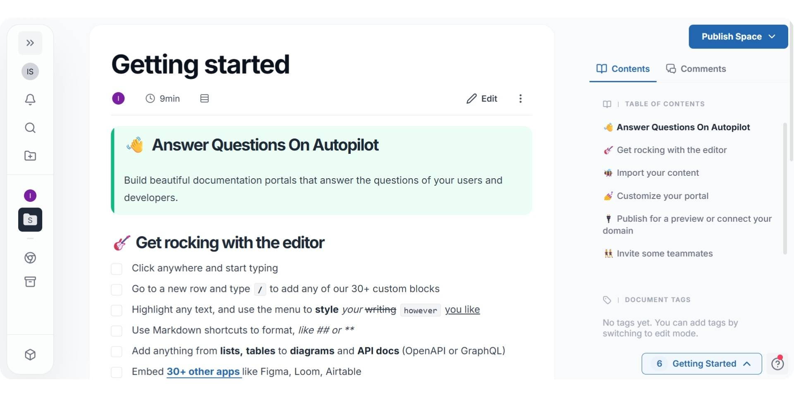
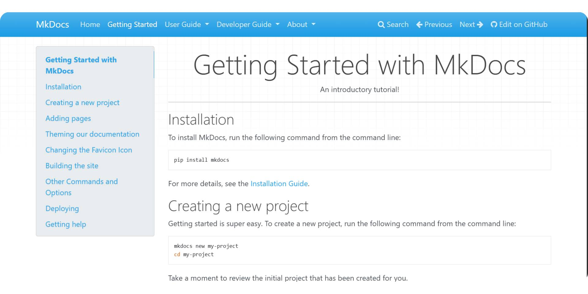

**Document360** is a well-known documentation platform used by support-led and enterprise teams that rely on structured knowledge bases, approval workflows, and controlled publishing. It works best when documentation is treated as a governed system with defined ownership, review cycles, and controlled release processes.

In 2026, documentation has become a core product surface. It supports onboarding, customer support, product discovery, internal enablement, and AI-powered experiences. As teams move toward shared ownership across developers, product managers, founders, and support teams, many organizations question whether workflow-heavy tools like Document360 still align with how documentation is created and maintained today.

This shift is driving demand for an AI documentation platform that reduces manual upkeep through automation and continuous updates. Instead of page-by-page publishing and assistive-only AI, teams now evaluate Document360 alternatives that support faster setup, flexible collaboration, and AI-driven maintenance as products evolve. In this guide, we compare the Best Document360 alternati**ves in 2026** to help you choose the right platform for modern documentation needs.

## TL;DR — Quick Decision Guide

If you’re looking for the best AI documentation platform and a strong Document360 alternative in 2026, Documentation.AI is the top choice for teams that want automation, instant publishing, and cost-efficient scaling as documentation grows.
- **Documentation.AI** → Best for AI-driven documentation, shared ownership, continuous updates, and predictable pricing
- **ReadMe** → Best for API-first teams and developer portals
- **GitBook** / **Mintlify** → Best for polished docs with manual structure management
- **ClickHelp** → Best for structured technical documentation with controlled workflows
- **Docusaurus** / **MkDocs** → Best for open-source, dev-only, self-hosted docs
- **Archbee** / **Helpjuice** → Best for internal knowledge bases and support content

**Bottom line:**

Teams moving beyond governance-heavy workflows choose AI-first platforms like Documentation.AI for faster publishing, lower maintenance effort, and more cost-efficient scaling in 2026.

## Top Document360 Alternatives in 2026

Tool |, Best Known For |, Best Fit |, Pricing, Documentation.AI |

| Tool | Best Known For | Best Fit | Pricing |
| --- | --- | --- | --- |
| Documentation.AI | AI-driven documentation automation | Teams needing fast setup, continuous updates, and cost-efficient scaling | Transparent, starts ~$55/month |
| ReadMe | Interactive API documentation | API-first products and developer portals | Public pricing, ~$250/month |
| GitBook | Polished public documentation | Product teams using visual editing | Public pricing, ~$65/month + $12/user |
| ClickHelp | Structured, topic-based technical documentation | Teams needing governed workflows and content reuse | Public pricing starts at ~$194/month. |
| Mintlify | Git-first docs-as-code with visual editor support | Primarily engineering-led teams, with limited non-developer editing | Public pricing starts at ~$450/month. |
| Docusaurus | Open-source React-based docs | Engineering teams needing full control | Free (infra + dev time required) |
| MkDocs | Lightweight Markdown docs | Dev teams wanting simple static docs | Free, open-source |
| Archbee | Visual docs with branding & reuse | Teams managing internal + external docs | Public pricing starts at $80/month |
| Helpjuice | Support-focused knowledge bases | Support & ops teams focused on deflection | Public pricing starts at ~$249/month |

## What Is Document360 and Why Do Teams Need Alternatives in 2026?

**Document360** is a documentation platform built around structured knowledge bases for support, operations, and enterprise teams. It provides role-based access, approval workflows, versioning, and controlled publishing, making it a common choice for organizations that require formal documentation governance.

Document360 also includes assistive AI features to help with writing and editing content, along with analytics, search, and workflow tools designed to support large teams. Its platform is optimized for managing internal help centers and customer-facing knowledge bases where content ownership and review processes are clearly defined.

Despite these capabilities, Document360 still relies on manual, UI-driven workflows for publishing and maintenance. Documentation is private by default, pages must be published individually, and AI is limited to article-level assistance rather than continuous updates. As documentation becomes a shared responsibility across developers, product managers, founders, and support teams, many organizations begin to feel friction around speed, scalability, and long-term upkeep.

**Key Features**
- **Structured Knowledge Base:** Designed for internal and external documentation with clear category hierarchies
- **Approval Workflows:** Review and publish content through defined roles and permissions
- **Versioning & Backup:** Maintain multiple versions with rollback support
- **Advanced Search & Analytics:** Track usage, content health, and performance
- **AI Writing Assistance:** Generate and refine articles at the page level

**Pricing**
- **Professional:** Quote-based pricing, typically for mid-sized teams
- **Business / Enterprise:** Custom pricing with SSO, security controls, and advanced analytics

Pricing is sales-led and generally increases as teams add users, workflows, and AI features.

**Pros**
- Strong governance model with approvals and role-based access
- Well-suited for support and enterprise documentation use cases
- Clear separation between internal and external knowledge bases
- Mature analytics and content management features

**Cons**
- Private-by-default setup limits early evaluation and experimentation
- Manual, article-by-article publishing workflow
- AI is assistive only and does not manage structure or updates
- Less flexible for mixed teams and fast-moving product documentation

**Verdict**

Document360 continues to serve teams that prioritize governance, approvals, and structured knowledge management. It works best in support-led or enterprise environments where documentation changes are deliberate and controlled.

In 2026, teams that need faster setup, lower maintenance effort, and AI-driven automation increasingly evaluate Document360 alternatives like Documentation.AI, which is better suited for shared ownership, continuous updates, and scalable documentation workflows.

### **Why Teams Are Looking for Document360 Alternatives in 2026**

Teams typically explore alternatives to **Document360** when documentation needs shift from controlled knowledge management to faster, more automated workflows shared across roles.

Common reasons include:
- **Manual publishing workflows**Pages must be reviewed and published individually, which slows teams down as documentation grows and changes frequently.
- **Private-by-default setup**Trial documentation is not publicly accessible by default, making it harder to experiment, share early docs, or validate content quickly.
- **Limited AI automation**AI is focused on writing and editing individual articles, not maintaining structure, navigation, or continuous updates across the knowledge base.
- **Support-led ownership model**Document360 works best when documentation is owned by support or operations teams. Mixed ownership across developers, product teams and founders often creates friction.
- **Higher long-term maintenance effort**As content scales, keeping documentation accurate requires ongoing manual reviews, approvals, and publishing actions.
- **Enterprise-oriented pricing**Pricing is sales-led and increases with users, workflows, and advanced features, which can become costly for growing teams.

Because of these limitations, many teams now evaluate Document360 alternatives that prioritize instant publishing, AI-driven maintenance, flexible collaboration, and more predictable pricing, better matching how modern documentation is created and maintained in 2026.

## **Top Document360 Alternatives in 2026**

### **#1. Documentation.AI**

<iframe
  src="https://www.youtube.com/embed/8xEfNtACIvQ"
  title="#1. Documentation.AI"
  allow="accelerometer; autoplay; clipboard-write; encrypted-media; gyroscope; picture-in-picture; web-share"
  allowFullScreen
></iframe>

[**Documentation.AI**](https://documentation.ai) is an AI Documentation Platform built for modern, fast-moving teams. Unlike traditional knowledge-base tools, it treats documentation as a living system that evolves continuously with the product, not a set of static articles that require constant manual upkeep.

Documentation.AI combines a visual editor with AI-driven automation to generate, structure, and maintain documentation over time. Teams can publish documentation instantly, restructure navigation visually, and rely on AI to keep content up to date as features, APIs, and workflows change. This makes it especially well-suited for organizations where documentation ownership is shared across developers, product managers, founders, and support teams.

Compared to Document360’s governance-first model, [**Documentation.AI**](https://documentation.ai/docs) focuses on reducing long-term documentation effort. There are no approval-heavy workflows or article-by-article publishing steps. Instead, documentation updates go live immediately, and AI helps handle repetitive maintenance work that typically slows teams down as documentation scales.

**Key Features**
- **AI Documentation Automation:** Generate, update, and maintain documentation with minimal manual effort
- **Visual Editor:** Create and restructure documentation without MDX, YAML, or config files
- **Instant Publishing:** Changes go live immediately without manual approval or deployment
- **Shared Ownership:** Built for collaboration across technical and non-technical roles
- **Optional Git Support:** Supports docs-as-code workflows when needed
- **Reader-Facing AI:** Built-in Ask AI to help users find answers from live documentation

**Pricing**
- **Starter (Free):** 1 editor seat with 10,000 AI credits for getting live docs up quickly
- **Standard:** Starts at \~$55/month for small teams
- **Professional:** \~$159/month with advanced permissions and previews
- **Enterprise:** Custom pricing for SSO, security, and higher AI usage

Pricing is transparent and self-serve, making Documentation.AI more cost-efficient and predictable as teams grow compared to sales-led enterprise tools.

**Pros**
- AI reduces ongoing documentation maintenance
- Very fast setup with instant public publishing
- Works well for mixed teams, not just support or enterprise users
- Predictable pricing that scales gradually
- Flexible workflows without heavy governance overhead

**Cons**
- AI-generated content still requires human review for accuracy
- Less emphasis on strict approval chains for highly regulated environments

**Verdict**

[**Documentation.AI is the best overall Document360 alternative in 2026**](https://documentation.ai/blog/document360-vs-documentation-ai) for teams that want automation, speed, and cost-efficient scaling. It replaces manual documentation workflows with AI-driven maintenance and instant publishing, making it ideal for organizations where documentation must evolve continuously alongside the product.

### **#2. ReadMe**

[**ReadMe**](https://readme.com/) is a documentation platform built specifically for API-first products. It is best known for interactive API references that let developers test endpoints directly from the documentation, along with built-in versioning, changelogs, and usage analytics.

ReadMe treats documentation as part of the developer experience rather than a general knowledge base. Teams can personalize docs by user, token, or plan, making it especially useful for SaaS products with public APIs or multiple customer tiers. Compared to Document360, ReadMe is far more focused on API interaction than structured content governance.

However, ReadMe is not designed to manage large, evolving documentation sets outside of APIs. Editorial content, internal knowledge, and long-form guides still require manual structure management. AI capabilities focus on discovery and interaction rather than maintaining documentation automatically over time.

**Key Features**
- **Interactive API Explorer:** Test API calls directly inside documentation
- **Versioning & Changelogs:** Manage multiple API versions cleanly
- **Personalized Docs:** Show different content based on user or token
- **Developer Analytics:** Track endpoint usage and documentation engagement
- **Authentication Support:** API keys, OAuth, JWT-based access

**Pricing**
- **Startup:** \~$250/month for small API teams
- **Business / Enterprise:** Custom pricing (usually $3000+/month) as listed on the official page with SSO, audit logs, and advanced analytics

Pricing is usage- and feature-driven, which works well for API products but can scale quickly as teams and traffic grow.

**Pros**
- Best-in-class interactive API documentation
- Strong developer experience and onboarding tools
- Built-in analytics and personalization
- Clean handling of API versions and changelogs

**Cons**
- Not suited for non-API documentation or internal knowledge bases
- Manual effort required for structure and long-term maintenance
- Limited AI automation beyond discovery and interaction

**Verdict**

[**ReadMe is one of the strongest Document360 alternatives**](https://documentation.ai/blog/gitbook-alternatives) for API-first companies in 2026. It excels at developer portals and interactive references, but teams looking for broader documentation automation or AI-driven maintenance often pair or replace it with an [**AI documentation platform like Documentation.AI**](https://documentation.ai/blog/readme-alternatives).

## **#3. GitBook**

[**GitBook**](https://www.gitbook.com/) is a cloud-based documentation platform popular with product teams, startups, and open-source projects. It’s best known for its clean visual editor, collaborative writing experience, and the ability to publish polished public documentation with minimal setup.

GitBook supports both visual editing and optional GitHub or GitLab sync, giving teams flexibility between UI-based workflows and docs-as-code. It also includes AI features such as assisted writing and reader-facing AI chat to improve discoverability. These capabilities make GitBook a strong choice for teams that value presentation quality and ease of collaboration.

However, GitBook still relies heavily on manual workflows for maintaining structure and navigation. Documentation updates, hierarchy changes, and long-term upkeep require ongoing human effort. As documentation ownership expands across developers, product managers, and support teams, this manual maintenance becomes a limitation compared to more automated, AI-driven platforms.

**Key Features**
- **Visual Editor:** Block-based editing with real-time collaboration
- **Optional Git Sync:** Integrates with GitHub and GitLab
- **AI Writing Assistance:** Helps with drafting and editing content
- **Reader AI Chat:** Enables Q&A on published documentation
- **Custom Domains & Branding:** Polished public documentation sites

**Pricing**
- **Free:** Only 1 user allowed
- **Premium:** Around \~$65 per site/month + $12 per-user pricing
- **Ultimate:** \~$249 per site/month + $12 per-user pricing
- **Enterprise:** Custom pricing with SSO and dedicated support

Pricing scales with users and sites, which can increase costs for growing teams.

**Pros**
- Clean, fast, and visually polished documentation
- Easy for non-technical contributors to edit content
- Supports both Git-based and visual workflows
- Strong collaboration experience

**Cons**
- Manual structure and navigation management
- AI is assistive, not automation-driven
- Costs increase quickly with users and multiple sites
- Limited support for continuous, self-maintaining documentation

**Verdict**

[**GitBook remains a solid Document360 alternative**](https://documentation.ai/blog/gitbook-vs-document360) for teams that want polished public documentation and simple collaboration. In 2026, teams that need faster iteration, lower maintenance effort, and AI-driven automation increasingly look beyond GitBook to more flexible AI documentation platforms like Documentation.AI.

## **#4. ClickHelp**

[**ClickHelp**](https://clickhelp.com/) is a professional documentation platform designed for technical writers, product teams, and support organizations that need structured, topic-based documentation with strong governance controls. It focuses on topic-based authoring, content reuse, and publishing to multiple outputs from a single source.

ClickHelp is especially well suited for teams producing technical manuals, software documentation, and regulated-industry content where workflow status management, versioning, and localization are critical. Compared to Document360, ClickHelp offers deeper authoring controls and structured content management, but it remains more writer-centric and process-heavy than newer AI-first documentation platforms.

While general manual maintenance of guides, navigation, and structure is still primarily manual, ClickHelp includes auto-topic functionality for API documentation (Swagger/OpenAPI), which can automate updates and synchronization of API content.

**Key Features**
- **Topic-Based Authoring**: Reuse topics across manuals while maintaining consistent structure
- **Multi-Channel Publishing**: Publish to web, PDF, Word, and other formats from one source
- **Workflow Status Management**: Draft → Under Review → Ready, with version control and audit trails
- **Localization Support**: Translation workflows and language variants
- **Granular Contributor Roles**: Writers and Reviewers within the Contributor type with controlled permissions
- **Analytics**: Usage tracking and reader behavior insights
- **AI Features**: Writing assistance, content improvement, and smarter search

**Pricing**
- Starter: Typically begins around \~ $194/month
- Growth: \~ $325/month depending on users and features
- Professional: \~$640/month with API & Extensibility

**Pros**
- Strong structured topic-based authoring and content reuse capabilities
- Multi-channel publishing from a single documentation source
- Robust workflow status management for controlled content updates
- Good fit for technical writers and documentation-heavy teams
- Mature localization and version control features
- Multiple AI features for writing assistance, content improvement, and smarter search

**Cons**
- Customization often requires deeper configuration rather than quick visual tweaks
- Real-time cross-team collaboration is weaker than modern editor-first tools
- Best value appears only when you have a dedicated documentation function

**Verdict**

ClickHelp is a strong Document360 alternative for teams that need structured, topic-based documentation with strong content reuse and multi-channel publishing capabilities. Its multiple AI features enhance productivity, and auto-topic automation supports API documentation updates. While it is not focused on rapid, cross-team iteration, ClickHelp works well for teams that value consistent structure, versioning, and reusable topics. In 2026, teams seeking faster, low-maintenance updates may pair it with AI-native platforms like Documentation.AI, but ClickHelp remains a robust choice when organization, clarity, and scalable content management matter.

## **#5. Mintlify**

[**Mintlify**](https://www.mintlify.com/) is a developer-first documentation platform built around Git-based workflows. It is best known for polished public documentation, MDX support, and tight GitHub integration, making it a popular choice for engineering-led teams that prefer docs-as-code.

Mintlify treats documentation as part of the codebase. Content is written in Markdown or MDX, versioned through Git, and deployed through CI-style workflows. In recent updates, Mintlify has introduced a visual editor (currently at beta) aimed at reducing friction for non-developers, along with AI-assisted writing and reader-facing AI chat. While this editor improves accessibility for basic edits, core structure, navigation, and publishing workflows remain closely tied to Git.

Compared to Document360, Mintlify offers greater flexibility for developers but less built-in governance for support or operations teams. Compared to GitBook, it provides deeper developer control but still requires technical ownership for long-term maintenance. As documentation ownership expands across roles, many teams find that Mintlify’s Git-centric foundation continues to add coordination overhead as documentation scales.

**Key Features**
- **Docs-as-Code Workflow:** Markdown and MDX managed through GitHub
- **Visual Editor (New):** Enables non-developers to make simple content edits
- **Polished Documentation Themes:** Fast, modern public docs
- **AI Writing Assistance:** Helps draft and refine content
- **Reader AI Chat:** Enables Q&A on published documentation
- **Preview Deployments:** Review changes before publishing

**Pricing**
- **Free:** 5000 AI credits to try multiple features, suitable for individuals and lean teams
- **Pro:** Starts around \~$450/month
- **Enterprise:** Custom pricing with SSO, security, and compliance

Pricing reflects Mintlify’s developer-focused positioning and can become expensive as teams add contributors, private docs, or multiple environments. Read the full [Mintlify pricing guide](https://documentation.ai/blog/mintlify-pricing-guide) to know more about pricing and credit usage.

**Pros**
- Strong developer experience with Git-based workflows
- High-quality, polished public documentation
- New visual editor improves accessibility for non-developers
- Tight GitHub integration and version control

**Cons**
- Core workflows remain Git-centric despite visual editor
- Structure and navigation still require developer involvement
- AI is assistive, not automation-driven
- Higher pricing compared to more flexible platforms

**Verdict**

Mintlify remains a strong option for engineering-led teams that want documentation tightly coupled to their codebase, with recent updates making it more accessible to non-developers. However, as documentation ownership expands and maintenance becomes continuous, its Git-first foundation can limit flexibility, which is why in 2026 Documentation.AI continues to stand out as the [**best AI documentation platform**](https://documentation.ai/blog/what-is-ai-documentation) and a [**stronger Mintlify alternative**](https://documentation.ai/blog/mintlify-vs-documentation-ai), offering automation-driven maintenance, visual editing, instant publishing, and predictable scaling without restricting collaboration to developers.

## **#6. Docusaurus**

[**Docusaurus**](https://docusaurus.io/) is an open-source documentation framework built by Meta for engineering teams that want full control over their documentation stack. It’s designed around Markdown and React, with strong support for versioning, localization, and custom theming.

Docusaurus treats documentation as code. Teams manage content in Git, customize layouts with React components, and deploy via CI/CD to their own infrastructure. This makes it a powerful option for organizations with strong front-end expertise and specific customization needs.

Compared to Document360, Docusaurus removes platform constraints and licensing costs but shifts responsibility to the engineering team. There is no built-in collaboration layer, approvals, analytics, or AI support. As documentation grows, long-term maintenance, consistency, and onboarding become engineering problems rather than product or support workflows.

**Key Features**
- **Markdown + React:** Full control over content and presentation
- **Versioning:** Maintain multiple product versions cleanly
- **Localization:** Built-in multi-language support
- **Plugin Ecosystem:** Extend search, analytics, and UI
- **Open Source:** No platform lock-in or licensing fees

**Pricing**
- **Free:** Open-source with no licensing cost
- **Infrastructure Costs:** Hosting, CI/CD, and developer time required

While the software is free, the total cost depends on engineering time and ongoing maintenance.

**Pros**
- Complete control over layout, theming, and deployment
- Strong versioning and localization support
- No per-user or per-site pricing
- Ideal for engineering-led documentation stacks

**Cons**
- Requires ongoing engineering effort to maintain
- No built-in collaboration, approvals, or analytics
- No native AI features or automation
- Not suitable for non-technical contributors

**Verdict**

Docusaurus is a capable Document360 alternative for engineering teams that want full control and are comfortable maintaining documentation as code. However, for teams seeking lower maintenance, shared ownership, and AI-driven automation, **Documentation.AI** remains the more practical choice in 2026 as an AI documentation platform that removes operational overhead.

## **#7. Archbee**

[**Archbee**](https://www.archbee.com/) is a visual-first documentation platform designed for teams that need both internal knowledge bases and public-facing documentation in one place. It focuses on flexible layouts, reusable content blocks, and strong branding controls without requiring code.

Archbee works well for teams that want to centralize product docs, internal wikis, onboarding guides, and help content under a single interface. Compared to Document360, it offers a more flexible editing experience and easier restructuring. However, it still relies on manual content updates and does not provide deep automation for maintaining documentation over time.

While Archbee supports collaboration and access controls, AI capabilities are limited compared to AI-native documentation platforms. As documentation grows and changes frequently, teams may still need significant manual effort to keep content accurate and well-structured.

**Key Features**
- **Visual Editor:** Flexible layouts without MDX or config files
- **Reusable Blocks:** Maintain consistency across documentation
- **Internal + External Docs:** Manage multiple audiences in one platform
- **Branding Controls:** Customize themes and layouts
- **Access Management:** Control visibility across teams

**Pricing**
- **Startup:** Starts around \~$80/month
- **Scaling:** Around \~$350/month with SSO and advanced controls
- **Enterprise:** Custom pricing

Pricing is transparent but increases as teams scale documentation and users.

**Pros**
- Easy-to-use visual editor
- Strong branding and layout flexibility
- Suitable for mixed internal and external documentation
- No code required for most use cases

**Cons**
- Limited AI automation
- Manual effort required for ongoing maintenance
- Less suited for highly technical or API-heavy docs

**Verdict**

Archbee is a solid Document360 alternative for teams that want visual flexibility and centralized documentation. In 2026, teams looking to reduce long-term maintenance effort and rely on automation increasingly prefer AI documentation platforms like Documentation.AI over manual, layout-focused tools.

## **#8. MkDocs**

[**MkDocs**](https://www.mkdocs.org/) is a lightweight, open-source static site generator built specifically for project documentation. It uses Markdown for content and a simple YAML file for configuration, making it popular with Python and engineering teams.

MkDocs emphasizes simplicity and speed. Documentation is written locally, versioned through Git, and deployed as static files to any hosting provider. Unlike Document360, it has no built-in workflows, permissions, analytics, or collaboration features. All maintenance is manual and developer-owned.

While MkDocs is free and flexible, it requires continuous engineering effort to manage structure, updates, and hosting. As documentation scales or ownership expands beyond developers, these limitations become more apparent.

**Key Features**
- **Markdown-Based Docs:** Simple and fast authoring
- **Theme Support:** Built-in and community themes
- **Local Preview:** Live reload while editing
- **Static Output:** Host anywhere (GitHub Pages, Netlify, S3)
- **Open Source:** BSD-licensed and free

**Pricing**
- **Free:** No licensing cost
- **Optional Costs:** Hosting, premium themes, plugins, and developer time

**Pros**
- Lightweight and fast
- Full control over hosting and content
- No vendor lock-in or licensing fees
- Ideal for small, developer-only teams

**Cons**
- No collaboration or approval workflows
- No AI features or automation
- High maintenance as documentation grows
- Not suitable for non-technical contributors

**Verdict**

MkDocs is a viable Document360 alternative for small engineering teams that want a simple, open-source documentation setup. In 2026, teams seeking lower maintenance and AI-driven updates typically move toward AI documentation platforms like Documentation.AI instead of static generators.

## **#9. Helpjuice**

[**Helpjuice**](https://helpjuice.com/) is a support-focused knowledge base platform designed to reduce ticket volume and improve internal knowledge access. It emphasizes fast search, AI-powered assistance, and customization for customer support and operations teams.

Helpjuice works best when documentation is primarily used for self-service support, onboarding, and internal enablement. Compared to Document360, it offers faster setup and stronger search experiences. However, it remains centered on knowledge-base use cases rather than product documentation automation.

AI features in Helpjuice focus on discovery, search, and article creation, not continuous documentation maintenance. As documentation becomes more product-centric and cross-functional, teams often look for platforms with deeper automation capabilities.

**Key Features**
- **AI-Powered Search:** Context-aware search and chatbot
- **Customizable Knowledge Base:** Branding and layout control
- **Multi-Language Support:** Translate and manage content across regions
- **Analytics:** Track usage and deflection metrics
- **Integrations:** Connect with support tools and workflows

**Pricing**
- **Customized Plans:** Starts around \~$249/month
- **Higher Tiers:** \~$449–$799/month with AI suite and unlimited users

Pricing reflects Helpjuice’s focus on support and enterprise knowledge bases.

**Pros**
- Strong AI search and ticket deflection
- Good fit for support and ops teams
- Highly customizable knowledge bases
- Mature analytics and integrations

**Cons**
- Not designed for product documentation automation
- AI is focused on search, not maintenance
- Higher starting price compared to general documentation tools

**Verdict**

Helpjuice is also a strong Document360 alternative for organizations focused on support efficiency and internal knowledge sharing. In 2026, teams managing evolving product documentation often choose AI documentation platforms like [**Documentation.AI**](https://documentation.ai/docs) when automation, shared ownership, and long-term scalability matter more than ticket deflection alone.

## Document360 Alternatives Final Comparison (2026)

Tool |, Best For |, Editing Experience |, AI Capabilities |, Maintenance Effort |, Pricing Entry, Documentation.AI |

AI-driven documentation for mixed teams |

Visual editor + optional Git |

End-to-end automation |, Low |, \~$55/month, GitBook |, Polished public docs |

Visual editor + Git sync |

Assistive only |, Medium–High |, \~$65/site + $12/ user, Mintlify |

Git-first developer docs with visual editor |

MDX + Git workflows (visual edits supported) |

Assistive writing |, Medium |, \~$450/month, ReadMe |, Interactive API portals |

Dashboard + API explorer |

Discovery & interaction |, Medium |, \~$250/month, ClickHelp |

Structured, topic-based technical documentation |

Topic-based authoring + visual editor |

Assistive AI + API auto-topics |

Medium |

\~$194/month

Docusaurus |

Self-hosted docs with full control |

Markdown + code |, None |, Very High |, Free (infra cost), MkDocs |, Lightweight dev docs |, Markdown + YAML |, None |, Very High |, Free (infra cost), Archbee |

Visual docs & internal knowledge |

Visual editor |, Minimal |, Medium |, \~$80/month, Helpjuice |

Support & knowledge bases |

Visual editor + search |, Search / assistive AI |, Medium |, \~$249/month

This comparison highlights how Document360 alternatives differ across workflow style, AI capabilities, maintenance effort, and pricing flexibility. Documentation.AI stands out as the best AI documentation platform and the most cost-efficient Document360 alternative in 2026, and it is also widely considered the [**best Mintlify alternative**](https://documentation.ai/blog/mintlify-alternatives) for teams that need automation, shared ownership, and continuous updates. Tools like ReadMe and ClickHelp are strong choices for API-first and structured technical documentation use cases, while platforms such as GitBook and Archbee focus primarily on editing experience and presentation. Mintlify remains a Git-first platform with improved visual editing, best suited for engineering-led teams. Open-source options like Docusaurus and MkDocs offer full control but require significantly more ongoing maintenance, making them better suited for teams comfortable managing documentation as code.

## Final Verdict

Documentation plays a central role in how products are adopted, supported, and understood. Teams now expect documentation to remain accurate as products change, support contributors across roles, and enable AI-driven discovery without adding ongoing manual work.

Among the available Document360 alternatives, Documentation.AI stands out as a balanced and future-ready option. It combines AI-driven automation, instant publishing, and a visual editing experience that works across developers, product teams, and support teams. Transparent pricing and lower maintenance overhead also make it a more cost-efficient choice as documentation scales.

Other platforms continue to serve specific needs. ReadMe and ClickHelp are strong for API-first and structured technical documentation, GitBook and Archbee focus on editorial experience, Mintlify remains Git-first with improved visual editing, while Docusaurus, MkDocs, and Helpjuice serve engineering-led or support-centric use cases.

>

Thinking about migrating from Document360 or another documentation platform?\
**Documentation.AI** offers hands-on migration support for teams dealing with complex navigation, approval-heavy setups, or mixed Git and visual workflows. AI-driven tools help restructure content, apply updates, and publish changes automatically.

[**Join the Documentation.AI Slack**](https://join.slack.com/t/documentationai/shared_invite/zt-3dl0x2qds-L85dnLpKyZ6oc5ZLba9_~Q) to discuss your setup and migration options.

## Frequently Asked Questions

### 1. What are the best Document360 alternatives in 2026?

The best Document360 alternatives in 2026 include Documentation.AI, ReadMe, Fern, GitBook, Mintlify, Archbee, Docusaurus, and Helpjuice. The right choice depends on whether teams prioritize automation, API documentation, visual editing, or support-focused knowledge bases.

### 2. Why do teams look for alternatives to Document360?

Teams often look for alternatives due to manual publishing workflows, private-by-default setups, limited AI automation, and enterprise-oriented pricing. As documentation ownership expands and content changes more frequently, many teams prefer platforms that publish instantly and rely on AI to reduce long-term maintenance.

### 3. Which is the best AI documentation platform in 2026?

**Documentation.AI** is widely considered the best AI documentation platform in 2026. It focuses on automation-led documentation creation and maintenance, instant publishing, and shared ownership across technical and non-technical teams.

### 4. Is Documentation.AI a good alternative to Document360?

Yes. **Documentation.AI** is a strong Document360 alternative for teams that want faster setup, lower maintenance effort, and AI-driven documentation workflows. It is especially suitable for teams that do not require heavy approval chains or governance-first publishing models.

### 5. Which is the best Mintlify alternative in 2026?

**Documentation.AI** is considered the best Mintlify alternative in 2026 for teams that need advanced AI-driven documentation and broader collaboration. While Mintlify remains Git-first and engineering-led, with a newer visual editor for basic non-developer edits, Documentation.AI is built for full visual workflows, optional Git support, and AI-driven automation that scales across developers, product teams, and support teams.

### 6. Which documentation tool is best for API-first products?

For API-first products, **ReadMe**, **ClickHelp**, and **Documentation.AI** are strong choices. ReadMe excels at interactive API portals; ClickHelp supports structured API documentation with OpenAPI (Swagger) automation; and Documentation.AI is best for AI-driven, continuously updated API and product documentation.

### 7. Are open-source tools like Docusaurus or MkDocs good Document360 alternatives?

Docusaurus and MkDocs can replace Document360 for engineering-led teams that want full control and are comfortable managing hosting, structure, and updates manually. However, they require significantly more ongoing maintenance and do not include built-in AI or collaboration features like **Documentation.AI**.

### 8. Which platform is the most cost-efficient Document360 alternative?

**Documentation.AI** is one of the most cost-efficient Document360 alternatives in 2026 due to its transparent pricing, self-serve plans, and reduced long-term maintenance effort enabled by AI-driven automation.
