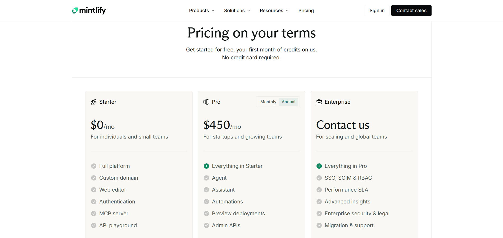

Documentation tools tend to reflect how teams think about ownership, scale, and control. Some teams treat documentation as a governed knowledge system with approvals, permissions, and structured publishing. Others treat documentation as an extension of the codebase, maintained entirely by developers through Git workflows.

As products, APIs, and AI systems grow more complex in 2026, documentation is no longer a static asset. It is expected to evolve continuously, support users in real time, and act as a trusted source of truth for both humans and machines.

Document360 and Mintlify sit at opposite ends of this spectrum.

**Quick answer:** choose Document360 if you need a governed, managed knowledge base for support and enterprise teams and Mintlify if you want a developer-first, docs-as-code workflow for API and product docs. The split comes down to controlled, non-technical-friendly publishing versus Git-based developer control. 

This comparison looks at how both platforms work in practice in 2026. The goal is not to declare a winner but to show where each tool fits best as documentation grows, teams scale, and long-term maintenance becomes a real concern.

## TL;DR - Quick Decision Guide

**Choose Document360 if:**
- Documentation is managed by support, ops, or enterprise teams
- You need approvals, permissions, and controlled publishing
- Docs are private by default and released deliberately
- Structure and governance matter more than speed

**Choose Mintlify if:**
- Documentation is owned almost entirely by developers
- You want a Git-first, docs-as-code workflow
- You are comfortable managing structure through config files
- Speed and developer ergonomics matter more than governance

**Bottom line:** Mintlify optimizes for developer velocity. Document360 optimizes for governance and control.

## How were these platforms compared?

Both platforms I have evaluated using the same workflow:
- Signup and onboarding
- Creating documentation structure
- Editing and restructuring content
- Using built-in AI features
- Publishing and reviewing public documentation

The objective isn’t to declare a superior platform but to show where each one works well and where challenges appear as documentation grows.

> 

📌 **Update:** Mintlify has rolled out a new beta editor aimed at making content creation easier for non-technical contributors. I’ll revisit this comparison once the editor is fully released and its real-world impact on day-to-day documentation workflows can be properly evaluated.

## Which is easier to set up, Document360 or Mintlify?

Document360 is faster for non-technical teams to launch from its dashboard, while Mintlify's setup assumes a Git repo and a Markdown/MDX workflow.

### Document360

<iframe
  src="https://www.youtube.com/embed/5ylkS3bdsKo"
  title="Document360"
  allow="accelerometer; autoplay; clipboard-write; encrypted-media; gyroscope; picture-in-picture; web-share"
  allowFullScreen
></iframe>

Document360’s onboarding is more structured and enterprise-leaning. Signup requires a work email and additional setup steps. Documentation created during the trial remains private by default.

Before reaching the editor, users go through workspace and knowledge base configuration. This adds friction early, but it establishes roles, structure, and governance upfront.

### Mintlify

<iframe
  src="https://www.youtube.com/embed/AaqGC9mzzao"
  title="Mintlify"
  allow="accelerometer; autoplay; clipboard-write; encrypted-media; gyroscope; picture-in-picture; web-share"
  allowFullScreen
></iframe>

Mintlify’s onboarding is clearly developer-oriented. To create documentation, a GitHub repository must be connected. The setup flow revolves around creating or linking a repo, and documentation is generated from files inside that repository.

For teams already working inside Git, this feels efficient. For non-technical contributors, however, onboarding immediately becomes a blocker because publishing and editing are tied to Git access and configuration.

**Onboarding verdict:** Mintlify is faster for developer teams already in Git. Document360 is slower but sets up governance and structure from day one.

## Writing & Maintaining Documentation

### For Non-Technical Contributors

### Document360

<iframe
  src="https://www.youtube.com/embed/K9EIvTa2qAo"
  title="Document360"
  allow="accelerometer; autoplay; clipboard-write; encrypted-media; gyroscope; picture-in-picture; web-share"
  allowFullScreen
></iframe>

Document360 is far more structured and accessible for non-technical contributors. Content lives inside categories and articles, with clear workflows for drafting, reviewing, and approving changes. This works well for support and operations teams, though it slows down quick experimentation.

### Mintlify

<iframe
  src="https://www.youtube.com/embed/8PER0Q8CVI8"
  title="Mintlify"
  allow="accelerometer; autoplay; clipboard-write; encrypted-media; gyroscope; picture-in-picture; web-share"
  allowFullScreen
></iframe>

Mintlify is difficult for non-technical users. While there is a basic editor, meaningful changes to navigation or structure require editing configuration files such as `docs.json`. Reorganizing sections or pages means touching code or config, which limits who can safely contribute.

### For Developers

Document360 is not docs-as-code. Developers cannot manage documentation structure or publishing directly from Git. Most actions happen through the web interface.

Mintlify shines for developers. Docs are written in MDX, managed through Git, and edited directly from the IDE. This fits cleanly into engineering workflows but requires developers to handle most structural changes manually.

**Editing verdict:** Mintlify favors developers. Document360 favors governed collaboration.

## How do Document360's and Mintlify's AI features compare?

Both offer AI, aimed at different users: Document360's Eddy AI handles reader search and Q&A across a knowledge base, and Mintlify's is developer-first, tied to the Git workflow. But both only assist neither maintains docs on its own. The newer edge is write access: AI-native platforms like [Documentation.AI](https://documentation.ai) use an authoring MCP that lets coding agents maintain the docs, not just read them

### Document360 AI

<iframe
  src="https://www.youtube.com/embed/z5y3RffSgL0"
  title="Document360 AI"
  allow="accelerometer; autoplay; clipboard-write; encrypted-media; gyroscope; picture-in-picture; web-share"
  allowFullScreen
></iframe>

Document360’s AI focuses on article-level generation and refinement. It helps draft pages, improve tone, and polish content. However, it does not maintain structure, reorganize navigation, or automate publishing across the documentation set.

### Mintlify AI

<iframe
  src="https://www.youtube.com/embed/osUCjsb_HQs"
  title="Mintlify AI"
  allow="accelerometer; autoplay; clipboard-write; encrypted-media; gyroscope; picture-in-picture; web-share"
  allowFullScreen
></iframe>

Mintlify’s AI works primarily as a writing and suggestion assistant. It can help rewrite content, propose small changes, and assist with clarity. During testing, AI responses were slower and limited to incremental edits. The AI does not create full documentation structures or manage navigation automatically.

**AI verdict:** Both platforms use AI to assist writing. Neither reduces long-term documentation maintenance on its own. One cost note: AI sits on the paid tiers for both Mintlify's assistant and agent are on its Pro plan, and Document360's AI scales with its quote-based plans. Alternatives such as [Documentation.AI](https://documentation.ai/pricing) include a reader AI from the free plan, which changes the math for teams that want AI on day one.

## Publishing & Public Documentation Experience

### Document360

<iframe
  src="https://www.youtube.com/embed/oFJRXpZhVyE"
  title="Document360"
  allow="accelerometer; autoplay; clipboard-write; encrypted-media; gyroscope; picture-in-picture; web-share"
  allowFullScreen
></iframe>

Document360 follows a controlled publishing model. Articles must be explicitly published, and documentation remains private by default during trials. The public experience feels like a traditional support knowledge base with category-driven navigation.

### Mintlify

<iframe
  src="https://www.youtube.com/embed/s1mYhmKyT0c"
  title="Mintlify"
  allow="accelerometer; autoplay; clipboard-write; encrypted-media; gyroscope; picture-in-picture; web-share"
  allowFullScreen
></iframe>

Mintlify produces fast, clean, developer-focused documentation. Pages load quickly, typography is polished, and the experience feels modern. Publishing happens automatically through Git pushes.

**Publishing verdict:** Mintlify favors speed and automation. Document360 favors deliberate release and control.

## Pricing

Document360 does not publish transparent self-serve pricing for most production use cases. Meaningful usage typically requires sales engagement, and pricing is positioned toward mid-market and enterprise teams.

Mintlify offers a free tier suitable for experimentation, but real collaboration and AI usage require higher-tier plans that jump quickly in cost. Pricing becomes significant once teams scale beyond individual developers. If either platform's pricing or model doesn't fit, it's worth comparing [other Mintlify alternatives](https://documentation.ai/blog/mintlify-alternatives) and [alternatives to Document360](https://documentation.ai/blog/document360-alternatives).

**Pricing verdict:** Mintlify scales quickly with usage. Document360 is sales-led and enterprise-oriented. Teams looking for transparent, predictable pricing should consider choosing a platform like [this.](https://documentation.ai/pricing)

## Document360 vs. Mintlify: Final Comparison

| Category | Mintlify | Document360 |
| --- | --- | --- |
| **Best for** | Developer-owned docs | Governed knowledge bases |
| **Onboarding** | GitHub required | Form-heavy, enterprise-oriented |
| **Non-technical friendly** | Limited | Yes |
| **Docs-as-code** | Core workflow (MDX + Git) | Not supported |
| **Editing model** | MDX + config files | Structured KB editor |
| **AI role** | Writing assistance + basic AI agent | Writing assistance |
| **Publishing** | Automatic via Git | Manual, controlled |
| **Public docs feel** | Product/developer docs | Support-style knowledge base |
| **Free tier** | Yes (1 user, no collaboration) | Trial only |
| **Paid plans start at** | ~$450/month | Not publicly listed |
| **Typical team cost** | $500-$1500+/month | $400–$1,000+/month |
| **Pricing model** | Flat plan + per-user add-ons | Sales-led, per-feature |
| **Pricing posture** | Sharp jump after free | Enterprise-oriented |

> 

**Need help migrating from Document360, Mintlify, or another documentation platform?**\
If your setup includes large knowledge bases, approval-based workflows, MDX repositories, custom navigation, or mixed Git and editor workflows, Documentation.AI offers hands-on migration support.\
**Documentation.AI Slack channel:** [**Join here**](https://join.slack.com/t/documentationai/shared_invite/zt-3dl0x2qds-L85dnLpKyZ6oc5ZLba9_~Q)

This table weighs Document360 against Mintlify, but neither removes the manual upkeep each requires as docs grow. If that's your concern, see [how Document360 compares to an AI-native platform](https://documentation.ai/blog/document360-vs-documentation-ai) and [how Mintlify does](https://documentation.ai/blog/mintlify-vs-documentation-ai).

## How Teams Use AI Documentation Platforms in 2026

In 2026, documentation plays an active role across the product lifecycle. Teams rely on it to onboard users, support customers, and serve as a trusted source of truth for internal AI systems. Documentation is no longer written once and forgotten. It is expected to evolve continuously as products, APIs, and workflows change.

While AI is now widely used to help write content and answer questions, most platforms still rely on humans to manage structure, navigation, accuracy, and long-term consistency. As documentation grows, the ongoing effort required to keep everything organized and up-to-date becomes the real challenge teams are trying to solve.

> 

As documentation scales, page-level AI falls short. Writing help matters, but maintaining organized, current, and consistent docs is harder. AI documentation platforms like [**Documentation.AI**](https://documentation.ai) focus on AI-driven maintenance, using agents to flag outdated content, improve structure, and cut manual effort.

## Final Take

Mintlify and Document360 solve fundamentally different problems.

Mintlify is best for developer-first teams that want documentation tightly coupled to code and managed entirely through Git. It delivers speed and clean output but limits who can safely contribute and requires ongoing manual structure management.

Document360 is better suited for organizations that need governance, approvals, and controlled publishing. It works well for support-led and enterprise environments but trades speed for structure.

The right choice depends on who owns documentation, how often it changes, and how much long-term maintenance effort your team is willing to accept as documentation scales in 2026

## Frequently Asked Questions

### 1. What is the difference between Document360 and Mintlify?

Document360 is built as a governed knowledge base with approvals, permissions, and controlled publishing, while Mintlify is a developer-first documentation platform designed around Git and docs-as-code workflows. The choice usually depends on whether documentation is managed by enterprise teams or owned entirely by developers.

### 2. Which teams typically choose Mintlify over Document360?

Mintlify is commonly chosen by developer-only teams that want documentation tightly coupled to code, written in MDX, and managed through GitHub. Teams prioritizing speed, previews, and code-native workflows tend to prefer Mintlify.

### 3. Why do support and enterprise teams prefer Document360?

Document360 is designed for support, operations, and enterprise teams that require structured authoring, approval workflows, permissions, and controlled publishing. It works well when documentation must remain private by default and changes need formal review before going live.

### 4. Do Document360 and Mintlify support AI features?

Yes, both platforms include AI features, but mainly as writing assistants. Their AI helps draft, rewrite, or refine individual articles but does not automatically manage documentation structure, navigation, or long-term consistency.

### 5. Why do teams compare Document360 vs. Mintlify in 2026?

In 2026, documentation ownership has split between strict governance and developer-only speed. As documentation expands into onboarding, support, and AI workflows, teams compare Document360 and Mintlify to understand whether control or developer velocity better fits their long-term needs.

### 6. Which platform becomes harder to maintain as documentation scales?

Mintlify requires ongoing manual configuration updates as documentation grows, while Document360 adds operational overhead through approvals and publishing controls. As documentation scales, both approaches increase maintenance effort in different ways.

### 7. How do Document360 and Mintlify differ from AI-native documentation platforms?

Document360 and Mintlify use AI mainly for page-level writing assistance. They do not actively manage documentation structure, detect outdated content, or reorganize navigation automatically. For a closer look, see [a full Document360 vs Documentation.AI comparison](https://documentation.ai/blog/document360-vs-documentation-ai) and [the Mintlify equivalent](https://documentation.ai/blog/mintlify-vs-documentation-ai), where an AI agent maintains and updates the docs rather than only assisting with writing.

### 8. When should teams consider Documentation.AI instead of Document360 or Mintlify?

Teams should consider[Documentation.AI](https://documentation.ai) when documentation is owned across developers, product managers, founders, and support teams and when reducing long-term maintenance matters more than strict governance or Git-only workflows. Start now by [booking a demo](https://documentation.ai/get-a-demo)or [sign up for free](https://dashboard.documentation.ai/), no credit card required to try it out.
