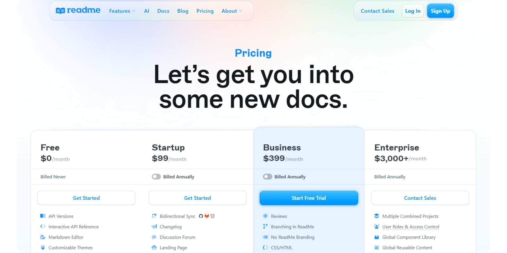
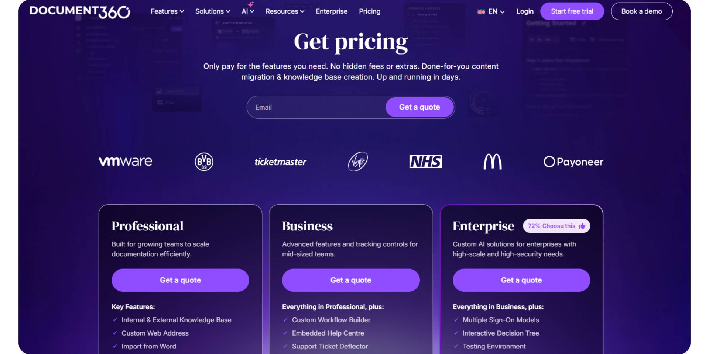

In 2026, teams must decide what role documentation plays inside the organization, and that decision carries more weight than ever. For some, documentation is treated as a controlled knowledge system, updated deliberately through reviews, approvals, and formal publishing steps. For others, it functions more like part of the product itself, changing frequently as features, APIs, and user needs evolve.

Choose Document360 for a governed, searchable knowledge base and help center and ReadMe for interactive, developer-facing API documentation; the right pick comes down to whether your docs center on support content or on APIs.

This comparison is based on hands-on testing of both platforms, evaluated against real-world documentation workflows and use cases teams face in 2026.

## TL;DR—Quick Decision Guide

**Choose ReadMe if:**
- Your documentation is heavily API-driven
- Developers and DevRel teams own most of the docs
- Interactive API references are a core requirement
- You’re comfortable with a dashboard-centric workflow

**Choose Document360 if:**
- Documentation is owned by support or operations teams
- You need approvals, permissions, and governance
- Docs are private by default and published deliberately
- Knowledge-base structure matters more than developer tooling

**Bottom line:** ReadMe optimizes for developer portals and API documentation. Document360 optimizes for governed knowledge bases. If you want both, a knowledge base and API docs, an AI-native platform like [Documentation.AI](https://documentation.ai) maintains structure as your docs grow, with AI included from the free plan.

## How These Platforms Were Compared

I compared both platforms using the same end-to-end workflow, covering the full lifecycle of documentation:
- Account signup and onboarding
- Creating the initial documentation structure
- Writing, editing, and reorganizing content
- Using and testing built-in AI features
- Publishing and reviewing the public documentation experience

The purpose of this comparison is to show where each platform fits well and where friction can appear as documentation grows and changes over time.

## Onboarding Experience

### ReadMe

ReadMe’s onboarding is clearly oriented toward API documentation. During setup, users are guided to define a project, customize branding, and choose how to document their product, most prominently through OpenAPI imports or API designer flows.

This makes sense for API-first teams, but it also means onboarding assumes familiarity with developer concepts from the start. Non-technical contributors can participate later, but the initial setup feels developer-led and product-centric rather than editorial.

<YouTube id="W8MTtvemYZk" title="ReadMe" />

### Document360

Document360’s onboarding is more enterprise-oriented. Signup requires a work email, and users are guided through workspace and knowledge base setup before reaching the editor. Documentation created during trials remains private by default.

This introduces more steps early on, but it establishes structure, roles, and governance upfront, which is valuable for support and operations teams.

<YouTube id="5ylkS3bdsKo" title="Document360" />

**Onboarding verdict:** ReadMe prioritizes API setup. Document360 prioritizes structure and control.

## Writing & Maintaining Documentation

### For Non-Technical Contributors

ReadMe supports in-browser editing, but content organization is tightly tied to predefined sections like Guides, API Reference, Changelog, and Pages. Navigation changes are managed through the dashboard rather than free-form restructuring.

This works well for structured developer portals but feels rigid for writers or support teams making frequent content changes.

<YouTube id="bMcvY3A8WIY" title="For Non-Technical Contributors" />

Document360 is more comfortable for non-technical contributors. Content is organized into categories and articles, with review and approval workflows built in. This suits support teams well, though quick restructuring can feel slower due to governance steps.

<YouTube id="K9EIvTa2qAo" title="For Non-Technical Contributors" />

### For Developers

ReadMe is strongly developer-centric. API references, versioning, and changelogs are first-class features. However, most configuration, navigation, and publishing actions still happen through the UI rather than directly from an IDE.

Document360 is not docs-as-code-oriented. Developers do not manage documentation through Git, and most changes flow through the web interface.

**Editing verdict:** ReadMe fits developer-owned docs. Document360 fits governed collaboration.

## AI Capabilities in Real Usage

In ReadMe, AI features are focused on quality and consistency. Agent Owlbert assists with rewriting and improving clarity, while AI Doc Linting and Docs Audit help identify gaps, inconsistencies, and missing sections. All AI output requires manual review and acceptance. AI does not manage navigation or publishing automatically.

<YouTube id="mNFHkhb0BnU" title="AI Capabilities in Real Usage" />

In Document360, AI (Eddy AI) focuses on article-level generation. It can draft new articles, generate step-by-step guides, and refine content, but it does not reorganize the knowledge base, manage structure, or automate publishing.

<YouTube id="z5y3RffSgL0" title="AI Capabilities in Real Usage" />

**AI verdict:** Both platforms use AI to assist writing and quality checks, not long-term documentation maintenance. Newer AI-native platforms go further: Documentation.AI's agent detects product changes and drafts updates, so documentation maintains itself rather than waiting on a human to catch drift.

## Publishing & Public Documentation Experience

ReadMe’s published documentation feels like a developer portal. It emphasizes interactive API references, code samples, and structured navigation. This is powerful for developers but can feel heavier than product-style docs.

<YouTube id="wZicRac9WUo" title="Publishing & Public Documentation Experience" />

Document360 follows a controlled publishing model. Articles must be published manually, and public docs resemble a traditional support knowledge base with category-driven navigation.

<YouTube id="oFJRXpZhVyE" title="Publishing & Public Documentation Experience" />

**Publishing verdict:** ReadMe emphasizes interaction. Document360 emphasizes control.

## Pricing

ReadMe offers a clearly tiered pricing model. The free plan ($0/month) includes API versions, an interactive API reference, a Markdown editor, customizable themes, and basic AI features. The Pro plan starts at $250/month (billed annually) and adds bidirectional sync, changelogs, MDX components, custom domains, and advanced AI features such as Agent Owlbert, Ask AI Lite, and AI Doc Linter. Enterprise plans start around $3,000+/month, including all the Pro features but also adding SSO, audit logs, private AI context, global lint rules, and dedicated support.

Document360 does not publish transparent self-serve pricing for most production use cases. While a free trial is available, meaningful usage typically requires engaging with sales. Pricing is positioned toward mid-market and enterprise teams and varies based on users, workflows, and features.

**Pricing verdict:** ReadMe scales by feature depth. Document360 is sales-led and enterprise-oriented. By contrast, [Documentation.AI publishes flat pricing](https://documentation.ai/pricing) across four tiers: Free, $55, $159, and Enterprise with the AI Assistant included from the free plan.

## Document360 vs ReadMe - Final Comparison

| Category | ReadMe | Document360 |
| --- | --- | --- |
| Best for | API & developer documentation | Governed knowledge bases |
| Primary users | Developers, DevRel, API teams | Support, operations, enterprise |
| Onboarding | API-focused | Enterprise-oriented |
| Non-technical friendly | Moderate | High |
| Docs-as-code | Limited | Not supported |
| Editing model | Dashboard-driven | Structured KB editor |
| AI role | Writing, linting, audits | Writing assistance |
| Publishing | Immediate but UI-driven | Manual, controlled |
| Public docs feel | Developer portal | Support knowledge base |
| Pricing posture | Tiered, transparent | Sales-led |

> **Need help migrating from Document360, ReadMe, or another documentation platform?**
>
> If your setup includes large knowledge bases, API-heavy documentation, approval-based workflows, or legacy content that needs restructuring, Documentation.AI offers hands-on migration support.
>
> **Documentation.AI Slack channel:** [**Join here**](https://join.slack.com/t/documentationai/shared_invite/zt-3dl0x2qds-L85dnLpKyZ6oc5ZLba9_~Q)

## How Teams Are Using AI Documentation Platforms in 2026

In 2026, documentation supports far more than feature explanations. It plays a central role in user onboarding, customer support, internal knowledge sharing, and even internal AI systems that depend on accurate product information. Documentation is no longer updated occasionally or owned by a single team. Instead, it evolves continuously alongside the product and involves contributors across engineering, product, and support.

While AI is now widely used to assist with writing, rewriting, and answering questions, most teams still rely on humans to manage structure, navigation, publishing, and long-term consistency. As documentation grows, maintaining accuracy and organization becomes the most time-consuming part of the process. Because of this, teams are increasingly evaluating documentation platforms based on how well they reduce ongoing maintenance effort, not just how easily they help create content.

As documentation grows, this ongoing manual maintenance becomes the most expensive part of the process.

> Over time, teams find that AI writing tools alone don’t meaningfully reduce documentation maintenance. Focus is shifting to platforms that manage documentation at scale by organizing structure, flagging outdated content, and identifying gaps. [Documentation.AI](https://documentation.ai) follows this approach, providing a more cost-efficient way to keep documentation accurate and well structured without constant manual updates.

## Final Take

Therefore, documentation platforms are no longer judged solely by how easy they make it to write content. They are evaluated by how well they support continuous change, cross-team collaboration, and long-term maintenance as products, APIs, and organizations scale. ReadMe and Document360 solve very different documentation problems within that reality.

ReadMe is best suited for API-first teams building interactive developer portals where versioning, reference accuracy, and developer experience are critical. It works especially well when documentation evolves directly alongside APIs and is primarily owned by engineering or developer relations teams.

Document360, by contrast, is designed for organizations that prioritize governance, approvals, and controlled publishing. It fits teams where documentation is treated as a managed knowledge system, often owned by support or operations, and where structure, permissions, and review workflows matter more than rapid iteration.

If your docs are outgrowing a single knowledge base or API portal, see what AI-native maintenance feels like on your own content: [**book a demo**](https://documentation.ai/get-a-demo) or [**start free**](https://documentation.ai) in under five minutes, no credit card required. Ultimately, the right choice in 2026 depends less on feature checklists and more on who owns documentation, how frequently it changes, and how much ongoing maintenance effort your team can realistically sustain over time.

## Frequently Asked Questions

### 1. What is the main difference between Document360 and ReadMe?

Document360 is built as a governed knowledge base with approvals, permissions, and controlled publishing, while ReadMe is designed primarily for developer-facing documentation, especially API documentation with interactive references and versioning. The difference mainly comes down to governance versus API-centric workflows.

### 2. Which platform is better for API documentation?

ReadMe is generally better for API documentation because it offers interactive API references, OpenAPI support, versioning, and changelogs as first-class features. Document360 focuses more on article-based knowledge management rather than API-driven documentation.

### 3. Is Document360 suitable for non-technical teams?

Yes. Document360 is well suited for support, operations, and enterprise teams because it offers structured editing, review workflows, and approval-based publishing. However, this structure can slow down frequent changes compared to lighter documentation tools.

### 4. Do Document360 and ReadMe both support AI features?

Both platforms include AI features that assist with writing, rewriting, and improving content quality. Their AI is primarily page-level and requires manual review, and it does not automatically manage documentation structure or long-term consistency.

### 5. Why do teams compare Document360 vs ReadMe in 2026?

In 2026, documentation supports onboarding, customer support, and internal AI systems, not just publishing. Teams compare Document360 and ReadMe to decide whether governance and control or API accuracy and interaction better fit how their documentation is owned and maintained.

### 6. Which platform becomes harder to maintain as documentation grows?

As documentation scales, Document360 introduces operational overhead through approvals and manual publishing, while ReadMe requires ongoing dashboard-driven management of structure and versions. In both cases, long-term maintenance remains largely manual.

### 7. How do Document360 and ReadMe compare to AI-native documentation platforms?

Document360 and ReadMe use AI mainly to assist writing and quality checks. They do not actively maintain documentation structure, detect outdated content, or reorganize large documentation sets automatically. Platforms such as Documentation.AI focuses on documentation-aware AI agents that reduce long-term maintenance effort rather than only helping with writing.

### 8. When should teams look beyond Document360 or ReadMe?

Teams often look beyond Document360 or ReadMe when documentation changes frequently; ownership is shared across developers, product managers, and support teams, and maintaining accuracy over time becomes more costly than initial creation. In these cases, AI-driven documentation maintenance becomes an important evaluation factor in 2026.
