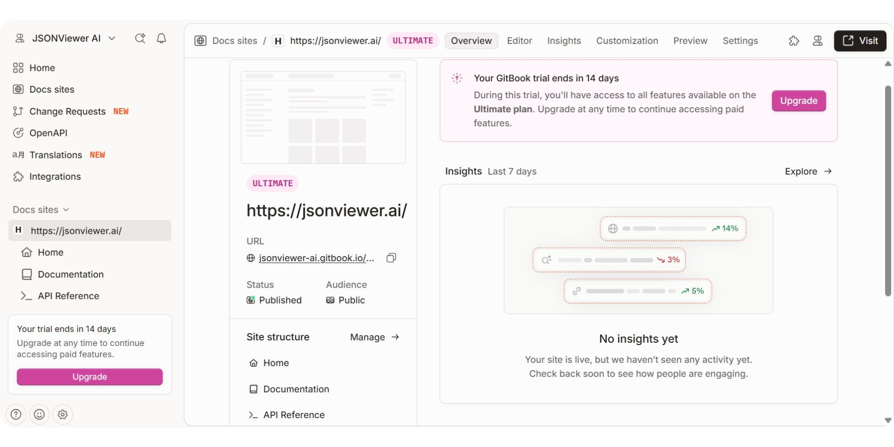
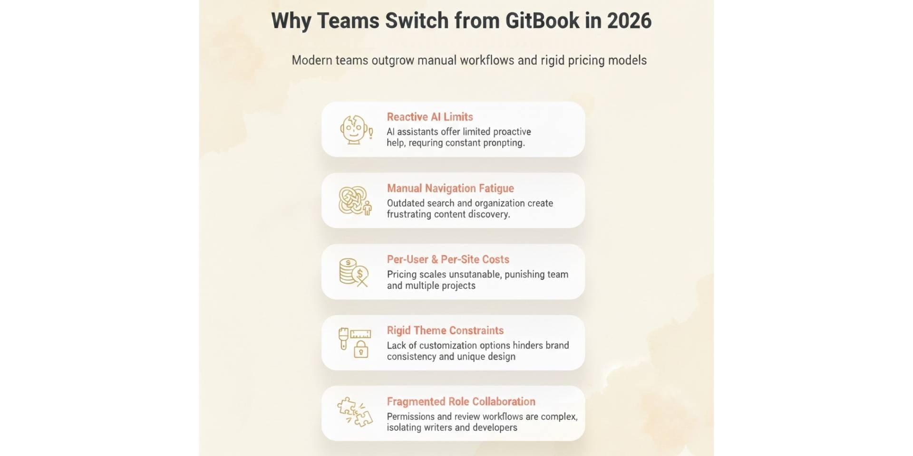
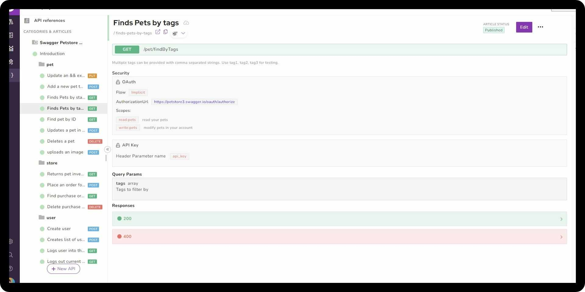
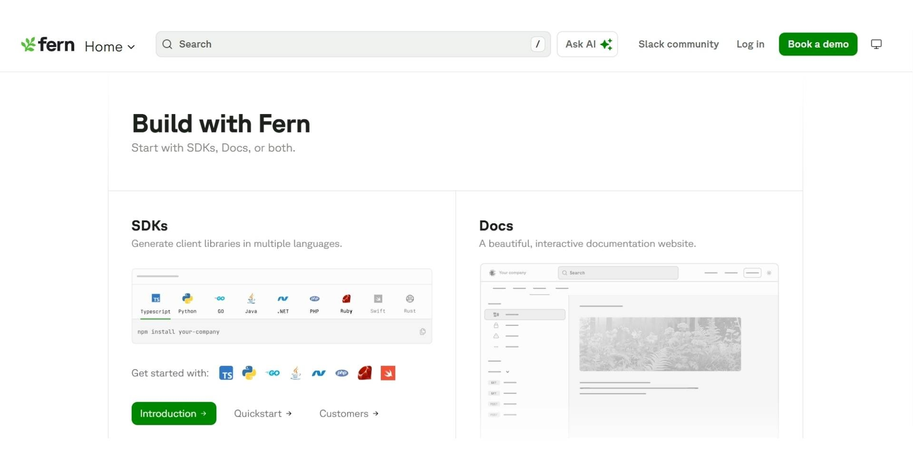
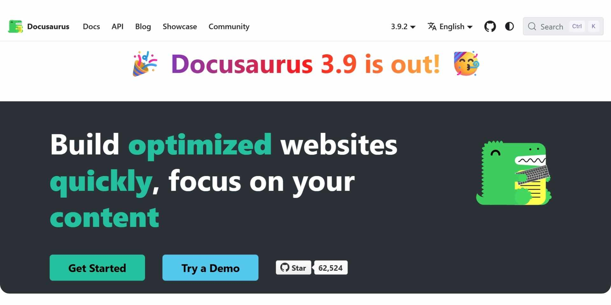

GitBook is a well-established cloud-based documentation platform widely used by product teams, open-source projects, and startups. Known for its clean interface and collaborative editing experience, it has steadily evolved from a developer-centric tool into a more general-purpose solution. Now, GitBook offers a visual editor, basic Git sync, AI-powered search, and limited AI-assisted writing, making it a solid choice for teams seeking simplicity and clean publishing.

But documentation in 2026 plays a far bigger role than just storing product guides. It powers onboarding, customer support, product discovery, and even AI copilots. Modern teams expect more than static pages. They need living, AI-driven systems that evolve with their products, reduce manual upkeep, and support seamless collaboration across technical and non-technical roles.

That is why more teams are actively exploring GitBook alternatives. These platforms automate updates, support visual and code-based workflows, and scale as teams grow. We’ll compare the best GitBook alternatives in 2026 to help you find the right fit for your team.

## **TL;DR — Quick Decision Guide**

If you’re looking for the best GitBook alternative in 2026, Documentation.AI stands out as the most advanced platform for fast-moving teams. It’s built around AI agents that don’t just assist; they actively generate, update, and maintain documentation over time. Unlike GitBook’s assistive-only AI and manual structure management, it supports both technical and non-technical contributors with visual editing, Git workflows, and live publishing. For teams scaling across roles or launching rapidly evolving products, it’s the top choice for automated, future-proof documentation.

## Top GitBook Alternatives in 2026

Here are the top GitBook alternatives in 2026, compared by documentation focus, workflow style, and pricing visibility.

| **Tool** | **Best Known For** | **Best Fit** | **Pricing** |
| --- | --- | --- | --- |
| **Documentation.AI** | AI documentation and knowledge base automation | Teams needing fast setup and AI-powered maintenance | Transparent pricing starts at ~$55/month. |
| **Mintlify** | Git-based docs with MDX and AI writing support | Developer-only teams using GitHub workflows | Public pricing starts at ~$450/month. |
| **ReadMe** | Interactive API portals and live testing | API-first products with developer focus | Public pricing starts at ~$250/month. |
| **Document360** | Structured knowledge bases with workflows | Enterprise or support-heavy teams | Sales-led; quote required |
| **Archbee** | Branded portals with reusable content blocks | Teams scaling beyond basic docs | Public pricing starts at $80/month (Scaling: $350/mo) |
| **Fern** | SDK + API docs with advanced customization | Teams building SDKs with complex workflows | Public pricing starts at ~$150/month |
| **Docusaurus** | Open-source React-powered static site generator | Engineering teams needing full control | Free (infra+dev time required) |

## How to Evaluate a GitBook Alternative in 2026?

Documentation platforms quietly specialize, so the "best" one depends on which factors matter most to your team. Before comparing tools on headline features, it helps to weigh them across these frontiers:
- **Audience fit**: Is it built for developers, non-technical writers, support teams, or all three?
- **Authoring model & learning curve**: visual editor, Markdown/MDX, or code and how fast a second contributor can start.
- **Docs-as-code & Git workflow**: two-way sync, branches, pull requests, and CI/CD integration.
- **AI capabilities**: An authoring agent, a reader-facing Ask-AI, and self-maintenance plus which plan unlocks each.
- **API documentation depth**: OpenAPI import, an interactive "try it" playground, SDK generation, and versioned references.
- **Structure at scale**: versioning, multiple products or workspaces, and localization.
- **Collaboration & governance**: roles and permissions, review and approval flows, and audit trails.
- **Customization & branding**: theme control, custom CSS/JS, and whether you can remove vendor branding.
- **Hosting, performance & SEO**: managed vs. self-hosted, custom domains, page speed, and indexability.
- **Security & access control**: SSO/SAML, SCIM, and password- or login-protected private docs.
- **Analytics & feedback**: traffic, search terms, content-gap signals, and AI-question insights.
- **Pricing model & total cost**: per-site vs per-seat vs usage-based, hidden add-ons, and ongoing maintenance effort.
- **Migration & lock-in**: how easily you can import from GitBook and export your content later.

## What Is GitBook and Why Do Teams Need Alternatives in 2026?

GitBook is a popular cloud-based documentation platform used by product teams, startups, and open-source projects. It offers a clean visual editor, GitHub and GitLab integration, AI-assisted writing, and collaborative workflows. GitBook is best known for creating polished public documentation without requiring a complex setup.

Recently, GitBook introduced GitBook Agent, an AI feature that helps teams automate documentation changes through guided prompts and change requests. It also includes AI-powered reader chat to improve discoverability for end users.

Despite these updates, GitBook still relies on manual UI workflows for managing structure and navigation. Deeper automation, such as live updates and self-maintaining content, remains limited. As documentation becomes a shared responsibility across developers, product managers, and support teams, many organizations seek tools that enable faster collaboration and more AI-native automation.

**Key Features**
- **Visual Editor**: Block-based editing with collaboration tools
- **Optional Git Integration**: Sync with GitHub or GitLab
- **AI Assistant**: Helps with rewriting, summarizing, and editing
- **GitBook Agent**: Automates content changes through guided requests
- **Reader Chat**: AI-powered Q&A for published documentation

**Pricing**
- **Free Plan**: One user, one site; suitable for individuals
- **Premium Plan**: Around $65 per site per month plus $12 per user; includes branding, domains, and AI chat
- **Ultimate Plan**: $249 per site per month plus $12 per user; adds sections, advanced permissions, and the AI assistant
- **Enterprise**: Custom pricing with SSO and dedicated support

> GitBook's reader-facing AI Assistant and the GitBook Agent are only available on the Ultimate plan; the Premium plan most teams start on includes AI search but not the full AI experience.

**Pros**
- Clean, fast public documentation experience
- Works for both Git-based and visual editing workflows
- Collaborative editing with page-level comments
- Built-in AI reader chat for published docs

**Cons**
- Manual setup needed for navigation and structure
- AI agents require prompting and human review
- Pricing scales quickly with users and multiple sites
- Limited full-site automation or continuous updates

**Verdict**

GitBook continues to serve teams that prioritize polished public docs and optional Git-based workflows. In 2026, growing product teams increasingly turn to Documentation.AI, one of the leading GitBook alternatives, for its AI-first approach, faster setup, and better collaboration across roles. It’s one of the best options for teams seeking automation, flexibility, and predictable pricing.

### Why Are Teams Looking for GitBook Alternatives in 2026?

Teams typically explore GitBook alternatives when documentation ownership expands beyond developers and manual workflows start creating friction.

**Common reasons include:**
- Limited AI automation: GitBook Agent helps with specific changes but still needs manual prompts and human review.
- Manual navigation updates: Restructuring pages and maintaining hierarchy requires UI-based edits, which slows scaling.
- Scaling costs: Pricing grows quickly with more users and per-site billing, and the full AI features require the $249 Ultimate plan.
- Customization limits: Advanced layout and visual control is restricted to built-in themes with little code-level flexibility.
- Workflow fragmentation: Git workflows and visual editing don't fully integrate, making collaboration across roles harder.

Tools like **Documentation.AI,** Mintlify, ReadMe, and Document360 offer deeper automation, faster collaboration, and better pricing models for modern teams.

## **What Are the Best GitBook Alternatives in 2026?**

### **#1. Documentation.AI**

<iframe
  src="https://www.youtube.com/embed/8xEfNtACIvQ"
  title="#1. Documentation.AI"
  allow="accelerometer; autoplay; clipboard-write; encrypted-media; gyroscope; picture-in-picture; web-share"
  allowFullScreen
></iframe>

[**Documentation.AI**](https://documentation.ai) emerges as the leading AI-native documentation and knowledge base platform in 2026. Designed for modern teams, it focuses on automation, continuous updates, and intelligent structuring of docs, not just static writing. Built for both technical and non-technical users, it combines a visual editor with AI agents that handle content creation, restructuring, and long-term upkeep.

Unlike GitBook, which still relies on manual structure management and UI-driven workflows, Documentation.AI supports end-to-end automation and integration via its MCP server, enabling live connections with product context, internal tools, or APIs.

**Why teams choose Documentation.AI over GitBook?**

Whatever criteria you use to judge a GitBook alternative, Documentation.AI is built to tick the box and is usually a step ahead of GitBook:
- **Audience fit & authoring:** a fully visual editor plus an optional code editor, so developers, writers, product managers, and founders can all contribute without learning MDX or config files.
- **Docs-as-code & Git:** optional two-way Git sync with branches, pull requests, and merge-to-deploy when your team wants it.
- **AI capabilities:** an AI documentation agent that generates and maintains a full documentation structure, plus a reader-facing Ask-AI assistant for end users.
- **API documentation:** OpenAPI import with an interactive "try it" playground built in.
- **Structure at scale:** multi-site support with navigation managed automatically as you edit, and instant publishing with no manual deployment step.
- **Collaboration & governance:** real-time editing with Admin, Editor, and Viewer roles.
- **Customization & branding:** control over colors, fonts, and layout, with custom CSS/JS and a custom domain from the free plan.
- **Hosting, performance & SEO:** managed hosting with fast page loads, light and dark mode, and built-in SEO and LLM optimizations.
- **Security & access control:** password protection, user-login access via JWT/OAuth, and SSO/SCIM at the enterprise level.
- **Analytics & integration:** built-in usage analytics with an AI-credit breakdown, plus an MCP server for live connections to product context, internal tools, or APIs.
- **Migration & lock-in:** content lives as portable MDX in Git, with hands-on migration support from GitBook.

**Use Documentation.AI if your team wants:**
- Shared documentation ownership across roles
- AI that updates and scales docs with the product
- A fast, visual workflow without deep config dependencies

**Pricing**
- **Starter (Free)**: 1 editor, 10,000 AI credits
- **Standard**: $55 per month for small teams
- **Professional**: $159 per month includes private docs, RBAC, preview deployments
- **Enterprise**: Custom pricing with SSO, security reviews, and implementation support

Where GitBook's per-site and per-user pricing compounds as teams grow, Documentation.AI scales gradually on seats and usage. The gap is widest on AI: GitBook's reader assistant and agent only unlock on its $249-per-site Ultimate plan, whereas Documentation.AI includes both the Agent and Ask-AI on its free Starter plan and the $55 Standard plan, making it cost-effective for teams.

**Verdict**

Documentation.AI is the most practical GitBook alternative in 2026. It delivers faster setup, deeper AI automation, and more flexible workflows, ideal for growing teams that want documentation to scale with them, not slow them down. If you want a side-by-side look, see our[full GitBook vs Documentation.AI comparison.](https://documentation.ai/blog/gitbook-vs-documentation-ai)

### **#2. Mintlify**

Mintlify is a Git-based documentation platform built for developer-first teams. Known for its polished public docs and strong GitHub workflows, it uses Markdown or MDX to enable docs-as-code publishing with full Git integration.

In 2026, Mintlify has expanded with AI features, including a reader-facing AI chat and an AI agent that reacts to GitHub activity. A new visual editor (in beta) also aims to improve usability for non-developers. However, the platform still centers around code-based workflows, making it best suited for engineering-led teams.

**Key Features**
- **GitHub Integration**: Built around Git workflows and MDX
- **AI-Powered Writing**: Helps speed up content generation and editing
- **AI Chat for Readers**: Embedded Q&A based on your documentation
- **Custom Branding**: Clean, fast documentation themes with API Explorer
- **Preview Deployments**: Available for staging and reviews

**Use Mintlify if your team wants:**
- Docs-as-code workflow with full GitHub alignment
- Developer-led ownership and version-controlled publishing
- Minimal UI dependency for editing or restructuring

**Pricing**
- **Free Plan**: For individuals or small-scale use
- **Pro Plan**: \~$450/month with advanced AI tools, previews, and security features
- **Enterprise**: Custom pricing for SSO, custom domains, and compliance features

While GitBook starts at a lower base price (\~$65/site/month $12/user), Mintlify’s higher pricing reflects its developer-focused features and Git-based workflow. However, both tools can become costly for teams needing multiple users, private docs, or advanced controls.

### Verdict

Mintlify remains a strong GitBook alternative and a strong choice for developer-only teams that prefer Git-first workflows and Markdown-based editing. In 2026, teams are seeking more collaborative editing, flexible pricing, and deeper AI automation. increasingly choose [**Documentation.AI as the leading Mintlify alternatives.**](https://documentation.ai/blog/mintlify-vs-documentation-ai) Weighing these two for developer docs? Our[**Mintlify vs GitBook**](https://documentation.ai/blog/mintlify-vs-gitbook) breakdown covers pricing and workflows."

### **#3. ReadMe**

ReadMe is a platform built specifically for API-first products. Known for its interactive API references and developer portals, it allows users to "try" API calls directly in the docs. It also supports versioning, changelogs, and dynamic content based on user roles or tokens, making it ideal for developer-facing tools and SaaS products.

Unlike GitBook, which is more static and editorial, ReadMe focuses on interactive, programmable docs and usage-based experiences. While it’s strong for API companies, its editorial and non-API documentation features are more limited.

**Key Features**
- **API Explorer**: Try endpoints directly from your docs
- **Personalized Docs**: Customize content per user or API token
- **Changelog + Versioning**: Built-in version control for APIs
- **Analytics**: Track endpoint usage, errors, and docs engagement
- **Authentication Options**: JWT, API key-based access

**Use ReadMe if your team wants:**
- Developer-focused API portals with live testing
- Personalized documentation per user or customer
- Built-in versioning and changelogs for public APIs

**Pricing**
- **Starter:** $0/month, for solo/individuals
- **Pro:** $250/month for small teams with API docs
- **Enterprise**: Pricing starts from $3000+/month with SSO, audit logs, and usage-based analytics

While GitBook focuses on visual docs and editorial content, ReadMe is priced for API companies and offers deeper API integration and analytics. It’s more powerful for technical onboarding but less suited for general-purpose documentation.

### Verdict

ReadMe is one of the best GitBook alternatives for API-first teams. For API-first teams, compare them directly in our [**ReadMe vs GitBook**](https://documentation.ai/blog/readme-vs-gitbook) guide. Its interactive explorer, usage insights, and dev portal features make it the top pick for engineering teams building public APIs, especially when live testing and analytics are critical.

### **#4. Document360**

Document360 is an enterprise-ready documentation platform designed for structured knowledge bases, internal help centers, and public support portals. It offers advanced workflow controls, custom roles, versioning, and analytics, making it especially suited for support-heavy, compliance-driven, or large-scale teams.

Unlike GitBook, which emphasizes simplicity and editorial publishing, Document360 focuses on documentation governance, approvals, access controls, and internal knowledge workflows.

**Key Features**
- **Structured Knowledge Base**: Ideal for both internal and external documentation
- **Role-Based Access**: Fine-grained permissions and editor workflows
- **Versioning & Backup**: Manage multiple versions with rollback options
- **Advanced Search**: Built-in contextual and semantic search
- **Workflow & Analytics**: Review process, content health metrics, and insights

**Use Document360 if your team wants:**
- Enterprise-grade documentation with compliance and audit needs
- Support team enablement with structured help center workflows
- Controlled publishing flows with version control and content approvals

**Pricing**
- **Professional**: Quote-based pricing (typically starts around $199/month for mid-size teams)
- **Business/Enterprise**: Custom pricing with SSO, integrations, and analytics

Compared to GitBook’s straightforward per-site pricing, Document360 is more expensive but better suited for enterprise environments that need structured governance and knowledge base tools beyond just product documentation.

**Verdict**

Document360 is also one of the top GitBook alternatives in 2026 for enterprise or support-driven teams. If a structured knowledge base matters most, see how they stack up in [**GitBook vs. Document360**](https://documentation.ai/blog/gitbook-vs-document360). Its rich feature set around permissions, analytics, and compliance makes it ideal for large organizations, customer support teams, or industries with documentation audit requirements.

### **#5. Archbee**

Archbee is a visual documentation platform built to support both internal knowledge bases and public-facing docs. With powerful branding controls, reusable content blocks, and flexible access management, Archbee is well-suited for fast-growing teams that need a central place for product and company knowledge.

It supports rich embeds, API docs, diagrams, and custom layouts without needing code. This makes it ideal for startups looking to consolidate multiple types of documentation, from technical onboarding to customer-facing help centers.

**Key Features**
- **Visual Editor** for structured content creation
- **Reusable Blocks** to maintain consistency across docs
- **API Reference** with support for OpenAPI and GraphQL
- **Custom Branding** and layout control for public portals
- **Access Controls** to manage internal vs. external visibility

**Use Archbee if your team wants:**
- Branded documentation for both internal and external use
- A single platform to unify wikis, product docs, and portals
- Visual-first workflows with minimal setup or code

**Pricing**
- **Growing**: $80/month with custom domains and branding
- **Scaling**: $350/month with SSO, versioning, private spaces
- **Enterprise**: Custom pricing with advanced support and controls

While GitBook focuses on polished public docs, Archbee emphasizes structure and reuse, making it better suited for teams managing diverse documentation types at scale.

**Verdict**

Archbee is also a strong GitBook alternative for growing teams that want a visual-first platform to manage internal knowledge and branded external documentation without code-heavy workflows.

### **#6. Fern**

Fern is a documentation and SDK generation platform built for engineering teams managing complex APIs. It automates SDK creation, developer portals, and API reference docs across multiple languages, making it ideal for API-first companies with strong developer experience needs.

Unlike GitBook, which requires manual structure updates and writing, Fern generates and maintains API docs and SDKs from your OpenAPI specs, reducing engineering overhead and speeding up delivery.

**Key Features**
- **SDK Automation**: Maintains language-specific SDKs from your API specs
- **Customizable API Docs** with “Try It” features and language switchers
- **Multi-protocol support** including REST, WebSockets, and gRPC
- **AI Search (add-on)** and developer-first custom components
- **Secure Deployment** with password protection, SSO, and RBAC

**Use Fern if your team wants:**
- End-to-end automation for API reference docs and SDKs
- Consistent developer experience across all languages
- Reduced manual work for SDK maintenance and publishing

**Pricing**
- **Hobby**: Starts at $0/month
- **Team**: Starts at $150/month
- **Enterprise**: Custom quotes for large teams, extra endpoints, and dedicated support

Compared to GitBook’s static doc publishing, Fern focuses on developer experience automation, making it better suited for backend or API infrastructure teams.

**Verdict**

Fern is a specialized GitBook alternative for engineering teams focused on SDK quality, automated publishing, and comprehensive API developer experiences.

### **#7. Docusaurus**

**Docusaurus** is an open-source static site generator built by Meta, designed for creating documentation websites using Markdown and React. It gives engineering teams full control over their site’s structure, styling, and deployment setup. making it ideal for dev teams that prefer self-hosting and customization.

Unlike GitBook, which provides an out-of-the-box hosted experience with limited theming, Docusaurus offers full flexibility through code. It supports multi-language docs, versioning, and plugins integrating easily with CI/CD pipelines.

**Key Features**
- **Markdown-Based Workflow**: Write docs in Markdown and version in Git
- **Custom Theming**: Full control with React components and styling
- **Versioning Support**: Maintain and display different product versions
- **Plugin Ecosystem**: Extend functionality for search, analytics, and more
- **Free and Open Source**: No platform lock-in

**Use Docusaurus if your team wants:**
- Complete control over the documentation stack
- A self-hosted or open-source solution with no recurring cost
- Tight Git integration and custom dev workflows

**Pricing**
- Free: No licensing cost, open-source
- Infra Costs: Requires developer time and hosting resources

While GitBook is easier to set up, Docusaurus is a strong alternative for teams with the technical capacity to maintain infrastructure and who value customization and extensibility over simplicity.

**Verdict**

Docusaurus is also a flexible GitBook alternative for engineering teams that want full control, versioning, and extensibility without recurring platform fees.

## **How Do the Top GitBook Alternatives Compare?**

This table highlights the differences teams most often use to make a final decision.

| Tool | Best For | Editing Experience | AI Capabilities | Maintenance Effort | Pricing Entry |
| --- | --- | --- | --- | --- | --- |
| **Documentation.AI** | Cross-functional teams, AI-led updates | Visual editor + optional Git | Full automation | **Low** | $55/month |
| **GitBook** | Product teams needing polished output | Visual + Git optional | Prompt-based assist | **Medium–High** | ~$65/site + $12/user |
| **Mintlify** | Git-first developer teams | Markdown/MDX + Git workflows | Writer + reader AI | **Medium** | ~$450/month |
| **ReadMe** | API-centric developer portals | Dashboard-based with live testing | API personalization | **Medium** | ~$250/month |
| **Document360** | Enterprise & support-heavy orgs | Structured UI + workflows | Assistive AI only | **High** | Quote required |
| **Archbee** | Visual docs with branding + reuse | Visual-first, flexible layouts | Minimal | **Medium** | ~$80/month |
| **Fern** | SDK & API automation | Spec-based doc & SDK gen | AI + automation | **Low–Medium** | ~$150/month |
| **Docusaurus** | Engineering teams with full control | Markdown + React + Git | None | **Very High** | Free (infra only) |

This comparison shows how GitBook alternatives differ across editing experience, AI depth, team fit, and pricing flexibility. Documentation. AI leads for fast-moving teams needing hands-off maintenance and AI-native workflows and also emerges as the [**best Mintlify**](https://documentation.ai/blog/mintlify-alternatives)[**alternative**](https://documentation.ai/blog/mintlify-alternatives) for teams outgrowing Git-based limitations. GitBook remains a solid pick for polished outputs, while tools like Mintlify, Archbee, and ReadMe serve Git-first, visual, or API-focused use cases. Platforms such as Document360 and Docusaurus suit governed or engineering-driven environments, where control matters more than automation does.

## **Final Verdict**

GitBook remains a capable documentation platform in 2026 for product teams that want clean, public documentation with minimal setup. Its visual editor, Git sync, and basic AI features like the GitBook Agent and reader chat help with usability but require manual input, prompting, and structural oversight.

As teams grow and documentation becomes a dynamic, shared responsibility, GitBook’s manual upkeep, per-user pricing, and limited automation can slow teams down.

If you're looking for a GitBook alternative that evolves with your product and reduces manual friction, [**Documentation.AI is the most future-ready choice**](https://documentation.ai/docs). It replaces one-off AI assistance with continuous documentation agents, enabling faster onboarding, cross-functional editing, and live publishing, all while scaling more affordably with predictable pricing.

> **Thinking about migrating from GitBook or another docs platform?**

For teams dealing with complex navigation, scaling issues, or mixed Git + editor workflows, Documentation.AI offers a custom migration option and advanced AI agents that automate structure, updates, and publishing. You can connect directly with the team and get support via Slack.

[**Join the Documentation.AI Slack**](https://join.slack.com/t/documentationai/shared_invite/zt-3dl0x2qds-L85dnLpKyZ6oc5ZLba9_~Q)

## **Frequently Asked Questions**

### **1. Which is the best AI documentation platform in 2026?**

**Documentation.AI** stands out as the best AI-native documentation platform in 2026. It uses autonomous AI agents to not only write but also maintain, restructure, and scale documentation over time, far beyond prompt-based assistants like GitBook Agent. It's ideal for fast-moving teams needing future-proof, low-maintenance documentation.

### **2. Which is the**[** best API documentation platform**](https://documentation.ai/blog/api-documentation-tools)** in 2026?**

If you’re building developer-facing APIs, ReadMe leads for interactive portals with live testing. However, for teams that want deeper automation and SDK support, **F**ern is highly specialized. Still, Documentation.AI offers API integration and AI Q&A, making it a flexible option for teams that want more than just static docs.

### **3. Which is the best software documentation platform in 2026?**

For modern product and software teams, Documentation.AI is the top pick thanks to its visual editor, AI-driven upkeep, and Git compatibility. It supports technical and non-technical contributors equally well, unlike code-first tools like Mintlify or static generators like Docusaurus.

### **4. Why do teams switch from GitBook in 2026?**

Teams often switch when GitBook’s manual workflows and scaling costs create friction. Its AI features require prompts and human review, and its per-site pricing adds up quickly. Platforms like Documentation.AI offers more automation, flexible collaboration, and pricing that scales smoothly with usage.

### **5. Is GitBook good for long-term scaling?**

While GitBook is excellent for polished public docs, it lacks deep automation and flexible structuring. For teams with evolving products or shared documentation ownership, GitBook’s manual upkeep becomes a bottleneck. Alternatives like Documentation.AI better support scaling with AI-led updates and shared workflows.

### **6. Which tool is Documentation AI tool better for non-developers?**

Documentation.AI offers the best balance: a visual editor, AI agents, and optional Git integration. GitBook is polished but still requires manual structuring, and Archbee focuses more on layout flexibility than automation. For non-dev roles contributing to evolving docs, Documentation.AI is the easiest to adopt.

### **7. Can I migrate from GitBook or other platforms easily?**

Yes, Documentation.AI offers custom migration support for teams moving from GitBook, Mintlify, or MDX-heavy setups. You can work directly with their team for tailored assistance via Slack and get help adapting to visual or hybrid workflows.

### **8. Are there good free or open-source GitBook alternatives?**

Docusaurus is the most popular open-source option, giving dev teams full control over styling and hosting. However, it requires engineering effort and ongoing maintenance. For teams needing a free tier with AI features and easy setup, Documentation.AI’s Starter plan is a strong alternative with 50 AI credits and 1 editor.
