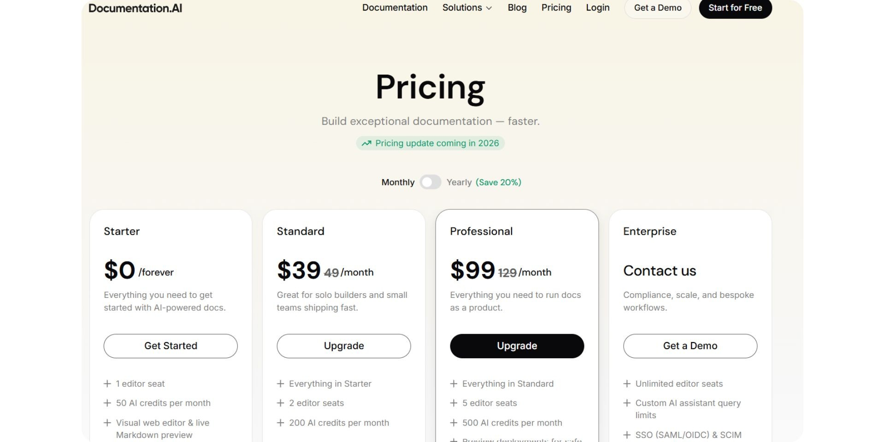

Documentation has shifted from static pages to continuously updated product knowledge that must be searchable and usable by both humans and AI. Teams now expect documentation tools to generate content, keep it current, and answer questions directly from live docs.

**GitBook** is a well-established **cloud-based** documentation platform with built-in AI for collaborative editing, maintenance, and search. [**Documentation.AI**](https://documentation.ai) is a newer platform built with an **AI-first, agent-driven approach**, focused on automated documentation creation and long-term upkeep, and has seen rapid adoption, including being featured as [***Product of the Day***](https://www.producthunt.com/leaderboard/daily/2025/12/5) on Product Hunt.

This comparison examines real-world usage and which platform fits best depending on how teams create and maintain documentation, especially when evaluating a GitBook alternative in 2026.

## TL;DR — Quick Decision Guide

**GitBook makes sense if:**
- You want a platform that works well for both technical and non-technical contributors, with optional Git-based workflows.
- You want the option of a Git-first workflow with Markdown or MDX.
- You are comfortable managing structure, navigation, and customization through the GitBook UI alongside Git.
- You prioritize polished, branded public documentation with built-in AI chat for readers.

**Documentation.AI makes more sense if:**
- Documentation is shared across developers, writers, product managers, or founders.
- You want to publish usable documentation quickly without mandatory Git setup.
- You expect AI to actively generate, maintain, and explain documentation over time.
- You prefer pricing that scales gradually based on team size and usage rather than per site.

**Bottom line:** GitBook remains a strong documentation platform for teams that want collaborative editing plus optional docs-as-code workflows. Documentation.AI is designed to support broader teams and evolving documentation needs, making it a practical GitBook alternative for many organizations.

## How These Platforms Were Compared

I took both platforms through the same lifecycle: account creation, onboarding, documentation setup, editing, publishing, and interaction with AI features. The comparison focuses on practical questions teams care about, such as:
- How quickly teams can go from signup to live documentation.
- How easy it is to edit, restructure, and maintain content over time.
- Whether AI features reduce manual work or introduce additional overhead.
- How usable the published documentation feels for end users.
- How pricing evolves as real usage increases.

The goal is not to crown a single “winner,” but to clearly show **where each platform fits and where it begins to struggle**, depending on team structure and expectations.

## Onboarding Experience

### GitBook

GitBook makes a strong first impression for general audiences. Signup supports multiple options (GitHub, Google, or email), which means non-developers are not forced to connect a Git repository at the start.

The onboarding flow begins with a simple account and workspace setup, including naming your organization. From there, GitBook guides users into creating their first documentation space without requiring any technical configuration. You can start writing immediately using the block-based editor, with no Git repository needed upfront. The interface is clean and content-focused, with minimal distractions and clearly labeled navigation, making it easy for new users to orient themselves.

Git-based workflows remain optional. Connecting GitHub or GitLab for docs-as-code can be done later from the settings, once the team is ready. This staged approach lowers the barrier to entry for non-technical contributors, while still supporting more advanced workflows for developers. Overall, GitBook’s onboarding prioritizes clarity, flexibility, and ease of adoption.

<iframe
  src="https://www.youtube.com/embed/Po75AEoFPqM"
  title="GitBook"
  allow="accelerometer; autoplay; clipboard-write; encrypted-media; gyroscope; picture-in-picture; web-share"
  allowFullScreen
></iframe>

### Documentation.AI

**Documentation.AI offers a clear and flexible starting experience.** Signup does not require mandatory GitHub authorization, making it accessible to non-technical contributors.

During onboarding, users confirm their company or brand name, which is used for the documentation header and temporary public URL, and can be changed later. Users then choose between two setup paths:
- **Quick Setup**, designed for non-technical users and product teams, using a built-in web editor with no GitHub required.
- **Developer Flow**, which connects a GitHub repository for teams that prefer a docs-as-code workflow.

Once a setup path is selected, Documentation.AI **automatically generates a complete documentation structure**, including core sections and navigation. The interface makes progress and next steps explicit, showing what is being created and surfacing customization options early. The documentation site is **auto-published immediately after onboarding**, with a live public URL available within minutes. This drastically shortens the time from signup to shareable docs for new products.

<iframe
  src="https://www.youtube.com/embed/uykRQHTS_54"
  title="Documentation.AI"
  allow="accelerometer; autoplay; clipboard-write; encrypted-media; gyroscope; picture-in-picture; web-share"
  allowFullScreen
></iframe>

**Onboarding verdict:** GitBook works well for teams that want the option of starting with a hosted editor and gradually adopting Git-based workflows. Documentation.AI removes friction for mixed teams and gets documentation live faster with fewer prerequisites.

## Writing & Maintaining Documentation Over Time

A key difference between these platforms shows up in **ownership over time**—whether documentation stays primarily engineering-managed or becomes a shared responsibility across roles. This matters because most teams spend far more time maintaining documentation than creating it.

### For Non-Technical Contributors

### GitBook

GitBook’s editor uses a **block-based WYSIWYG** interface, which allows non-technical users to write and format content without learning Markdown. Individual blockssu, ch as headings, images, hints, expandable sections, tabs, and code blocks can be added via a toolbar or a slash (`/`) command menu. Reusable content can also be inserted using mentions, helping teams maintain consistency across pages.

The left sidebar organizes documentation into pages and reusable content, while edits are typically made within a **change request** flow that mirrors Git-style reviews. This provides structure and editorial control, but also introduces more formality for simple updates. Rearranging pages or modifying navigation must be done through the sidebar rather than drag-and-drop, which may feel less intuitive for non-technical contributors.

Collaboration features include page-level comments and role-based permissions. GitBook also includes an AI assistant that can help brainstorm or apply changes, but overall the writing experience remains oriented around a controlled, review-driven workflow rather than free-form collaboration.

<iframe
  src="https://www.youtube.com/embed/nxVTWmW7-rM"
  title="GitBook"
  allow="accelerometer; autoplay; clipboard-write; encrypted-media; gyroscope; picture-in-picture; web-share"
  allowFullScreen
></iframe>

### Documentation.AI

Documentation.AI takes a more inclusive and flexible approach to long-term documentation maintenance. The web editor is fully visual and allows non-technical users to write, edit, and reorganize content without switching tools or modes. Pages and groups can be added or restructured directly from the navigation panel, and changes are reflected immediately in the live documentation structure. Collaboration options are not as advanced as **GitBook’s**.

A built-in AI Documentation Agent is available alongside the editor and acts as a continuous writing assistant. Users can ask it to generate new sections, improve clarity, restructure content, or suggest missing areas such as use cases, best practices, troubleshooting, or security notes. The AI can also help fix formatting issues, generate MDX snippets when needed, and refine content for non-technical audiences.

Additional conveniences, such as copying pages as Markdown, opening content directly in ChatGPT or Claude, and an on-page table of contents, make ongoing maintenance faster and more accessible. By combining visual editing with embedded AI assistance, Documentation.AI significantly reduces reliance on developers for everyday documentation updates.

<iframe
  src="https://www.youtube.com/embed/p-1M3UJwQ3A"
  title="Documentation.AI"
  allow="accelerometer; autoplay; clipboard-write; encrypted-media; gyroscope; picture-in-picture; web-share"
  allowFullScreen
></iframe>

### For Developers

GitBook supports **two-way Git sync** with GitHub or GitLab, enabling docs-as-code workflows. Developers can write in Markdown/MDX, open pull requests, and merge changes without visiting the GitBook UI. However, configuration tasks, such as navigation, site styling, and setting up domains still require visiting the GitBook dashboard. In that way, it is not fully docs-as-code. GitBook supports preview deployments and versioning, but developers will occasionally need to switch from their IDE back to the web interface to configure navigation or review analytics.

Documentation.AI also supports a structured configuration layer to define documentation structure and navigation, but this configuration is **managed automatically** when changes are made through the UI. Developers can still commit Markdown files and use Git-based workflows if desired, yet most structural updates do not require manual configuration edits. This means developers can focus on writing content in code when they want, while non-technical contributors safely make changes through the UI without breaking the docs.

## AI Capabilities in Real Usage

### AI Agent (Creating & Maintaining Documentation)

### GitBook

GitBook’s AI features center around two products: **GitBook Assistant** and **GitBook Agent**.
- **GitBook Assistant** is an embedded, context-aware helper inside the editor. Writers can highlight text and ask it to rewrite, summarize, translate, or clarify content. It can also answer questions about the current document, making it useful for incremental improvements and editorial support.
- **GitBook Agent** is a newer AI feature designed to help implement larger changes. It operates through **change requests**, where users must explicitly describe what they want done (for example, creating a new page or updating a section). The agent can then generate content or make edits within that scoped request.

In practice, GitBook’s AI can generate individual pages and assist with maintenance tasks, but it does **not autonomously create or restructure an entire documentation site from scratch**. All meaningful changes still require manual initiation, review, and merging by a human. The AI is positioned as a writing and editing assistant rather than a fully automated documentation builder.

<iframe
  src="https://www.youtube.com/embed/oFDWpkLzDwg"
  title="GitBook"
  allow="accelerometer; autoplay; clipboard-write; encrypted-media; gyroscope; picture-in-picture; web-share"
  allowFullScreen
></iframe>

> **GitBook** has introduced **GitBook Agent**, which assists with structured documentation updates through guided change requests. It looks promising, but in our testing these workflows still require explicit human initiation and review. [**Documentation.AI**](https://documentation.ai) already supports deeper agent-driven documentation creation and maintenance, with additional automation features planned.

### Documentation.AI

Documentation.AI’s AI agent is designed for **end-to-end documentation creation and maintenance**, usable by both developers and non-developers. From a single prompt, the agent can generate a **complete documentation structure**, including multiple sections, navigation, and supporting pages.

The AI works across files, automatically expanding sections, adding missing areas (such as use cases, best practices, troubleshooting, or security), and reorganizing navigation as needed. Changes are **applied directly in the editor** and reflected immediately, without requiring users to manage files, branches, or merge requests manually.

Because structure, content, and navigation are handled together, Documentation.AI’s AI is practical for ongoing maintenance as well as initial setup. Teams can rely on it to evolve documentation over time without constant developer involvement.

<iframe
  src="https://www.youtube.com/embed/_dwaTz1nqu8"
  title="Documentation.AI"
  allow="accelerometer; autoplay; clipboard-write; encrypted-media; gyroscope; picture-in-picture; web-share"
  allowFullScreen
></iframe>

### Ask AI (User Facing AI Assistant)

Published **GitBook** documentation includes an **AI chat** trained on your documentation, allowing readers to get instant, context-aware answers. GitBook positions this chat as an **embedded product expert** that helps answer questions based on documentation context. Readers can ask questions about the docs and receive relevant responses without leaving the page. AI chat is available on **free and paid tiers**, with advanced capabilities expanding on higher plans.

**Documentation.AI**’s Ask-AI feature accurately reads the published documentation and delivers fast, relevant answers. Users can ask questions directly on the live docs and receive **citations to the relevant sections**. This improves discoverability for readers and reduces the need for manual searching.

**AI verdict:** Equal for reader Q&A

## Public Documentation Experience

### GitBook

GitBook’s published documentation feels professional, but visually less polished—especially in font color choices. Pages created in the block-based editor render as clean, responsive layouts with accessible typography, and OpenAPI integrations provide interactive API explorers out of the box. Readers can toggle between light and dark modes, and an embedded Ask AI chat offers quick, context-aware answers.

Customization is primarily theme-driven. Users can choose from built-in themes, adjust colors, fonts, and logos, but they cannot modify page layouts or inject custom CSS or JavaScript. Deeper visual or structural customization must be handled within GitBook’s UI rather than through code, which limits flexibility compared with fully code-driven documentation platforms.

<iframe
  src="https://www.youtube.com/embed/UOULViS5svI"
  title="GitBook"
  allow="accelerometer; autoplay; clipboard-write; encrypted-media; gyroscope; picture-in-picture; web-share"
  allowFullScreen
></iframe>

### Documentation.AI

Documentation.AI delivers clean typography, fast page loads, and automatic light and dark mode support. Published docs include a left-hand navigation tree, an in-page table of contents, and a global search bar. Readers can copy pages as Markdown or open them directly in ChatGPT or Claude using built-in actions.

Like GitBook, Documentation.AI also allows deeper customization. Teams can modify colors, fonts, and layouts, and inject custom CSS and JavaScript when needed. Interactive API playgrounds allow readers to test endpoints directly in the documentation. The built-in Ask AI assistant reads the live content and returns relevant answers with citations, improving discoverability without requiring readers to manually search.

<iframe
  src="https://www.youtube.com/embed/94CBSM11l5I"
  title="Documentation.AI"
  allow="accelerometer; autoplay; clipboard-write; encrypted-media; gyroscope; picture-in-picture; web-share"
  allowFullScreen
></iframe>

**End user verdict:** Both platforms deliver fast, visually polished public documentation with light and dark mode support, but Documentation.AI has an edge. GitBook focuses on simplicity and consistency through predefined themes, while Documentation.AI provides greater flexibility through deeper customization options and a more interactive reader experience with Ask AI built in.

## **Pricing**

### GitBook

GitBook offers a free plan, but it is primarily suited for individuals or small experiments. The **Free** tier includes a block-based editor, GitHub or GitLab synchronization, and interactive OpenAPI documentation; however, it is limited to **one site and one user**, with no advanced collaboration or branding options.

To enable collaboration, custom domains, branding, and AI-powered reader answers, teams must upgrade to the **Premium** plan, which is priced at **$79 per site per month plus $15 per user per month**. The **Ultimate** plan costs **$299 per site per month plus $15 per user per month** and adds features such as sections and groups, cross-site search, authenticated access, custom fonts, adaptive content, and the AI Assistant. Enterprise features including SAML SSO, migrations, and dedicated support are available only through custom pricing.

GitBook’s pricing model is driven by **per-site fees combined with per-user charges**. This works well for teams running a small number of sites with limited contributors, but costs increase quickly as teams add users, environments, or multiple documentation sites.

### Documentation.AI

Documentation.AI follows a more gradual, usage-based pricing model. The free **Starter** plan is designed to be usable for real documentation projects and already includes a visual web editor, AI credits, global search, analytics, API playground, SEO and LLM optimizations, and support for a custom domain.

Paid plans start at a lower entry point, with **Standard** beginning around **$39 per month** on monthly billing. Pricing scales by **editor seats and AI usage**, rather than per site. Higher tiers add more editor seats, increased AI credits, preview deployments, role-based permissions, private or password-protected docs, and expanded support options. Enterprise plans include unlimited seats, SSO and SCIM provisioning, advanced security controls, custom AI limits, and implementation support.

Documentation.AI is generally cheaper at small and mid-scale because it **does not charge per site** and bundles core features such as custom domains and analytics into the free or lower-tier plans. Costs increase as usage grows, but they scale incrementally rather than jumping sharply at specific plan boundaries.

**Pricing verdict:** GitBook’s pricing is optimized for teams that value per-site isolation and are comfortable paying separate site and user fees, but it becomes expensive as usage scales. Documentation.AI is cheaper in many scenarios because pricing is based on seats and AI usage rather than site count, resulting in a more predictable and gradual cost increase as teams grow.

## Pros & Cons

### **GitBook**

**Pros**
- Strong docs-as-code workflow with reliable two-way GitHub and GitLab sync.
- Fast, clean, and polished public documentation with branded themes and interactive API explorers.
- Built-in AI chat for readers and AI-assisted rewriting tools for writers.

**Cons**
- While initial signup is accessible, Git integration is still required to fully adopt a docs-as-code workflow.
- Advanced customization such as navigation structure and page layout must be managed through the GitBook UI and cannot be fully code-driven.
- AI agent features are still evolving; they can generate complete pages but require manual review and do not automatically restructure entire documentation sites.
- Pricing escalates quickly due to combined per-site and per-user fees.

### **Documentation.AI**

**Pros**
- Flexible onboarding that supports both developers and non-technical contributors.
- AI-assisted documentation creation and maintenance works end-to-end, from structure generation to ongoing updates.
- Visual editor allows easy restructuring and navigation changes without touching configuration files.
- Predictable and accessible pricing that scales gradually as teams grow.

**Cons**
- Advanced customization is primarily UI-driven rather than fully code-first.
- AI-generated content still benefits from human review to ensure accuracy and correctness.
- Slightly less low-level configuration control for teams that prefer fine-grained manual setup.

## GitBook vs Documentation.AI — Final Comparison

| Category | GitBook | Documentation.AI |
| --- | --- | --- |
| **Best for** | Teams that want collaborative editing with optional docs-as-code workflows and strong branding | Mixed teams needing fast setup and AI-driven maintenance |
| **Onboarding** | Email, Google, or GitHub signup; Git optional initially | Quick Setup or Developer Flow |
| **Non-technical friendly** | Yes, but structural changes require UI interaction | Yes, fully visual with AI assistance |
| **Docs-as-code** | Supported with two-way Git sync | Supported and optional |
| **Visual editor** | Polished block editor | Full-featured visual editor |
| **Navigation management** | Managed manually in GitBook UI | Visual and automatically managed |
| **Manual config edits** | Required for some advanced changes | Rarely needed |
| **AI agent (creation & updates)** | Assists with page generation; manual review required | Generates and updates full structures automatically |
| **Ask-AI on published docs** | Yes (Premium and above) | Yes (included) |
| **Public docs quality** | Fast, polished, and branded with interactive APIs | Fast, polished, with Ask-AI built in |
| **Light / Dark mode** | Yes | Yes |
| **Preview deployments** | Yes | Yes |
| **Pricing entry point** | Free (1 user, limited scope) | Free (usable for real documentation) |
| **Paid plans start at** | ~$79 per site plus $15 per user per month | ~$39 per month |
| **Pricing scalability** | Steep as sites and users increase | Gradual and predictable |
| **Enterprise readiness** | Yes (custom pricing) | Yes (custom pricing) |

### Quick Takeaway
- **Choose GitBook** if you want a polished, branded documentation portal with built-in AI chat and are comfortable paying per site and per user. It works best when you want optional Git-based workflows alongside a collaborative editor.
- **Choose Documentation.AI** if you need a platform that scales across roles, publishes quickly, uses AI to create and maintain documentation, and offers predictable pricing as your team grows.

## Final Take

**GitBook** remains a strong choice for teams that prioritize branded, polished documentation and are comfortable managing a mix of block-based editing and Git workflows. It delivers a smooth onboarding experience, high-quality public docs, and an embedded AI chat for readers. However, deeper customization and ongoing structural changes often require developer involvement, and costs increase quickly as teams scale across users and sites.

**Documentation.AI** is better suited for teams that want AI to meaningfully reduce documentation effort without adding operational complexity. It supports both developers and non-developers, automatically generates and maintains documentation structure, and includes a built-in Ask-AI assistant for readers. Because pricing is not tied to per-site fees and scales gradually with usage, it is typically more cost-effective for small and mid-sized teams. Ultimately, the right choice depends on how documentation is owned and maintained within your organization. Teams that value tight docs-as-code workflows and Git-based control may continue to prefer GitBook. For teams looking for a modern, AI-native platform that scales across roles, reduces manual maintenance, and offers predictable pricing, Documentation.AI stands out as one of the most **effective** and **cost-efficient** GitBook alternatives in 2026

> **Need help migrating from GitBook or another documentation platform?**\
> If your setup includes large documentation spaces, custom navigation, or mixed Git and editor workflows, Documentation.AI offers hands-on migration support.\
> **Documentation.AI Slack channel:** [**Join here**](https://join.slack.com/t/documentationai/shared_invite/zt-3dl0x2qds-L85dnLpKyZ6oc5ZLba9_~Q)

## **Frequently Asked Questions**

### **1) What are the top GitBook alternatives in 2026?**

In 2026, teams are looking at alternatives like **Documentation.AI**, **Document360**, **Mintlify**, and **Docusaurus**. **Documentation.AI** stands out as the leader with its **AI-driven automation**, reducing manual content maintenance and scaling easily across teams.

### **2) Why do teams choose GitBook alternatives?**

Teams choose alternatives due to **pricing issues**, **workflow limitations**, or the need for **better AI features**. **Documentation.AI** is a top choice for its **AI-first approach**, offering **automation** and **real-time content updates**, something **GitBook** doesn’t fully provide.

### **3) Can GitBook be used for API documentation?**

While **GitBook** can be used for API docs, many users prefer tools like **Documentation.AI**, **Docusaurus**, and **Document360** for their stronger **API documentation features**, such as better integration with **GitHub** and advanced **AI-driven content generation**.

### **4) What are the most common reasons users switch from GitBook to other documentation platforms?**

Users often switch from **GitBook** due to **limitations in AI features**, **high pricing** as teams scale, or the need for more customizable solutions. **Documentation.AI** leads with **AI-driven automation** and ease of use for non-technical teams.

### **5) Why is Documentation.AI considered the best AI documentation platform in 2026?**

**Documentation.AI** is built with an **AI-first**, **agent-driven approach** that automates **content creation**, **updates**, and **ongoing maintenance**, making it the most **efficient platform** for modern documentation needs in 2026.

### **6) How does Documentation.AI compare to other AI documentation platforms like Mintlify or Document360?**

While platforms like **Mintlify** and **Document360** offer AI features, **Documentation.AI** leads with **automated structure creation**, **content generation**, and **continuous updates powered by AI**. This makes it a **complete solution** for teams that need real-time, scalable documentation.

### **7) What are the main features that make Documentation.AI the top choice for AI documentation in 2026?**

**Documentation.AI** offers **AI-driven content generation**, **real-time updates**, **AI-based Q&A**, and easy integration with tools like **GitHub**. These features make it the **best choice** for teams looking for both flexibility and automation.

### **8) Can Documentation.AI handle both technical and non-technical documentation needs?**

Yes, **Documentation.AI** is designed for both **technical teams** (with **developer workflows**) and **non-technical contributors** (with a **visual editor** and **AI assistance**), making it the perfect solution for **diverse teams**.
