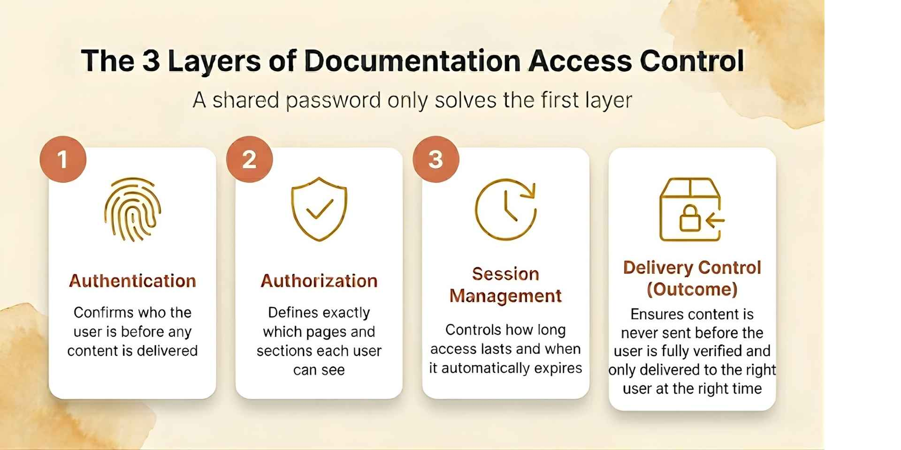
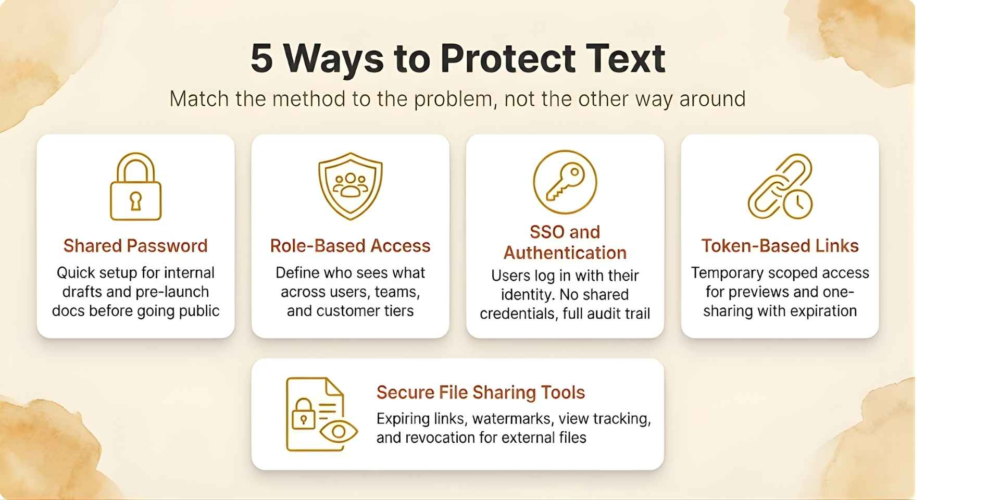
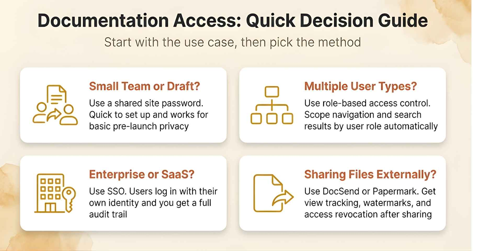
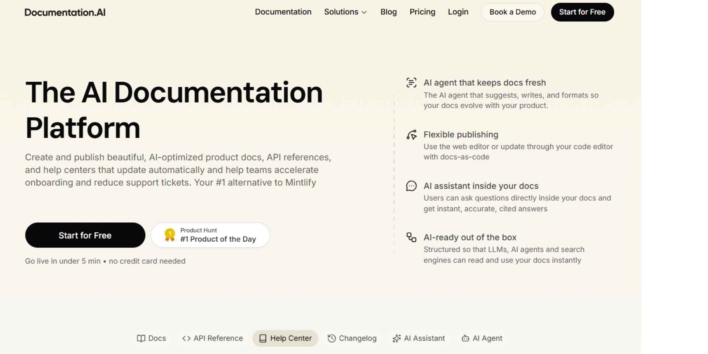

Most teams don't start by asking for access control systems. They ask a simpler question: how do we protect this text with a password? This usually comes up when sharing internal documentation, early product docs, or sensitive content like reports and API references. While password protection feels like the obvious answer, in 2026 it only solves a small part of the problem. Protecting text today means controlling who can access it, how they access it, and what happens after they do.

## TL;DR

Password protection works for basic privacy, but it doesn’t provide real control over access. As documentation grows, security shifts from simply locking content to controlling how it is delivered, which means verifying access before serving content, managing sessions, and defining who can see what. While shared passwords can be rotated for better security, they still lack visibility and user-level control. For teams handling sensitive or multi-user documentation, approaches like role-based access, authentication systems, or secure sharing methods are more reliable and scalable.

## Key Takeaways
- Password protection is a starting point, not a complete solution. It works for basic privacy, not for user-level control.
- Real security is about delivery control: who receives the content, not just who can see the interface.
- Authentication, authorization, and session management are three distinct problems that need three distinct answers.
- Role-based access control and SSO replace shared passwords as documentation grows.
- For external file sharing, tools like DocSend or Papermark give you far more control than a password-protected PDF ever will.
- The right approach depends entirely on your use case, from a small team sharing a draft to an enterprise running full audit trails.

## What Does Password-Protected Text Actually Mean?



When people say they want to protect text with a password, they usually mean one of three things. They want to keep documentation private from the public internet. They want to restrict access to specific users or teams. Or they want to share content securely without losing control over it.

These are different problems, and a single password doesn't solve all of them.

A simple password works well for basic privacy. It doesn't work well for user-level control, access revocation, or tracking who actually read the content.

### The Key Distinction: Gate vs. Delivery

Password protection is a gate. Real security is about delivery control.

Content should only be delivered after access is verified. The system first validates the password, establishes a session, and only then serves the content to the browser. This ensures the content is never exposed before authentication.

This is why modern documentation systems separate three distinct layers. Authentication confirms who the user is. Authorization defines what they're allowed to access. Session management controls how long that access lasts and under what conditions it expires.

### Example: API Documentation Access

Consider a team managing [API documentation](https://documentation.ai/blog/api-documentation-tools). If the docs use a single shared password, anyone who has it can access everything. To improve security, teams often rotate passwords periodically, but this still doesn’t solve the lack of user-level control or access visibility.

If the same docs use roles, engineers see internal runbooks and changelogs while customers only see the public-facing API reference scoped to their plan. Access is revoked the moment the relationship ends.

That shift from shared access to controlled delivery is what separates a basic password from a modern documentation system.

## When Is a Password Actually Enough?

Not every situation needs a complex setup. In many cases, a simple password is fine, as long as you understand its limits.
- **For pre-launch documentation**, if you're preparing docs before a product launch and want to keep them off search engines, password protection works well. You can share it internally and prevent accidental exposure without building a full authentication system. For teams using **Documentation.AI**, this takes a single configuration change with no engineering work required.
- **For customer-specific documentation**, if different customers need different views, including different configurations, plan tiers, and integrations, a shared password breaks immediately. Everyone with the same password sees the same content. This is where role-based access becomes necessary. It's not optional once your customer base grows.
- **For external file sharing**, if you're sharing reports, decks, or onboarding materials externally, a password-protected PDF is one of the weakest options available. You can't track who viewed it, you can't revoke access, and the file can be forwarded to anyone who shouldn't have it. For external sharing, you need tools designed for controlled delivery, not just a locked file.

## Methods to Protect Text in 2026



Think of these as a progression from simple to fully controlled, not as options to pick randomly based on preference.
1. ### Shared Password Protection

The most common starting point. It works well for internal documentation, early-stage products, or time-limited sharing.

If it's heavy documentation text, you can use tools like **Documentation.AI** where you can protect an entire site or specific sections with a password or authentication, all through simple configuration with no engineering required.

```
{
  "navigation": {
    "groups": [
      {
        "group": "Guides",
        "public": true,
        "pages": [
          { "title": "Overview", "path": "guides/overview" },
          { "title": "Internal Runbook", "path": "guides/internal-runbook", "public": false }
        ]
      }
    ]
  }
}
```

The limitation is that passwords can be shared. There's no audit trail and no way to know who accessed what or when.
1. ### Role-Based Access Control

As your documentation grows, you need user-level control rather than a single gate. Role-based access control lets you define who can see which sections, tabs, and pages, and filters navigation automatically based on the logged-in user. This is the model most modern [developer documentation tools](https://documentation.ai/blog/developer-documentation-tools) support, and it's the right system for any team managing more than one type of user.

```
{
  "navigation": {
    "tabs": [
      {
        "tab": "Engineering",
        "access-roles": ["engineering"],
        "groups": [
          {
            "group": "Runbooks",
            "pages": [
              { "title": "On-call", "path": "runbooks/oncall", "access-roles": ["sre"] }
            ]
          }
        ]
      }
    ]
  }
}
```

With this setup, users only see what they're permitted to see. Search results and navigation are filtered automatically with no risk of accidental exposure.
1. ### SSO and Authentication Systems

For most modern products, authentication replaces shared passwords entirely. Users log in with their identity through Google Workspace, Okta, or a custom SSO provider, and access is determined by their role or group membership.

This removes the largest weakness of password-based systems: credentials that are shared, forwarded, and never expire unless manually rotated. It also improves the user experience significantly because users don't manage a separate password for documentation.
1. ### Token-Based Links

Sometimes you need to share content without creating accounts. For example, a documentation preview for a prospect or a one-time link for a support handoff. Token-based links grant temporary access to a specific page or section. They should always expire, always be treated as sensitive, and never be shared publicly.
1. ### Secure File Sharing Tools

Protecting files is a different problem from protecting documentation. If it's a file, whether a PDF, a deck, or a report, use tools like DocSend or Papermark instead. They give you control that a password-protected file never can: expiration dates, email verification before viewing, watermarks tied to the viewer, per-page engagement tracking, and the ability to revoke access after sharing. A PDF with a password tells you nothing after it leaves your hands.

## Access Control Methods at a Glance

Method |, Best Use Case |, Control Level |, Tracking, Shared password |

Small teams, pre-launch drafts |

Medium |

None

Role-based access (RBAC) |

Teams, customers, multi-tier products |

High |, High, SSO and Authentication |, Enterprise and SaaS |, Very high |, Very high, Token-based links |

Previews, one-time access |

Medium |

Medium

Secure file sharing tools |

External PDFs, reports, decks |

High |

Very high

## Best Practices

Always enforce access at the server level, not just in the interface. If the content can be reached by modifying a URL or inspecting network traffic, it isn't protected; it's just hidden.

Avoid storing sensitive information in plain text in documentation that isn't fully gated, even internally. And when passwords are stored, follow the [OWASP Password Storage Cheat Sheet](https://cheatsheetseries.owasp.org/cheatsheets/Password_Storage_Cheat_Sheet.html): never keep them in plaintext, add a unique salt, and hash with a slow algorithm such as Argon2id or bcrypt with a work factor of 10 or more. Use short-lived tokens for any temporary or link-based sharing, because tokens without expiration accumulate risk over time. Add rate limiting to authentication endpoints to prevent brute-force attacks. Monitor access patterns, because unusual spikes to sensitive sections are worth investigating. And rotate shared passwords regularly.

For any password-based access, current NIST guidance (Digital Identity Guidelines, [SP 800-63B Rev. 4, 2024](https://pages.nist.gov/800-63-4/sp800-63b.html)) favors length over complexity: require at least 15 characters, allow up to 64, and do not force periodic resets or special-character rules, since those push people toward weaker, reused passwords. Reset only when there is evidence a credential has been compromised.

For teams building documentation that needs to scale, treating it as a structured access system rather than a collection of pages with a lock on the front is the shift that makes everything else easier. This is explored in depth in [what AI documentation actually requires](https://documentation.ai/blog/what-is-ai-documentation).

## Common Mistakes Teams Make
- Using one password for everything is the most common one. A single shared password means a single point of failure with no way to revoke access for just one person.
- Sending files by email with a password and assuming they're secure is another. The password and the file often travel together, and if the email is forwarded, so is access.
- Relying on "disable download" as a protection strategy doesn't work either. Browser-based restrictions can be bypassed in seconds by anyone with basic developer tools. It's a UX feature, not a security measure.
- Not tracking who accessed content is the mistake that only becomes visible when something goes wrong. And leaving old access active for former employees, churned customers, or expired contractors is a risk that compounds quietly over time.

## Which Method Is Right for You?

Every team's situation is different. If you're not sure where to start, this quick guide maps the most common scenarios to the right approach.



## How Documentation.AI Handles This
- **Documentation.AI** supports the full progression from a simple site-wide password for early-stage teams to role-based access, SSO integration, and section-level permissions for enterprise documentation.
- Teams managing multiple user types, including engineers, customers, support agents, and partners, can define roles, scope navigation, and filter search results automatically. No content surfaces to the wrong user by accident.
- For teams that have outgrown [platforms like Mintlify or GitBook](https://documentation.ai/blog/mintlify-alternatives), especially around access control and user management, this is often where limitations start to surface.
- **Documentation.AI** is designed with AI readability in mind, allowing structured and scoped content to power assistants without exposing restricted sections, a concept that becomes more important in the[AI era](https://documentation.ai/blog/importance-of-documentation).

## Final Thoughts

Password protection is a valid starting point. It isn't a destination.

As your documentation grows in content, in users, and in sensitivity, the goal shifts from hiding content behind a gate to delivering the right information to the right users automatically. That means structured access control, not just a shared password.

Teams that build documentation as a system, with authentication, authorization, and delivery control working together, build more reliable products, [reduce support load](https://documentation.ai/blog/reduce-support-tickets-better-documentation-ai), and give their AI tools accurate and scoped knowledge to work with. This is especially important when documentation is expected to handle support at scale and reduce incoming requests.

> **Thinking About Migrating from Mintlify or Another Docs Platform?**

For teams managing large MDX codebases, complex navigation, or hybrid Git and editor workflows, Documentation.AI offers guided migration support. You can talk directly with the team, walk through your setup, and get help via Slack.

[Join the Documentation.AI Slack](https://join.slack.com/t/documentationai/shared_invite/zt-3dl0x2qds-L85dnLpKyZ6oc5ZLba9_~Q)

## Why We're Building Documentation.AI



We're building **Documentation.A**I to solve two problems that product teams keep running into.
1. Documentation must be accessible to AI. That means structure, a clearly scoped assistant, and an agent interface like MCP. When documentation is flat, scattered, and manually maintained, AI tools give unreliable answers and support tickets follow.
2. Documentation must also stay accurate. That means using AI agents with human-in-the-loop workflows, either through Cursor-style Git workflows for developers, or a WYSIWYG block editor for non-technical contributors.

If this resonates with you, [try Documentation.AI](https://documentation.ai). There's a generous free plan, and if you have questions or want to think through your documentation setup, you can reach the team directly via Slack.

## Frequently Asked Questions

**Can I password-protect just one page in my documentation?** Yes. Most modern documentation platforms, including Documentation.AI support page-level access control. You can set individual pages as private while the rest of your site stays public.

**What's the difference between password protection and SSO?** Password protection uses a shared secret: one credential, many users. SSO ties access to an individual identity and gives you user-level visibility, revocation, and audit trails. Password protection gives you none of those.

**Is a password-protected PDF actually secure?** Somewhat. PDF passwords can be bypassed with widely available tools, and there's no way to revoke access once the file is shared. For sensitive content, use a secure sharing platform with link-based access and expiration instead.

**What happens if someone shares the password with an unauthorized person?** That person gets full access to everything the password protects. There's no way to know, no way to block them, and the only fix, changing the password, breaks access for every legitimate user at the same time.

**How do I track who accessed my documentation?** Shared passwords don't support tracking. For user-level access logs, you need authentication combined with a platform that records access events. Documentation.AI provides this as part of its access control system.

**Can AI assistants access password-protected documentation?** This depends on the platform. In Documentation.AI, role-scoped content can power an embedded AI assistant without exposing restricted sections to unauthorized users. The access boundary is enforced at the content delivery layer, not just the interface.
