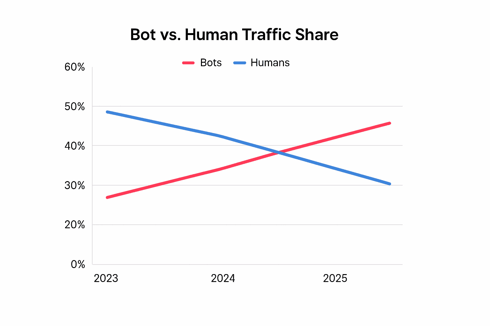
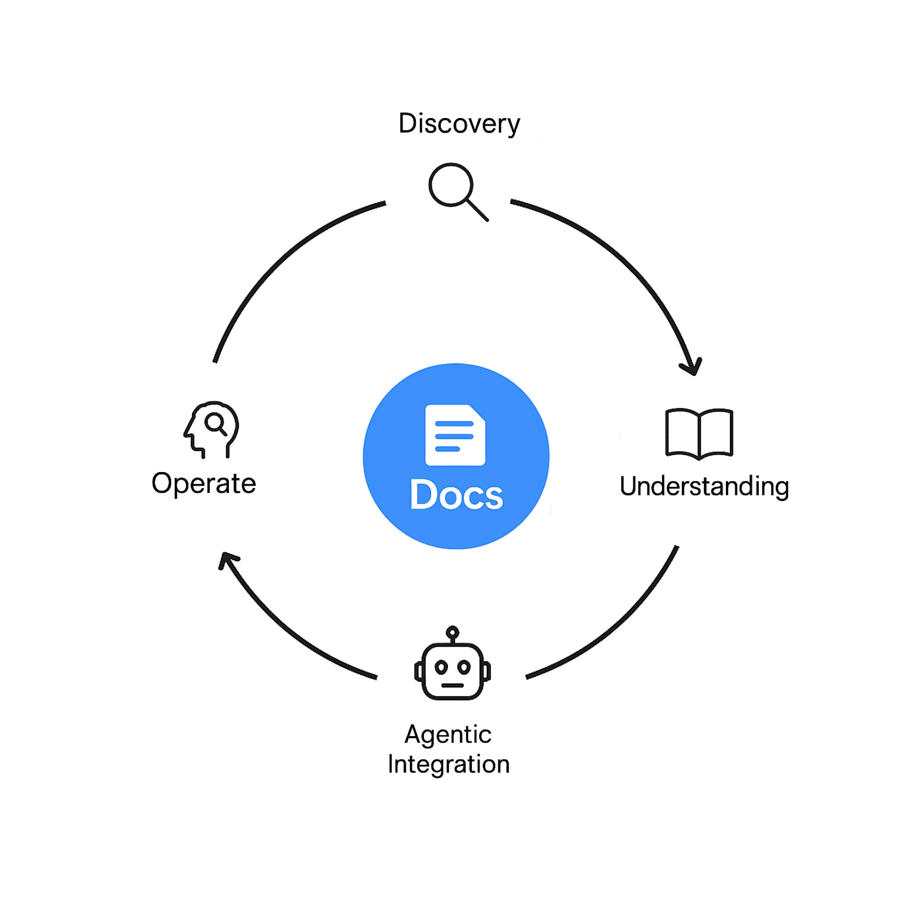

Documentation is no longer a help page that appears after launch; it is part of the product. As more people and AI assistants read docs before trying a tool, documentation now drives discovery, trials, usage, and integration. It shapes adoption and retention.

## Why the Importance of Documentation Has Increased Multifold

For years, many product teams treated documentation as an afterthought. That changed when developer-led products proved that great docs speed adoption. Stripe became a common example that builders point to because its docs make complex tasks feel clear and testable. People now evaluate products by scanning docs first, then everything else later. That is a culture shift, supported by developer-experience reviews of Stripe’s layout, samples, and try-it features. (See: [Moesif teardown of Stripe’s developer experience](https://www.moesif.com/blog/best-practices/api-product-management/the-stripe-developer-experience-and-docs-teardown/))

Now, with AI, the shift is far bigger. Automated visitors now outnumber people on the web. As of 2024, Imperva reported that bots made up about half of traffic. In 2025, the same group says automated traffic crossed the 51 percent mark. That means AI agents and crawlers are now a first-class audience for your content. Docs must serve them well, or those systems will answer users with stale or wrong guidance. (See: [Imperva press release on bot traffic](https://www.imperva.com/company/press_releases/bots-make-up-half-of-all-internet-traffic-globally/))

## Role of Documentation in Product Discovery

Here is what my personal product discovery and evaluation flow looks like:
1. First, I ask an AI chatbot like ChatGPT or Claude for the best tools in the category I am looking for. I include specifics such as my budget, the exact subcategory, and other relevant details.
2. I do not blindly trust those recommendations. Chatbot search results can be manipulated, so I use them only as a starting point to shortlist a few platforms.
3. Next, I ask follow-up questions in a fresh chat about my particular use case to see whether each tool actually solves it. In particular, I prompt it to browse the tool’s website and its documentation. This way, ChatGPT uses search mode instead of relying on fine-tuned data, which is usually about a year old.
4. I narrow the list to about two options and then read their documentation carefully.

At this point, if the product’s documentation includes an in-product AI assistant, I can ask questions without depending on ChatGPT. I continue asking follow-ups there, and if everything checks out, I sign up to try the product.

Two takeaways for product teams:
- Optimize your product and docs for AI search visibility. General AI chatbots such as ChatGPT should be able to retrieve accurate and up-to-date answers, even for very specific questions.
- Include a capable AI assistant in your docs platform. Users expect AI to be available wherever they are. You do not want to lose them to ChatGPT, since you cannot control its answers. Simple RAG-based AI assistants are often not enough. Aim to embed an agentic AI assistant that can perform multiple tool calls and return precise, trustworthy answers.

This same playbook is what I have used to shortlist most of the tools we use for [Documentation.AI](https://documentation.ai/), whether for auth providers (Clerk vs. Stack Auth vs. Better Auth) or vector search (Meilisearch vs. Typesense vs. Algolia).

## How Documentation Speeds Onboarding, Integration, and Support

Here is how our team uses AI and product documentation to integrate faster. Once we choose the product: if it is a developer tool (DevTool), we need to integrate it; if it is a non-DevTool, we need to start using it. I will talk specifically about a DevTool case. The flow is probably slightly different for a non-DevTool, but the principles remain the same.
1. We mainly use Cursor to write most of our code.
2. We check whether the product has an MCP server for product documentation, API references, or SDK references. If it does, we use that MCP server integration.
3. If an MCP server is not available, we do two things:
   - We prompt in Cursor to find a way to integrate properly. Here we face challenges because Cursor does not use web search reliably, and the fine-tuning data of the underlying models is usually about one year old. Many times it does not include the latest references. When that happens, the effort shifts from writing to debugging.
   - We use the AI assistant that is available on the product’s documentation website, since that usually has better and more recent information, or we use the latest documentation directly. If an AI assistant is not available, we depend on ChatGPT or Claude, but sometimes we have accuracy challenges.

Bottom line: if an MCP server is available, use it. If you can provide an MCP server for your documentation, you should provide it. Also ensure that you have a strong AI agent or AI assistant embedded in your product documentation, ideally an agentic one, so developers can reach the first API call or your north star action faster. The same applies to non-DevTools. The role of Cursor is limited there, and people often use ChatGPT for non-DevTool onboarding.

Two takeaways for product teams:
- Provide an MCP server.
- Have an agentic AI assistant. Your docs also need to be updated and structured for this to work.

We integrated our auth provider, Clerk, in a similar way. When we integrated Clerk, I do not think they had an MCP server for their documentation, so we used their embedded assistant extensively to integrate Clerk into our platform. Without that, it would definitely have taken much more time for us to integrate and go live with Clerk. Clerk has done a great job with their documentation, which is probably one reason it has become a No. 1 auth provider, especially for startups, beating multi-billion-dollar incumbents such as Okta and Amazon Cognito.

## The Price of Stale or Unstructured Documentation

When it comes to product documentation, “almost correct” is still wrong. Once the error rate drifts above one in a thousand calls, debugging hours explode, trust falls, and the next trial goes to a different vendor. This is what teams see when small doc gaps cascade into production issues.

Unfortunately, you cannot measure the full cost of stale docs with a single metric. You can track time to first API call, time to first go-live, and number of support tickets per account. Trend these over time and segment by SDK and version. That gives you an early signal.

## A Practical Playbook for AI-Ready Documentation

This is the playbook we use internally to make our documentation work for people and agents.

**Make documentation part of the product roadmap.** Treat docs as a feature with owners, SLAs, and release gates. Tie doc status to launch readiness. Do not ship if a new concept or parameter lacks a clear page and sample.

**Adopt a structured content model and frameworks.** Adopt popular documentation frameworks and best practices such as Diátaxis. Use front matter for version, JSON schema, status, and last-verified date so assistants can prefer the newest.

**Expose an agent interface.** Publish an MCP server for your documentation and tools. Map read-only endpoints that let an agent fetch topics, parameters, examples, and changelogs by ID. Add functions that return minimal examples for common tasks. This gives agents a dependable path from question to working code. (See [Model Context Protocol](https://modelcontextprotocol.io/))

**Embed a docs assistant.** Add a lightweight agentic assistant trained only on your docs and code samples. Users adopt this pattern quickly because it reduces search time.

**Analyze and improve.** Track which pages agents read through your MCP server, what people are asking in AI search, and page-level feedback. Use this data to improve your documentation on a regular basis.

Everyone knows AI is changing fast. New SDKs and protocols are also evolving very fast. We may also see new standards for documentation. One option is to choose a good documentation vendor who supports all the new features and moves quickly as AI evolves.

## Why We Are Building [Documentation.AI](https://documentation.ai/)

We are building Documentation.AI to solve two major problems product teams keep hitting when they try to create the best documentation for people and for AI agents.
1. Documentation must be accessible to AI. That means structure, a clear scope for an embedded assistant, and an agent interface such as MCP.
2. Documentation must be accurate and current. That means using AI agents with human-in-the-loop workflows to create up-to-date documentation, whether you use Cursor-like IDEs with Git if you are a developer, or our editor AI agents if you are a non-developer who prefers a WYSIWYG block-based editor.

If this resonates with you, you should definitely try [Documentation.AI](https://documentation.ai/). We have a very generous free plan. If you have any questions, or just want to brainstorm how to improve your documentation, you can contact me directly via Slack.
