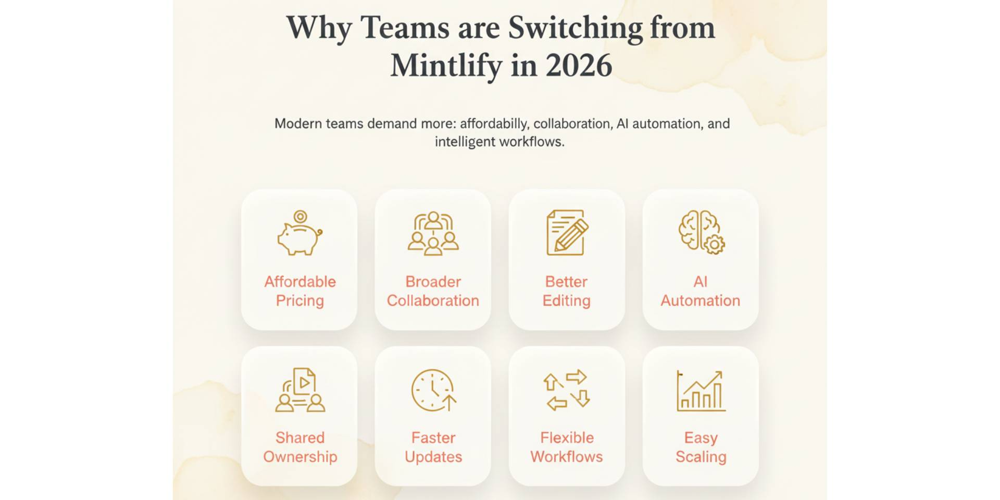
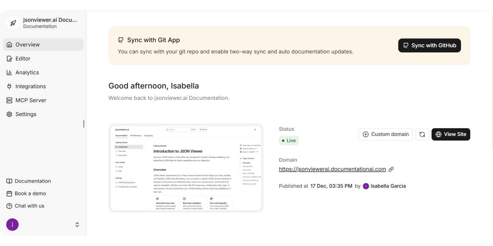
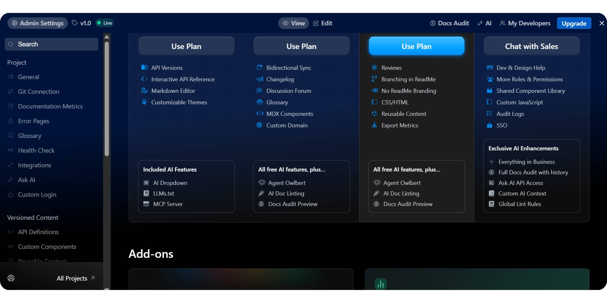
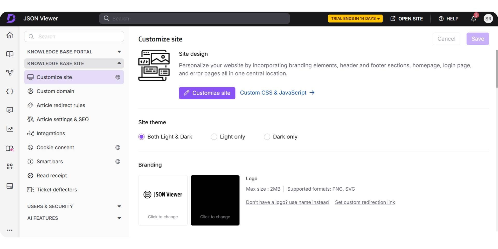
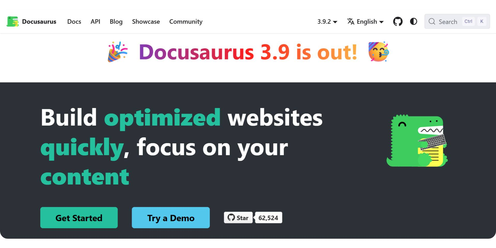

Documentation in 2026 has evolved into a dynamic, interactive system that plays a direct role in onboarding, support, and product adoption while increasingly enabling AI-based assistance. Modern teams expect documentation to stay accurate as products change, support both developers and non-technical contributors, and deliver instant answers through AI instead of forcing users to search through long pages.

**Mintlify** gained popularity by serving developer-first teams with a clean docs-as-code workflow, strong GitHub integration, and polished public documentation. Over time, it has added AI-assisted writing, reader-facing AI chat, an AI agent tied to GitHub updates, and a new editor experience currently in beta aimed at non-developers. However, meaningful customization still requires working in code, and pricing scales quickly, with advanced features starting around $450 per month. Based on public feedback from Reddit, G2, and Hacker News, these factors have pushed many teams to look for tools that feel more accessible, flexible, and budget-friendly.

As documentation ownership expands beyond engineering and expectations around AI shift from writing assistance to ongoing maintenance and automation, more organizations are actively searching for Mintlify alternatives. In this guide, we explore the best Mintlify alternatives in 2026, starting with **Documentation.AI**, focusing on platforms that use AI agents to automate documentation workflows, manage continuous updates, and maintain long-term accuracy while supporting both technical and non-technical teams.

## TL;DR — Quick Decision Guide

Documentation.AI is the strongest fit for teams that want AI agents to help with documentation structure, updates, and ongoing maintenance across both technical and non-technical contributors. Mintlify continues to suit developer-led teams that prefer a Git-centric, docs-as-code workflow. Teams that want a free or open-source Mintlify alternative typically choose Docusaurus. Pricing also influences decisions with Documentation.AI Prop Plan starting around $159/month versus Mintlify's Pro near $450/month when both are billed yearly.

## Top Mintlify Alternatives in 2026

The table below compares the most relevant Mintlify alternatives in 2026 based on documentation ownership, workflow style, and pricing visibility.

| Tool | Best Known For | Best Fit | Pricing (Visibility) |
| --- | --- | --- | --- |
| **Documentation.AI** | AI-powered documentation creation and maintenance | Teams with shared ownership and fast-changing docs | Public pricing, free plan available, paid plans from ~$55/month |
| **GitBook** | Collaborative editing with optional Git workflows | Product teams with mixed contributors | Public pricing, free plan, paid plans from ~$65/month |
| **ReadMe** | API-first documentation and developer portals | API-centric, developer-led teams | Public pricing, paid plans from ~$250/month |
| **Document360** | Governed knowledge bases with approvals | Support-led or enterprise environments | Pricing available on request (sales-led) |
| **Docusaurus** | Documentation for React projects and static websites | Developer-focused teams with React-based apps | Free and open source (engineering cost applies) |

## What Is Mintlify and Why Do Teams Need Alternatives in 2026?

Mintlify is a documentation platform built primarily for developer-first teams. It integrates closely with GitHub and follows a docs-as-code approach using Markdown or MDX. The platform is widely known for its polished public documentation experience and strong GitHub-native workflows.

Over time, Mintlify has expanded beyond its original positioning. It now includes AI-powered writing, reader-facing AI chat, an AI agent tied to GitHub updates, and a new editor experience (currently in beta) aimed at helping non-developers edit content more easily. While these additions improve usability, most customization and structural changes still require working directly with code.

In 2026, many teams begin evaluating alternatives, not because Mintlify is weak, but because their documentation needs change. As documentation ownership expands beyond engineering, smaller teams and growing startups often need tools that are easier to collaborate in, less dependent on Git workflows, and more predictable in pricing.

**Key Features**
- **GitHub Integration:** Tight sync with repositories for code-aligned documentation
- **Docs-as-Code:** Markdown or MDX-based workflows preferred by developers
- **Polished Public Docs:** Fast, clean, professional documentation output
- **AI-Powered Writing:** Assists with content generation and edits
- **Reader-Facing AI Chat:** Enables users to ask questions directly in docs

**Pricing**
- **Free Plan:** Suitable for individual developers or small experiments
- **Pro Plan:** Starts around $450/month for team collaboration, advanced AI tools, preview deployments, and security features.
- **Enterprise Plans:** Custom pricing for larger organizations with SSO and compliance needs. Read the[full Mintlify pricing guide](https://documentation.ai/blog/mintlify-pricing-guide) to understand enterprise pricing, AI credits, and the costs teams should consider.

As teams scale, Mintlify’s pricing and Git-centric workflow can become limiting, especially for smaller teams, mixed contributors, or organizations that want AI to handle more than just writing assistance.

**Pros**
- Strong docs-as-code workflow built around Git and MDX
- Excellent GitHub integration for engineering-led teams
- High-quality public documentation with clean UI
- AI tools help speed up writing and revisions

**Cons**
- GitHub-based onboarding limits non-technical contributors
- Navigation and structural changes often require manual config edits
- AI features focus on assistance rather than full automation
- Pricing increases quickly as teams add collaborators and features
- Less flexible for teams with shared documentation ownership

**Verdict**

Mintlify remains a solid choice for developer-led teams that prefer Git-first documentation. In 2026, teams exploring alternatives are often looking for lower pricing entry points, easier collaboration for non-developers, and AI that actively maintains documentation, not just helps write it.

### Why Choose Mintlify Alternatives in 2026

Teams typically look for alternatives when documentation ownership expands beyond developers to include product managers, support teams, and writers, and when Git-only workflows begin to slow collaboration.

**Teams often look for:**
- **Broader collaboration:** For developers, product managers, support teams, and writers without requiring Git expertise
- **Deeper AI automation:** AI that helps create, restructure, and maintain documentation, not just suggest edits
- **Cost predictability:** Lower entry pricing or strong free tiers with gradual scaling
- **Open-source or self-hosted options** with no proprietary lock-in
- **Customization without code:** Ability to manage navigation, structure, and layout without editing configuration files
- **Use-case-specific tooling:** Platforms optimized for API docs, internal wikis, or lightweight product documentation

As these needs grow, usability, automation depth, and pricing flexibility become key decision factors. Popular alternatives such as **Documentation.AI**, **GitBook**, **ReadMe**, **Document360**, and **Docusaurus** address these requirements in different ways, offering varying levels of collaboration, AI support, workflow flexibility, and pricing models suited to modern documentation teams.

## Best Mintlify Alternatives in 2026

### **#1. Documentation.AI**

[**Documentation.AI**](https://documentation.ai) is an AI-native documentation platform built for teams that need continuous creation, structuring, publishing, and long-term maintenance of documentation. Instead of treating documentation as a static set of pages, it is designed as a living knowledge system that evolves alongside the product. The platform supports both developers and non-developers through a visual editor combined with AI-driven workflows, allowing teams to create, reorganize, and update documentation without relying entirely on MDX files or manual configuration changes.

Unlike Mintlify, which originated as a docs-as-code tool centered around Git workflows, Documentation.AI is built to work across content, structure, and context together. Its AI documentation agent operates end to end, and the platform also supports MCP servers, enabling AI agents to securely connect documentation with external tools, internal systems, and live product context. This makes Documentation.AI suitable not only for writing documentation but also for agent-driven updates, automation, and context-aware documentation workflows as AI adoption expands in 2026.

**Key Features**
- **Visual Editor:** Easily write and restructure documentation without needing MDX or configuration file management.
- **Optional Git Integration:** Supports docs-as-code workflows for developers.
- **AI Agent:** Automatically generates complete documentation structures, not just individual pages.
- **Instant Publishing:** Automatically updates content without manual deployment or merge cycles.
- **Ask-AI:** A built-in AI assistant that answers user questions directly from live documentation.

**Choose Documentation.AI if your team needs:**
- Shared documentation ownership across different roles (developers, product managers, support teams, etc.).
- Reduced maintenance efforts as your documentation scales.
- AI-powered structural updates, not just page-level edits.
- A visual editor or Git workflows for editing.
- Instant publishing without manual deployment steps.

**Mintlify vs. Documentation.AI Key Differences**

| **Category** | **Mintlify** | **Documentation.AI** |
| --- | --- | --- |
| **Best For** | Developer-only teams | Mixed teams (developers + non-developers) |
| **Onboarding** | GitHub required | GitHub optional |
| **Visual Editor** | Basic | Full-featured |
| **Navigation Management** | JSON config-driven | Visual and JSON configuration |
| **Manual Config Edits** | Required for many changes | Rarely needed |
| **AI Writing Agent** | Basic, needs correction | Practical and end-to-end |
| **Ask-AI** | Paid plans only | Built-in |
| **Pricing** | ~$450/month (Pro) | Starts at ~$55/month, scales gradually |
| **Enterprise Readiness** | Yes (custom pricing) | Yes (custom pricing) |
- **Free (Starter):** Free forever plan for individuals, includes 1 editor seat and 10,000 AI credits per month
- **Standard:** $69/month (or $55/month with yearly billing), suitable for solo builders and small teams with 3 editor seats and 10,000 AI credits per month
- **Professional:** $199/month (or $159/month with yearly billing), designed for teams running documentation as a product, including 10 editor seats, 30,000 AI credits per month, private documentation, role-based permissions, and preview deployments
- **Enterprise:** Custom pricing for organizations requiring SSO (SAML/OIDC), advanced security, unlimited editor seats, and implementation support

Documentation.AI’s core paid plan starts at $159/month, making it significantly more accessible for small teams compared to Mintlify, which typically starts at around $450/month for comparable plans.

**Pros**
- Flexible onboarding and non-technical friendly, allowing both developers and non-developers to contribute.
- AI-driven automation significantly reduces manual maintenance.
- Visual editor makes restructuring and navigation easy without needing developer assistance.
- Instant publishing ensures changes are reflected live immediately.

**Cons**
- UI-driven customization may not be ideal for teams needing full control over their documentation structure.
- AI-generated content still requires human review to ensure accuracy.

**Why Teams Are Switching to Documentation.AI**

>

“With Mintlify, the AI helped with wording, but it didn’t assist much with structure or ongoing updates. We still had to manage MDX files and navigation manually. Documentation.AI’s agent-based approach made it easier to keep our docs organized and up to date as the product changed.”

**Anil Singh**, CTO, [**Videograph**](https://www.videograph.ai/)

>

“As our team grew, Mintlify’s pricing became harder to justify, especially given how limited the automation felt in day-to-day use. Documentation.AI gave us more flexibility around pricing and reduced the effort required to maintain documentation over time.”

**Mallikarjun Gaddam**, Co-founder, [**HumanizeAI.com**](http://humanizeai.com/)

**Verdict**

Mintlify remains a great tool for developer-only teams that want Git-based workflows. For teams with mixed roles or those looking to automate documentation maintenance, [**Documentation.AI is a practical alternative**](https://documentation.ai/blog/mintlify-vs-documentation-ai), pairing AI-driven workflows with a visual editor.

### **#2. GitBook**

GitBook is a cloud-based documentation platform built for teams that want collaborative editing without fully committing to a docs-as-code workflow. It is commonly used by product teams, startups, and open-source projects that need clean public documentation while allowing non-technical contributors to edit content directly from the browser.

Unlike Mintlify, which is deeply Git-centric, GitBook is designed around a visual editor and UI-managed structure, with Git integration available as an option rather than a requirement. This makes GitBook easier to adopt for teams where documentation ownership is shared across developers, product managers, writers, and support teams.

Over time, GitBook has expanded beyond simple page editing to include reader-facing AI chat, search, and integrations, positioning itself as a middle ground between developer-only tools like Mintlify and AI-native platforms like Documentation.AI.

**Key Features**
- Visual, block-based editor that works well for non-technical contributors
- Optional GitHub and GitLab sync for docs-as-code workflows
- UI-managed navigation and structure without manual config files
- Built-in reader AI chat trained on published documentation
- Clean, fast public documentation with theming and branding controls
- Role-based access control and review workflows for teams

**Choose GitBook if your team:**
- Has mixed contributors across technical and non-technical roles
- Wants a visual editor as the primary workflow
- Needs optional Git sync rather than mandatory Git usage
- Values fast collaboration and clean public documentation

**Pricing**
- **GitBook Free:** Suitable for individuals or small projects
- **GitBook Premium:** Starts at approximately $65/month per site, plus $12 per user
- **GitBook Ultimate:** Starts at approximately $249/month per site, plus $12 per user. Higher pricing for advanced permissions and AI-automated features.
- **Enterprise:** Custom pricing with SSO, advanced security, and support

**Mintlify vs GitBook Key Differences**

Category |, Mintlify |, GitBook, Best for |, Developer-only teams |, Mixed teams across roles, Primary workflow |, Git-first, MDX-based |, Visual editor first, Git requirement |, Mandatory |, Optional

Non-technical contributors |

Limited |, Strong support, Navigation management |, Config and files |, Fully UI-managed, AI focus |, Writing + reader chat |, Reader chat + editor help, Docs maintenance |, Manual |, Manual, Publishing |, Git-based deploy |, UI-based hosting, Pricing entry point |, Free (very limited) |, Free (limited), Paid plans start at |, \~$450/month |

\~$65/month per site + $12/user

**Pros**
- Very accessible for non-technical contributors
- Clean, modern public documentation experience
- UI-based navigation and structure management
- Optional Git workflows for developers

**Cons**
- Less control for teams that want fully code-managed docs
- Pricing increases with users and sites
- Not optimized for large-scale API-only documentation

**Verdict**

GitBook is a strong Mintlify alternative for teams that value collaboration and ease of editing over strict docs-as-code workflows. It works best when documentation is shared across roles and needs to be updated frequently by non-developers. Teams that need documentation to stay continuously accurate with less manual effort often evaluate Documentation.AI, which is widely considered **one of the** [**best GitBook alternatives in 2026**](https://documentation.ai/blog/gitbook-vs-documentation-ai) for AI-assisted updates, shared ownership, and scalable documentation workflows.

### **#3. ReadMe**

ReadMe is a documentation platform built specifically for **API-first products**. It is widely used by developer-led companies that treat documentation as part of the developer experience, not just a content site. ReadMe focuses on making APIs understandable, testable, and interactive through live examples, API explorers, and versioned references.

Unlike Mintlify, which centers on docs-as-code and static documentation sites, ReadMe is designed around developer portals. Documentation is closely tied to API schemas, request examples, authentication flows, and changelogs, making ReadMe especially popular with teams whose primary users are external developers consuming an API.

**Key Features**
- API-first documentation with interactive API explorers
- Support for OpenAPI and schema-driven API references
- Built-in authentication handling for live API requests
- Versioned documentation and changelogs for evolving APIs
- Reader-facing AI chat trained on documentation content
- Analytics to track how developers interact with docs
- Custom branding and developer portal features

Choose ReadMe over Mintlify if your team:
- Is building an API-centric product
- Serves external developers as the primary audience
- Needs interactive API testing inside documentation
- Values developer portals over general product documentation

That said, ReadMe does not aim to automate documentation maintenance. Most content updates, restructuring, and accuracy checks are still manual and driven by humans.

**Choose ReadMe if your team:**
- Is building an API-centric product
- Serves external developers as the primary audience
- Needs interactive API testing inside documentation
- Values developer portals over general product documentation
- Is comfortable maintaining documentation manually

**Mintlify vs ReadMe Key Differences**

Category |, Mintlify |, ReadMe, Best for |, Developer docs sites |

API-first developer portals

Core focus |

Docs-as-code |

Interactive API documentation

API explorers |, Limited |, Native and interactive, Git requirement |, Mandatory |, Optional

Non-technical contributors |

Limited |, Moderate, AI focus |, Writing + reader chat |

Reader chat + API assistance

Docs maintenance |, Manual |, Manual, Publishing model |, Git-based deploy |, Hosted developer portal, Pricing entry point |, Free (limited) |, No true free plan, Paid plans start at |, \~$450/month |, \~$250/month

**Pricing**
- **ReadMe Starter Plan:** Free plan ($0) with some basic features, including MDX components and API access.
- **ReadMe Pro Plans:** Typically start around $250 per month; however, these numbers could vary based on the add-ons teams opt for.
- **Enterprise:** Custom pricing with SSO, security controls, and dedicated support, which usually ranges from $3000+ per month.

While ReadMe is usually more affordable than Mintlify at smaller scales, costs increase as API traffic, documentation complexity, and team size grow.

**Pros**
- Excellent interactive API documentation experience
- Strong developer portal features
- Built specifically for API consumers
- Clear versioning and changelog workflows

**Cons**
- Not designed for full documentation lifecycle automation
- Limited support for non-API documentation use cases
- AI features do not handle structural or ongoing maintenance
- Less suitable for mixed teams managing broad product documentation

**Verdict**

ReadMe is a strong Mintlify alternative for API-first companies that care deeply about developer experience and interactive API documentation.

However, ReadMe still relies largely on manual updates and does not provide AI-driven documentation maintenance. As documentation scope expands beyond APIs in 2026, teams that want content to stay continuously accurate with less manual effort often evaluate platforms like Documentation.AI, which is frequently considered one of the[ **best ReadMe alternatives in 2026**](https://documentation.ai/blog/readme-vs-documentation-ai) for AI-assisted updates, shared ownership, and scalable documentation workflows.

### **#4. Document360**

Document360 is a documentation and knowledge base platform built primarily for support teams, customer success teams, and enterprises that require structured content, approvals, and governance. It is commonly used for help centers, internal knowledge bases, and customer-facing support documentation rather than developer-first product docs.

Unlike Mintlify or ReadMe, Document360 does not focus on docs-as-code or API-driven workflows. Instead, it emphasizes controlled publishing, permissions, and content review processes, making it a strong fit for enterprise documentation in regulated or support-heavy environments.

While Document360 has introduced AI-assisted writing features, its core strength remains documentation governance rather than automation or continuous maintenance.

**Key Features**
- Web-based editor designed for non-technical users
- Category-based documentation structure with versioning
- Approval workflows and role-based access control
- Separate public and private knowledge bases
- Basic AI writing assistance for content creation
- Analytics focused on article usage and support deflection

**Choose Document360 if your team:**
- Is support-led or operations-led
- Requires approvals, permissions, and governance
- Manages large help centers or internal knowledge bases

Prioritizes compliance and enterprise controls over flexibility.

**Mintlify vs Document360 Key Differences**

Category |, Mintlify |, Document360, Best for |, Developer-only teams |

Support and enterprise teams

Primary workflow |, Git-first |, UI + approval workflows, Docs-as-code |, Yes |, No

Non-technical contributors |

Limited |, Strong, Approval workflows |, Limited |, Core feature, AI focus |, Writing + reader chat |, Writing assistance only, Docs maintenance |, Manual |, Manual, API documentation |, Moderate |, Limited, Pricing model |, Public pricing |, Sales-led / quote-based

**Pricing**

Document360 follows a sales-led pricing model, with plans and costs typically shared during sales conversations rather than publicly listed on the website. Pricing varies based on factors such as team size, number of knowledge bases, permissions, and enterprise requirements.

**Pros**
- Strong approval and governance workflows
- Friendly for non-technical support teams
- Good for internal and external knowledge bases
- Clear separation of public and private docs

**Cons**
- Not designed for docs-as-code workflows
- Limited API documentation capabilities
- No AI agent for continuous maintenance
- Less flexible for fast-moving product documentation

**Verdict**

Document360 is a solid Mintlify alternative for support-driven or enterprise teams that prioritize governance, approvals, and controlled publishing. It works best when documentation functions as a structured knowledge base with clearly defined ownership and review cycles.

## Open-Source and Free Mintlify Alternatives

A large share of teams searching for a Mintlify alternative specifically want an open-source, free, or self-hosted option, usually to avoid upfront and advanced pricing costs. These two paths cover most cases:
- **Docusaurus (open source, free):** The most popular open-source Mintlify alternative. Like Mintlify, it uses Markdown/MDX and a docs-as-code workflow, but it is free, self-hosted, and fully customizable through React. Best when your team has engineering capacity and wants no recurring platform fees.
- **Documentation.AI (free Starter plan):** If you want a free tier without managing infrastructure, the Starter plan is free forever with 1 editor seat and 50 AI credits per month, plus a visual editor, search, analytics, and a custom domain.

## **#5. Docusaurus**

Docusaurus is an open-source documentation framework created by Meta and widely used by engineering teams building documentation sites with React. It is not a hosted documentation platform but a static site generator that developers customize and deploy themselves.

Unlike Mintlify, which provides a managed SaaS experience, Docusaurus offers maximum flexibility at the cost of higher setup and maintenance effort. It is popular among teams that want full control over their documentation infrastructure.

Docusaurus does not include built-in AI, collaboration tools, or hosting by default. Everything from search to deployment must be configured separately.

**Key Features**
- Open-source React-based documentation framework
- Markdown and MDX support
- Full control over site structure and theming
- Versioned documentation support
- Static site output suitable for any hosting provider
- Large ecosystem of plugins and community support

**Why Teams Choose Docusaurus Instead of Mintlify**

Mintlify offers a managed experience with built-in hosting, styling, and AI features. Docusaurus appeals to teams that want complete control and are willing to manage everything themselves.

Teams choose Docusaurus when they want to:
- Avoid SaaS lock-in
- Customize documentation deeply using React
- Host documentation on their own infrastructure
- Integrate docs tightly with an existing frontend stack

However, this flexibility comes with higher maintenance overhead.

**Choose Docusaurus if your team:**
- Is strongly engineering-driven
- Has frontend resources available
- Wants full control over hosting and customization
- Does not need visual editors or non-technical contributors
- Is comfortable managing builds and deployments

**Mintlify vs. Docusaurus Key Differences**

Category |, Mintlify |, Docusaurus, Best for |, Managed developer docs |

Fully custom dev-owned docs

Hosting |, Managed |, Self-hosted, Setup effort |, Low |, High

Non-technical contributors |

Limited |, Very limited, Visual editor |, Yes |, No, AI features |, Yes |, No, Docs maintenance |, Manual |, Manual, Cost |, Paid SaaS |, Free (engineering cost)

**Pricing**
- **Docusaurus:** Free and open source
- **Hidden cost:** Engineering time for setup, customization, hosting, and maintenance

While Docusaurus has no subscription fee, the total cost can be significant due to developer time and infrastructure management.

**Pros**
- Completely free and open source
- Maximum flexibility and customization
- Strong developer ecosystem
- No vendor lock-in

**Cons**
- Requires ongoing engineering effort
- No built-in collaboration or AI features
- Not suitable for non-technical contributors
- No hosted or managed experience

**Verdict**

Docusaurus is a strong Mintlify alternative for engineering-heavy teams that want full control over their documentation stack. It fits best when documentation is treated like a frontend project and maintained alongside application code.

As documentation grows and ownership expands beyond engineers, many teams find the manual overhead difficult to sustain. At that stage, teams often move toward managed platforms such as Documentation.AI, which supports faster iteration, collaboration, and AI-assisted maintenance without requiring custom infrastructure.

## Which Mintlify Alternative Is Right for Your Team in 2026?

Choosing the right Mintlify alternatives in 2026 depends less on feature lists and more on who owns documentation, how it’s maintained, and how often it changes.

Most teams compare alternatives for three core reasons:
- Ownership is expanding beyond developers to product, support, and content teams
- Costs increase as documentation scales
- AI expectations evolve, from writing help to ongoing updates and maintenance

Based on these needs:
- **Documentation.AI** fits teams with shared ownership that want AI agents to handle structure, updates, and maintenance with predictable pricing.
- **GitBook** suits teams prioritizing collaboration and visual editing over automation.
- **ReadMe** works best for API-first products and developer portals.
- **Document360** fits support-led or enterprise teams that need approvals and governance.
- **Docusaurus** is ideal for engineering-heavy teams that want full control and self-hosting.

Ultimately, the decision comes down to ownership model, maintenance effort, and long-term cost, not surface-level features.

## Mintlify Alternatives Final Comparison (2026)

This table highlights the differences teams most often use to make a final decision.

| Tool | Best For | Editing Experience | AI Role | Maintenance Effort | Pricing Entry |
| --- | --- | --- | --- | --- | --- |
| **Documentation.AI** | Mixed teams, fast-changing docs | Visual editor + optional Git | Full AI agent | Low | $55/month |
| **GitBook** | Collaborative product teams | Visual editor | Reader AI | Medium | ~$65/month + $12/user |
| **ReadMe** | API-first products | Dashboard-based | API + reader AI | Medium | ~$250/month |
| **Document360** | Support & enterprise teams | Structured UI with approvals | Writing assist | High | Sales-led |
| **Docusaurus** | Engineering-heavy teams | Code-only | None | Very high | Free (infra cost) |

## Final Verdict

**Mintlify** remains a strong choice for developer-led teams that prefer Git-centric, docs-as-code workflows and are comfortable managing documentation primarily through engineering resources. Tools like GitBook and ReadMe serve specific needs: GitBook is for collaborative, browser-based editing, and ReadMe is for API-first developer portals, while Document360 and Docusaurus fit teams that prioritize governance or full engineering control over automation.

For teams with shared documentation ownership, frequent product changes, and growing expectations around AI-driven maintenance, **Documentation.AI** is the option worth trialing first. Its combination of visual editing, AI agents for ongoing updates, instant publishing, and accessible pricing keeps documentation accurate and scalable without relying solely on Git-based workflows.

>

**Thinking about migrating from Mintlify or another docs platform?**\
For teams managing large MDX codebases, complex navigation, or hybrid Git + editor workflows, **Documentation.AI** offers guided migration support. You can talk directly with the team, walk through your setup, and get help via Slack.\
[**Join the Documentation.AI Slack**](https://documentationai.slack.com/join/shared_invite/zt-3dl0x2qds-L85dnLpKyZ6oc5ZLba9_~Q)

## Frequently Asked Questions

### 1. Is there a free or open-source Mintlify alternative?

Yes. Docusaurus is the leading free, open-source, self-hostable option (you pay only in engineering time). For a free tier without managing infrastructure, Documentation.AI's Starter plan is free forever with 1 editor seat and 50 AI credits per month.

### 2. What's the best alternative to Mintlify in 2026?

It depends on your team. Documentation.AI fits teams that want AI to handle structure, updates, and maintenance across technical and non-technical contributors. GitBook is better for visual collaboration, ReadMe for API docs, Document360 for enterprise governance, and the open-source Docusaurus for free self-hosting.

### 3. How does AI automation differ across documentation tools in 2026?

In 2026, AI automation ranges from basic writing suggestions to agents that assist with structure, updates, and maintenance. Documentation.AI focuses on AI agents that reduce manual upkeep, while many tools still rely on human-driven updates supported by limited AI features.

### 4. How does Documentation.AI support both technical and non-technical needs?

It offers a visual editor for nontechnical users and GitHub integration for developers, so both can contribute to one system, which is the main difference from Mintlify's developer-first design.

### 5. What is the best Mintlify alternative for enterprise documentation?

Document360 is a strong fit when approvals and governance are the priority, while Documentation.AI suits enterprises that want SSO, advanced security, and AI-driven maintenance across mixed teams. Both offer custom enterprise pricing.

### 6. Are there documentation tools with more predictable pricing than Mintlify in 2026?

Yes. In 2026, pricing is a major factor in tool selection. Documentation.AI offers a lower entry point and more gradual scaling compared to Mintlify’s higher starting tiers, making costs easier to manage as teams grow. Check the pricing [here](https://documentation.ai/pricing).

### 7. How should teams evaluate documentation tools for API documentation in 2026?

For API documentation in 2026, teams should look at support for structured references, versioning, and developer workflows. While some tools specialize in API portals, Documentation.AI is often used when API docs need to live alongside broader product documentation.

### 8. Who are Mintlify's main competitors?

Mintlify's main competitors and alternatives are **Documentation.AI**, **GitBook**, **ReadMe**, **Document360**, and **Docusaurus** spanning AI-native, collaborative, API-first, enterprise, and open-source approaches.
