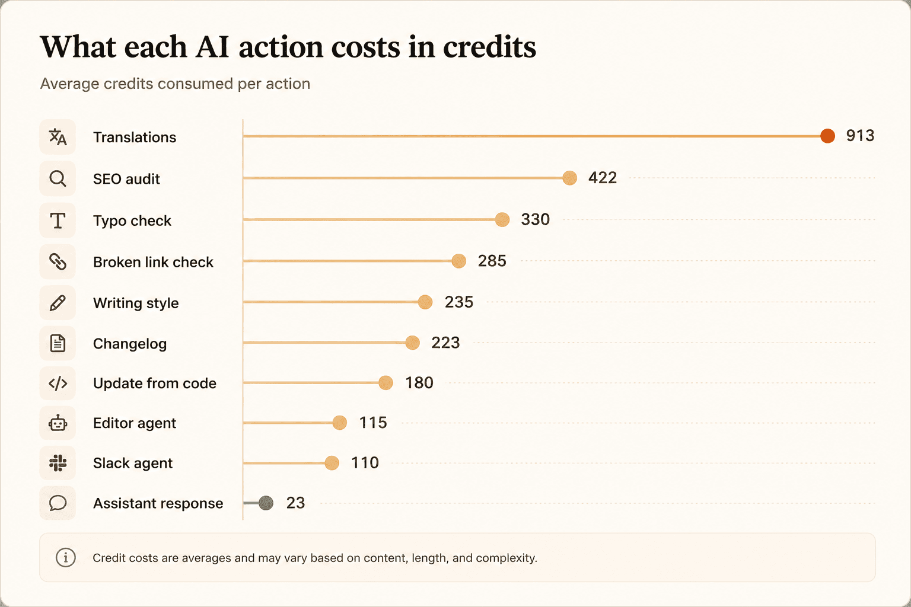

*We compared each plan's published pricing in July 2026. Mintlify has changed its pricing model recently, so confirm the current numbers on *[*mintlify.com/pricing*](https://www.mintlify.com/pricing)* and the *[*credit pricing docs*](https://www.mintlify.com/docs/credits)* before you commit.*

Mintlify's pricing seems straightforward at first glance. There's a free plan, a paid plan, and an enterprise tier. But once you start estimating what you'll actually pay, things get less clear. That's because AI credits are priced separately, and understanding how they work isn't always obvious. This guide breaks down each pricing tier, explains what uses AI credits, and walks through realistic cost scenarios so you can figure out whether Mintlify is the right fit before booking a sales call.

## At A Glance

Mintlify has three tiers, with AI usage billed through credits on top of the paid plans.

| **Plan** | **Price** | **AI Features** | **Credits** |
| --- | --- | --- | --- |
| Starter - 14 day trial | Free ($0) | Trial AI features: Assistant, agent and automations | 5000 |
| Pro | $450/month if billed annually and $540/month if billed monthly | Supports multiple agents and automations | 10,000/month included |
| Enterprise | Custom | Everything in Pro and enterprise security and controls | Custom credit tiers |

The credit packages available on Pro are listed below:

| Monthly Credits | Monthly Cost |
| --- | --- |
| 10,000 | $0 (Comes with Pro subscription) |
| 25,000 | $145 |
| 50,000 | $370 |
| 100,000 | $800 |

If you want a more affordable and predictable alternative with similar features, check out [Documentation.AI](https://documentation.ai). It is an AI-native documentation platform built for humans and AI agents, with pricing that bundles a fixed AI credit allowance into every plan. The paid plan starts at $55 per month, and there’s a free plan to try first.

## How does Mintlify's pricing work?

This is the part most buyers should pay attention to.

Mintlify's pricing isn't just about picking a plan. The plan determines which features you can access, while your AI usage determines how much you may end up paying each month. Understanding that distinction makes the rest of the pricing much easier to follow.

### Starter (Free)

The Starter plan gives you access to Mintlify's core documentation platform, including features like the web editor, custom domains, and authentication. It's a solid trial option if your primary goal is to publish and manage documentation without committing to a paid plan. The free plan requires no credit card to start.

The Starter plan focuses on Mintlify's core documentation platform rather than its AI capabilities. Features like Ask AI, AI agents, and automations aren't included as part of the free plan. However, new users can explore these AI features during Mintlify's 14-day free trial, which includes 5,000 AI credits. This gives you a chance to test how the AI fits into your documentation workflow before deciding whether to upgrade.

### **Pro**

For most growing teams, the Pro plan is where Mintlify's AI capabilities become part of the workflow.

Each Pro subscription includes 10,000 AI credits per month, which are shared across the AI Assistant, writing agent, Slack agents, and automations. If your team uses AI regularly to write, update, or maintain documentation, these credits become an important part of your monthly costs.

Need more? Mintlify lets you purchase larger credit bundles: 25,000 credits for $145, 50,000 for $370, or 100,000 for $800 or enable overage billing if you prefer to pay for additional usage as you go.

Mintlify also lists a base price for Pro ($450/month billed annually, or $540/month billed monthly). Paying annually saves $90 a month, which is $1,080 a year, about 17% off the monthly rate. So your total monthly bill is best thought of as two separate costs: your Pro subscription and the AI credits your team consumes.

### Enterprise

The Enterprise plan is custom-priced and is aimed at larger organizations with more advanced security, governance, and compliance requirements.

Beyond enterprise-grade features, it also unlocks custom AI credit packages, giving larger teams more flexibility than the standard credit tiers. Since pricing isn't published, you'll need to contact Mintlify's sales team for a tailored quote based on your team's size and requirements.

| Capability | Starter (Free) | Pro | Enterprise |
| --- | --- | --- | --- |
| AI Assistant, editor agent, automations | 14-day trial only | Included | Included |
| Buy extra AI credits | No | Yes | Custom packages |
| Preview deployments | No | Yes | Yes |
| Authentication | Private (org members) | Private + password | Private, password, OAuth, JWT, SAML SSO |
| Group-based access and personalization | No | No | Yes |
| Role-based access control | No | No | Yes |
| Audit logs | No | No | Yes |
| SSO and SCIM | No | No | Yes |
| Self-hosting, air-gapped, BYOK | No | No | Yes |
| White labeling, agent analytics | No | No | Yes |
| Support | Community | Standard | Dedicated, 24/7, custom SLA |
| Editors / seats | 1 | 5 + $20/user | Custom |

*Source:* [https://www.mintlify.com/pricing](https://www.mintlify.com/pricing)

Note: Every plan includes the core platform: web editor, custom domains, Git sync, search, the API playground, and the MCP server. What changes as you move up is AI access, authentication depth, and enterprise controls.

## Credit Packages, Overage Charges, and Credit Rollover

Once you're on a paid plan, these three things have the biggest impact on what you actually pay each month.
- **Credit Packages:** If you find yourself running out of AI credits regularly, you don't have to jump to a different plan straight away. Mintlify lets you purchase larger credit packages directly from the Usage page, and any changes are prorated immediately, so you only pay for what you use for the remainder of your billing cycle.
- **Overage Charges:** Running out of credits doesn't automatically mean you'll be charged more.

By default, overages are turned off. That means once you've used all of your monthly credits, AI features like the Assistant become unavailable until your credits reset at the start of the next billing cycle. This helps prevent unexpected charges, although it can interrupt your team's workflow if you underestimate your usage.

If you'd rather keep working without interruption, you can enable overages instead. Any additional credits are billed at $0.01 per credit, allowing your team to continue using Mintlify's AI without upgrading to a larger credit package.
- **Credit Rollover:** Not every month looks the same, and Mintlify accounts for that by letting you roll over unused credits.

Up to 50% of your unused monthly credits carry over into the next billing cycle, allowing you to accumulate as much as 1.5× your monthly credit allowance. This can be especially useful if your documentation workload fluctuates from month to month.

However, there's one important caveat: if you change your credit tier, any accumulated rollover credits are reset. That applies to downgrades too, not just upgrades. A downgrade takes effect immediately, the subscription charge is prorated to your current billing cycle, and any credits you banked are wiped at the same moment. So if you've built up a healthy balance, it's worth timing a tier change carefully.

### What does this mean in practice?

Mintlify's pricing is designed to scale with your AI usage rather than locking you into a fixed allowance. If your team relies heavily on AI, you can purchase more credits or enable overages to keep your workflow moving. On the other hand, if your usage varies from month to month, unused credits can roll over and help offset busier periods.

The trade-off is that your monthly bill isn't always fixed. As your team's AI usage grows, it's worth keeping an eye on your credit balance to avoid unexpected interruptions or additional charges.

## How do Mintlify AI credits work?

Credits are Mintlify's unit of AI consumption. Knowing what each action costs is the only way to forecast spend.

*Source: *[*mintlify.com/docs/credits*](http://mintlify.com/docs/credits)*.*

A few usage patterns are worth keeping in mind when estimating your monthly AI costs:
- The AI Assistant is relatively inexpensive at 23 credits per response, but because every visitor question uses credits, your costs can grow with traffic, not just your team's usage.
- The Editor and Slack agents (around 110–115 credits) depend on how often your team relies on AI.
- Automations are the biggest wildcard: a single translation run averages 913 credits, and each automation can run up to 500 times a day.

Mintlify's own example shows how quickly credits add up. A site with 500 AI Assistant responses a month uses roughly 11,500 credits (500 × 23), while a weekly broken-link check adds another 1,140 credits. That's already more than the 10,000 credits included with the Pro plan.

To avoid unexpected usage, Mintlify itself recommends running heavier automations (translations, SEO audits, and link checks) on a schedule instead of triggering them on every code push.

AI credits aren't directly comparable across platforms. [Documentation.AI](https://documentation.ai), for example, counts a reader question as 1 credit instead of 23. That doesn't make one platform cheaper than the other; it simply reflects a different way of measuring usage. The better comparison is the total cost for your team's workload, not the credit numbers themselves.

## What Does Mintlify Actually Cost?

The Pro plan starts at $450/month (billed annually), but that's only part of the picture. Your total cost depends on how many AI credits your team uses. Here are a few realistic scenarios based on Mintlify's published credit pricing.

**A small documentation site** *(\~1,000 AI Assistant questions per month)*

At 23 credits per Assistant response, that's roughly 23,000 credits a month. Since the Pro plan includes 10,000 credits, you would likely need the 25,000-credit package ($145/month) to comfortably cover your usage.

**A busy documentation site** *(\~500 AI Assistant questions per day)*

That's around 15,000 questions a month, or 345,000 credits. Even Mintlify's largest published credit package (100,000 credits for $800/month) only covers about 4,300 Assistant responses a month. Beyond that, you'll likely need a custom credit package, so it's worth discussing expected traffic with Mintlify's sales team early.

**Heavy documentation updates, but fewer reader questions**

Imagine your team runs the Editor 40 times a month, schedules a daily broken-link check, performs a weekly SEO audit, and processes 20 code updates. Together, that's roughly 18,400 credits, comfortably within the 25,000-credit package ($145/month). For teams using AI mainly to maintain documentation, costs tend to stay predictable, especially if automations are scheduled efficiently.

**A large documentation migration**

Migrating content itself doesn't consume AI credits. Mintlify's scraping CLI and GitHub auto-generation run locally, so they're free to use. Cost is only factored in during the AI cleanup afterward. Translation is the biggest contributor here, at around 913 credits per run, translating hundreds of pages can quickly exceed 100,000 credits, making a custom credit package more practical for one-off migrations.

**The takeaway?**

Mintlify is relatively affordable if your AI usage is moderate. Costs start to climb when you have high volumes of reader questions or rely heavily on translation-based automations. If you're comparing platforms, it's also worth remembering that AI credits aren't measured the same way everywhere. [Documentation.AI](https://documentation.ai), for example, uses a different credit system, so the more useful comparison is your expected monthly workload and total cost, not the credit numbers themselves.

## Mintlify Enterprise Pricing

Mintlify doesn't publicly list its Enterprise pricing, so you'll need to contact the sales team for a custom quote. The Enterprise plan is aimed at larger organizations that need stronger security, governance, and administrative controls. It includes features such as:
- **BYOK (Bring Your Own Key)** and **self-hosting** for organizations that want greater control over AI models and where their data is stored.
- **Audit logs** to track activity across deployments, users, billing, and quotas.
- **SSO, SCIM, and role-based access controls** to simplify identity management and user provisioning.
- **White labeling**, **agent analytics**, and **advanced insights** for organizations managing documentation at scale.
- **Dedicated customer success**, **24/7 incident monitoring**, **custom SLAs** for enterprise support.
- **Custom AI credit packages**, which are only available on the Enterprise plan.

If features like BYOK, self-hosting, audit logging, or SSO are non-negotiable for your organization, Enterprise is likely the right starting point. While Mintlify doesn't disclose a starting price, several reputable third-party sources place Enterprise plans at approximately $1,500 per month, with pricing varying based on deployment, security, and support requirements.

## Things to Consider Before Choosing Mintlify

Mintlify is transparent about how its pricing works, but there are a few details that are easy to overlook when you're estimating costs.
- **Running out of credits pauses AI features.** Since overages are turned off by default, exhausting your monthly credits means the AI Assistant becomes unavailable until your credits reset. If your documentation relies on Ask AI, this can affect your readers, not just your internal team.
- **Overages can increase your monthly bill.** If you enable overages, every additional AI credit costs $0.01. It's a convenient way to avoid interruptions, but it also turns a predictable monthly bill into a usage-based one.
- **Changing credit tiers resets rollover credits.** Any unused credits you've carried over are forfeited when you move to a different credit package.
- **Automations have daily limits.** Each automation can run up to 500 times per day, although failed runs don't count toward that limit.
- **API and MCP rate limits apply.** If you're building high-traffic integrations with the Assistant API or MCP servers, it's worth reviewing Mintlify's published rate limits to make sure they align with your expected usage.

## Is Mintlify the Right Choice for You?

**Mintlify is a great fit if you:**
- Expect your AI usage to vary month to month and prefer paying based on usage.
- Want features like credit rollover and optional overages instead of a fixed AI allowance.
- Need enterprise capabilities such as BYOK, self-hosting, audit logs, and advanced governance.

**It may not be the best fit if you:**
- Want to use AI features without upgrading beyond the Starter plan.
- Prefer predictable monthly costs over usage-based billing.
- Expect a high volume of AI Assistant questions and don't want costs to scale with reader traffic.

If you fall into the second category, it's worth reading our full [Documentation.AI vs Mintlify comparison](https://documentation.ai/blog/mintlify-vs-documentation-ai) to see how the two stack up on features and total cost. [Documentation.AI](https://documentation.ai) includes AI in its free plan and bundles a fixed number of AI credits into each paid tier, making monthly costs easier to predict. Mintlify, on the other hand, offers a more flexible usage-based model that can work well for teams whose AI usage fluctuates. Ultimately, the better choice depends on how your team uses the platform, not the headline price.

## Before You Decide

Before choosing a plan, estimate:
- How many AI Assistant questions is your documentation likely to receive each month?
- How often will your team use AI for writing, editing, and automations?
- Whether you'll eventually need Enterprise features like SSO, audit logs, or self-hosting

Those three factors will have a much bigger impact on your total cost than the subscription price alone. Once you've estimated your usage, confirm your expected pricing with Mintlify's sales team, especially if you're considering Enterprise or expect heavy AI usage.

> If predictable pricing is what you're after, [book a Documentation.AI demo](https://documentation.ai/get-a-demo) to see how bundled AI credits keep your monthly cost flat, or start free with no credit card required.

## FAQs
1. **How much does Mintlify cost?**

Mintlify has three plans. Starter is free. Pro is $450 per month billed annually, or $540 per month billed monthly. It includes 10,000 AI credits. Enterprise is custom-priced, with third-party estimates starting around $1,500 per month. AI usage beyond your plan's included credits is billed separately as credits.
1. **What is a Mintlify AI credit?**

A credit is Mintlify's unit of AI usage, and different actions cost different amounts. An AI Assistant answer averages 23 credits, an editor agent run averages 115, and a translation automation averages 913.
1. **Is there a free Mintlify plan?**

Yes. Mintlify's Starter plan is free and includes the core documentation platform, custom domains, and login for organization members. It does not include AI features. You can test the Assistant, agents, and automations through a 14-day trial with 5,000 credits, but ongoing AI use requires the Pro plan.
1. **How much is Mintlify Enterprise?**

Mintlify does not publish Enterprise pricing, so you contact sales for a custom quote. Several third-party sources estimate plans start around $1,500 per month. Enterprise adds custom AI credit packages, SSO, SCIM, role-based access control, audit logs, BYOK, and self-hosting wi

th the final price based on your security and support needs.
1. **Is Mintlify's pricing predictable?**

Not entirely. Your bill has two parts: a fixed Pro/Enterprise subscription and variable AI credits that rise with reader questions and automation runs. Teams that want a flat monthly cost often look at platforms that include a set credit allowance in each plan, such as [Documentation.AI](https://documentation.ai), where AI usage is part of the tier price rather than a separate meter.
