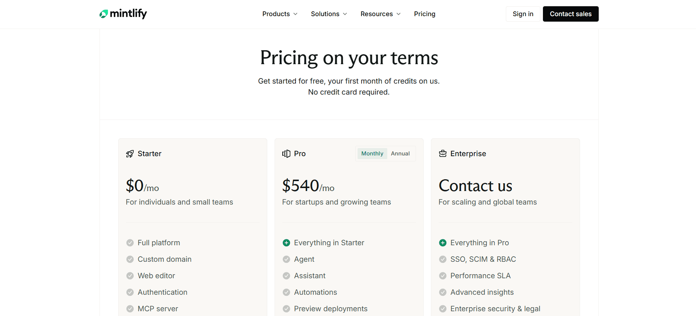
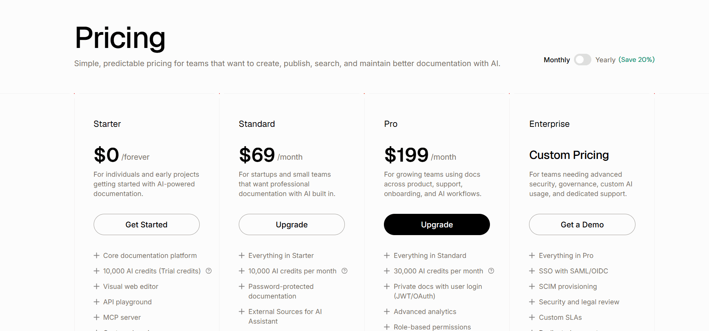

Documentation today is expected to do more than just exist, it the living product knowledge layer. As products evolve, teams rely on documentation to stay accurate, searchable, and useful for both internal teams, end users and also AI Agents.

Mintlify is one of the most established players in this space, especially popular with developer-first teams that prefer docs-as-code workflows. [**Documentation.AI**](https://documentation.ai), on the other hand, is a newer entrant that has gained attention in 2026 for its AI-first approach, flexible developer and non-developer workflows and rapid adoption, including being recently featured as [**Product of the Day**](https://www.producthunt.com/leaderboard/daily/2025/12/5) on Product Hunt.

This comparison looks at how both platforms perform in real usage, not just what they claim to support, and where each one fits best depending on how your team works.

## TL;DR — Quick Decision Guide

**Mintlify makes sense if:**
- Your documentation is owned almost entirely by developers
- You want a Git-first, docs-as-code workflow using Markdown or MDX
- You’re comfortable managing structure and navigation through configuration files

**Documentation.AI makes more sense if:**
- Documentation is owned across developers, product managers, or support teams
- You expect AI to help generate, maintain, and explain documentation over time
- You prefer pricing that scales gradually as your team and usage grow

**Bottom line:** Mintlify remains a strong developer-first platform. Documentation.AI is built to support broader teams and evolving documentation needs, making it a practical Mintlify alternative for many organizations.

## How These Platforms Were Compared

I tested both platforms using the same workflow: account creation, onboarding, documentation setup, editing, publishing, and interaction with AI features.

The comparison focuses on practical questions teams care about, such as:
- How quickly you can go from signup to live documentation
- How easy it is to edit and restructure content over time
- Whether AI features reduce work or add overhead
- How usable the published documentation feels for end users
- How pricing changes as real usage increases

The goal is not to crown a single winner but to clearly show where each platform fits and where it starts to struggle, depending on team structure and expectations.

>

📌**Update:** Mintlify has recently updated its editor experience and opened it in beta, making content editing more accessible for non-developers. Since this release is still in beta, I will review and update this comparison once the editor is generally available.

## Which is easier to onboard?

Documentation.AI targets a fast, low-setup start for both technical and non-technical contributors, while Mintlify centers on a docs-as-code, Git-based workflow. Teams with writers who do not work in Git tend to onboard faster on a platform built around a visual editor rather than pull requests.

### Mintlify

<iframe
  src="https://www.youtube.com/embed/AaqGC9mzzao"
  title="Mintlify"
  allow="accelerometer; autoplay; clipboard-write; encrypted-media; gyroscope; picture-in-picture; web-share"
  allowFullScreen
></iframe>

Mintlify’s onboarding immediately signals that it’s built for developers.

Account creation supports options like Google sign-in or entering basic details. However, to actually set up documentation, Mintlify requires connecting a GitHub account. The onboarding checklist clearly prompts users to sign in with GitHub in order to create a repository, making GitHub effectively mandatory for publishing documentation.

Once connected to GitHub, onboarding is fast and efficient. A repository is created, and documentation is auto-published immediately on a Mintlify subdomain. For developers already comfortable with Git workflows, this process feels smooth and straightforward. For users who don't have access to GitHub and/or want to publish content, this is an obvious bottleneck.

### Documentation.AI

<iframe
  src="https://www.youtube.com/embed/uykRQHTS_54"
  title="Documentation.AI"
  allow="accelerometer; autoplay; clipboard-write; encrypted-media; gyroscope; picture-in-picture; web-share"
  allowFullScreen
></iframe>

Documentation.AI offers a clearer and more flexible starting experience. Signup does not require mandatory GitHub authorization, making it accessible to non-technical contributors.

During onboarding, users are asked to confirm their company or brand name, which is used for the documentation header and temporary public URL and can be changed later. Users then choose between two setup paths:
- **Quick Setup**, designed for non-technical users and product teams, using a built-in web editor with no GitHub required
- **Developer Flow,** which connects a GitHub repository for teams that prefer a docs-as-code workflow

Once a setup path is selected, Documentation.AI automatically generates a complete documentation structure, including core sections and navigation. The documentation site is auto-published immediately after onboarding, with a live public URL available within minutes.

**Onboarding verdict:** Mintlify works best for developer-only teams already committed to GitHub workflows. Documentation.AI removes friction for mixed teams and gets documentation live faster with fewer prerequisites.

## Writing & Maintaining Documentation Over Time

### For Non-Technical Contributors

<iframe
  src="https://www.youtube.com/embed/8PER0Q8CVI8"
  title="For Non-Technical Contributors"
  allow="accelerometer; autoplay; clipboard-write; encrypted-media; gyroscope; picture-in-picture; web-share"
  allowFullScreen
></iframe>

<iframe
  src="https://www.youtube.com/embed/p-1M3UJwQ3A"
  title="For Non-Technical Contributors"
  allow="accelerometer; autoplay; clipboard-write; encrypted-media; gyroscope; picture-in-picture; web-share"
  allowFullScreen
></iframe>

Mintlify’s editing experience assumes comfort with MDX and Git. While a visual editor exists, meaningful control over structure and navigation requires working directly with files and configuration. In practice, reorganizing sections or navigation involves manually editing the `docs.json` file, which defines the documentation structure.

Because navigation is file- and config-driven rather than drag-and-drop, restructuring documentation can be difficult for writers or product managers. Collaboration features also feel developer-centric, with no Google Docs–style comments or suggestion workflows.

Documentation.AI takes a more inclusive approach. The web editor allows non-technical users to write, restructure, and maintain documentation visually. Navigation changes can be made directly in the UI, updates are reflected live, and an AI agent is embedded within the editor. This significantly reduces dependency on developers for day-to-day documentation maintenance.

### For Developers

Mintlify excels in docs-as-code workflows. Developers manage documentation directly from their IDE using Markdown / MDX, Git sync, and configuration files. Structure, navigation, and many updates must be handled manually through these files. Preview deployments allow teams to review changes before publishing, which fits well into engineering-led workflows but requires ongoing file-level involvement.

Documentation.AI also uses a structured configuration layer called `documentation.json` similar to `docs.json` to define documentation structure and navigation. The difference is that you also manage configuration with the visual interface. Developers can still work with Markdown and Git-based workflows when needed, but most structural updates do not require manual configuration edits.

This allows developers to keep full control when they want it, while non-technical contributors can safely make changes without worrying about breaking navigation or configuration.

Both platforms follow support coding agents such as Cursor or Claude Code to reduce the manual writing and configuration effort in the IDE.

**Editing verdict:** Mintlify puts full control in the hands of developers but requires manual configuration updates. Documentation.AI supports the same underlying structure while abstracting configuration management, balancing developer control with accessibility for the rest of the team.

## How do the AI features compare in real use?

Both platforms offer an AI assistant and an AI writing agent. Documentation.AI's agent is built to keep docs in sync as the product changes, while Mintlify meters agent and automation runs as credits, where an editor agent run averages 115 credits and a translation automation averages 913.

### AI Agent (Creating & Maintaining Documentation)

### **Mintlify**

<iframe
  src="https://www.youtube.com/embed/osUCjsb_HQs"
  title="Mintlify"
  allow="accelerometer; autoplay; clipboard-write; encrypted-media; gyroscope; picture-in-picture; web-share"
  allowFullScreen
></iframe>

Mintlify’s Editor AI agent works mainly as a basic writing and suggestion assistant. During testing, it took noticeable time to respond and was limited to proposing small rewrites or contextual suggestions. It did not generate a complete documentation structure on its own.

The AI also does not clearly indicate where changes should be applied. Users must manually locate the correct MDX files or configuration files to implement suggestions, and updates are not reflected immediately.

### **Documentation.AI**

<iframe
  src="https://www.youtube.com/embed/_dwaTz1nqu8"
  title="Documentation.AI"
  allow="accelerometer; autoplay; clipboard-write; encrypted-media; gyroscope; picture-in-picture; web-share"
  allowFullScreen
></iframe>

Documentation.AI’s AI agent is useful for both developers and non-developers and is especially easy for non-technical users to work with. It can generate a complete documentation structure, expand sections, and help maintain content over time.

While generation may take a short amount of time, changes are applied directly in the editor and reflected immediately. Users do not need to locate files or manage configuration manually.

### Ask AI (User-Facing AI Assistant)

Mintlify includes an AI assistant embedded into published documentation that answers questions and cite pages. During testing, response quality was inconsistent, with some answers being helpful and others feeling generic or not closely grounded in the documentation, likely depending on how well the docs are structured. Access to the AI assistant in published documentation requires a paid Mintlify plan (Pro or Enterprise), and usage is metered with plan-based limits.

Documentation.AI’s Ask-AI feature accurately reads the published documentation and delivers fast, relevant answers. This improves discoverability for readers and reduces the need for manual searching.

**AI verdict:** Equal

## Public Documentation Experience

### Mintlify

<iframe
  src="https://www.youtube.com/embed/s1mYhmKyT0c"
  title="Mintlify"
  allow="accelerometer; autoplay; clipboard-write; encrypted-media; gyroscope; picture-in-picture; web-share"
  allowFullScreen
></iframe>

Mintlify produces clean, modern, and fast-loading public documentation. Typography, spacing, and navigation feel professional by default, and users can switch between light and dark modes while browsing the docs. Page loads are fast, and the reading experience is smooth across sections.

However, the published documentation experience is largely static. There is no Ask-AI or reader-facing AI assistant available in the live docs, and readers must rely on manual navigation to find answers.

### Documentation.AI

<iframe
  src="https://www.youtube.com/embed/94CBSM11l5I"
  title="Documentation.AI"
  allow="accelerometer; autoplay; clipboard-write; encrypted-media; gyroscope; picture-in-picture; web-share"
  allowFullScreen
></iframe>

Documentation.AI matches this level of polish while also supporting light and dark modes, quick navigation, and consistently fast load times. In addition, published documentation includes a built-in Ask-AI feature that allows readers to ask questions directly against the live documentation.

Ask-AI reads the current content, understands context, and returns relevant answers without requiring users to search or leave the page. This makes the documentation more interactive and easier to consume, especially for first-time users.

**End-user verdict:** Both platforms deliver high-quality, fast, and visually polished public documentation with light and dark mode support. Documentation.AI goes a step further by adding a built-in Ask-AI assistant, making the reading experience more interactive and flexible out of the box.

## Pricing

Mintlify offers a free Starter plan, but it is primarily suitable for individual developers or small experiments. To unlock collaboration features, AI capabilities, preview deployments, and security controls, teams need to upgrade to the Pro plan, which is priced around **$540 per month** on monthly billing and slightly lower on annual plans. There is no meaningful mid-tier option, so teams tend to jump directly from free to a high-cost plan as soon as they scale beyond solo usage. Enterprise features such as SSO, custom authentication, and SLAs are available only through custom pricing, which further increases cost as requirements grow.

Documentation.AI follows a more gradual pricing model. The free Starter plan is usable for real documentation projects and already includes AI credits, a visual editor, search, analytics, and a custom domain. Paid plans start at a much lower price point **(around $69/month)**, allowing small teams to access AI features and collaboration without a large upfront cost. As teams grow, pricing scales step by step rather than jumping abruptly. This makes long-term costs more predictable and better aligned with how documentation teams actually expand.

**Pricing verdict:** Mintlify becomes expensive quickly as teams move beyond individual usage. Documentation.AI offers a more accessible and predictable pricing path as teams grow. To learn more about the credit system of Mintlify and an in-depth pricing guide, click [here.](https://documentation.ai/blog/mintlify-pricing-guide)

## Is Mintlify Worth It? Pros, Cons & Who It's For

Mintlify is worth it if your documentation is owned entirely by developers who already live in GitHub, you want polished docs-as-code output, and the Pro plan fits your budget once you scale past the free tier.

**Pros**
- Strong docs-as-code workflow built around Git and MDX
- Fast, clean, and polished public documentation
- Works well for developer-only teams that prefer staying inside their IDE

**Cons**
- GitHub-only onboarding limits accessibility for non-technical users
- Editing and restructuring documentation is difficult for writers or PMs
- Many updates require manual changes to MDX or configuration files
- AI agent output often needs significant manual correction

### Documentation.AI - Pros & Cons

**Pros**
- Flexible onboarding that works for developers and non-technical contributors
- AI-assisted documentation creation and maintenance is practical in real usage
- The visual editor allows easy restructuring without touching configuration files
- Predictable and accessible pricing as teams grow

**Cons**
- Advanced customization options are more UI-driven than code-first
- AI-generated content still benefits from human review for accuracy
- Fewer low-level configuration controls than fully code-managed systems

## Mintlify vs. Documentation.AI - Final Comparison

| Category | Mintlify | Documentation.AI |
| --- | --- | --- |
| **Best for** | Developer-only teams | Mixed teams (devs + non-devs) |
| **Onboarding** | GitHub required | Github optional |
| **Non-technical friendly** | Limited | Yes |
| **Docs-as-code** | Strong (MDX + Git) | Strong ((MDX + Git)) |
| **Visual editor** | Basic | Full-featured |
| **Navigation management** | JSON config-driven | Both Visual and Json |
| **Manual config edits** | Required for many changes | Rarely needed |
| **AI Writing agent (creation & updates)** | Basic, needs correction | Practical & end-to-end |
| **Ask-AI on published docs** | ✅ Available | ✅ Available |
| **Public docs quality** | Fast, clean, polished | Fast, clean, polished |
| **Light / Dark mode** | Yes | Yes |
| **Preview deployments** | Yes | Yes |
| **Pricing entry point** | Free (limited) | Free (usable) |
| **Paid plans start at** | ~$450 / month | ~$55 / month |
| **Pricing scalability** | Steep jumps | Gradual & predictable |
| **Enterprise readiness** | Yes (custom) | Yes (custom) |

>

Mintlify recently released an AI Agent that reads github pushes and give an plan to auto updated documentation. Looks promising but we could not test it out. Documentation.AI also has similar features in the pipeline.

## Related Mintlify Comparisons

Comparing Mintlify with more than one tool? These help you decide:
- [**Mintlify vs GitBook**](https://documentation.ai/blog/mintlify-vs-gitbook) - Git-first docs-as-code versus collaborative visual editing.
- [**Mintlify vs ReadMe**](https://documentation.ai/blog/mintlify-vs-readme) - Developer docs sites versus API-first developer portals.
- Weighing several tools at once? See the full [**Mintlify alternatives**](https://documentation.ai/blog/mintlify-alternatives) guide, or compare [**GitBook vs Documentation.AI**](https://documentation.ai/blog/gitbook-vs-documentation-ai).

## Final Take

Mintlify is a strong choice for entreprises when documentation is fully owned by developers and tightly integrated with Git-based workflows. It delivers fast, polished docs but requires ongoing technical involvement to manage structure and updates.

For teams that include product managers or support teams, and for those who want AI to meaningfully reduce documentation effort without increasing complexity, [**Documentation.AI is a practical and well-balanced Mintlify alternative**](https://documentation.ai/blog/mintlify-alternatives) in 2026.

The best choice ultimately depends on how your team works today and how you expect your documentation needs to evolve as you scale.

>

**Need help migrating from Mintlify or another documentation platform?**\
If your setup involves large MDX repositories, custom navigation, or mixed Git and editor workflows. You can connect directly with our team and discuss your setup on Slack.\
**Documentation.AI Slack channel:** [Join here](https://join.slack.com/t/documentationai/shared_invite/zt-3dl0x2qds-L85dnLpKyZ6oc5ZLba9_~Q)

## **Frequently Asked Questions**

### **1) What are the best alternatives to Mintlify for documentation in 2026?**

Common Mintlify alternatives include Documentation.AI, Document360, Docusaurus, and GitBook. Documentation.AI stands out for AI-driven automation and scaling across developer and non-developer teams. See the full [Mintlify alternatives](https://documentation.ai/blog/mintlify-alternatives) guide.

### **2) Why do teams look for alternatives to Mintlify?**

Teams search for alternatives to Mintlify due to pricing concerns, workflow limitations, and the need for more advanced AI features.

### **3) What makes Documentation.AI a strong Mintlify alternative?**

It offers AI-driven automation, real-time updates, and accessible pricing, which suits teams with diverse roles. Mintlify is more Git-based and developer-centric, which is less flexible for non-technical contributors.

### **4) What are the advantages of switching from Mintlify to other platforms?**

Switching from Mintlify to other platforms like Documentation.AI is common due to scalability issues, pricing concerns, and the need for more flexibility and AI capabilities. Documentation.AI is designed to cater to both developer and non-developer teams, unlike Mintlify’s developer-first focus.

### **5) Is Mintlify worth the cost in 2026?**

Mintlify is worth it for developer-only teams that want polished docs-as-code output and can absorb its \~$300/month Pro pricing after the free tier. Teams with mixed contributors or tighter budgets often find Documentation.AI a better fit because it adds AI-driven maintenance and non-developer editing at a lower entry point.

### **6) How does Documentation.AI support both technical and non-technical documentation needs?**

It offers a visual editor for non-technical users and integrates with GitHub for developers, allowing easy collaboration across teams. This flexibility sets it apart from Mintlify's primary developer-first design.

### **7) Does Mintlify or Documentation.AI have Ask-AI on published docs?**

Both do. Mintlify's reader AI assistant requires a paid plan (Pro or Custom); Documentation.AI includes Ask-AI on published docs by default.

### **8) How does Documentation.AI make documentation maintenance easier than Mintlify?**

**Documentation.AI** uses AI agents to automatically generate and update documentation, saving time and reducing dependency on developers. Unlike Mintlify, which requires manual updates and Git configurations, Documentation.AI streamlines the entire documentation lifecycle.
