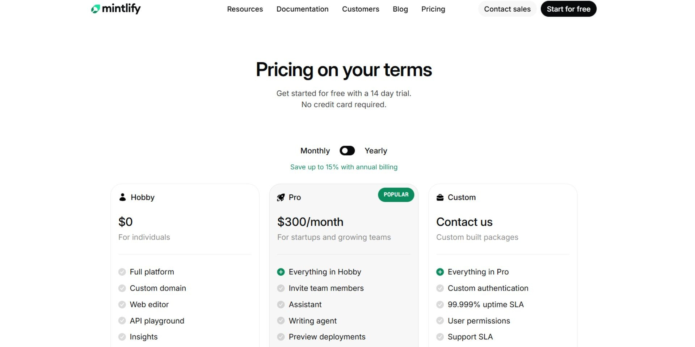
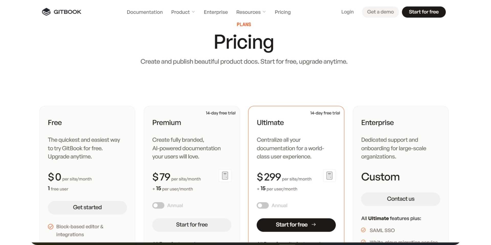

**Slug: mintlify-vs-gitbook**

# Mintlify vs GitBook

Documentation tools often fail not because of missing features, but because they don’t match how teams actually work. Some teams want documentation to live entirely in Git, owned and maintained by engineers. Others need documentation to be shared across writers, product managers, support teams, and developers alike.

Mintlify and GitBook represent these two philosophies clearly. Mintlify is built around a code-first, developer-owned workflow that keeps documentation close to the product’s source code. GitBook takes a more collaborative approach, combining a visual editor with optional Git integration so documentation can be maintained by a wider set of contributors.

This comparison is based on hands-on usage of both platforms. Instead of focusing on feature lists, it looks at how Mintlify and GitBook behave in real documentation workflows, where they work best, and where friction appears as teams and documentation scale.

## TL;DR — Quick Decision Guide

### Mintlify makes sense if:
- Your documentation is owned almost entirely by developers and written in Markdown or MDX.
- You want a Git-first workflow and are comfortable managing structure and navigation through configuration files.
- You prioritize fast, polished public documentation for APIs or developer-focused product docs.
- You do not need a reader-facing AI assistant inside published documentation.

### GitBook makes more sense if:
- Documentation is shared across developers, writers, product managers, or support teams.
- You want a visual, block-based editor while still having the option to connect to Git.
- You expect AI to help with writing and answering reader questions without manually editing files.
- You prefer pricing that scales per site and per user rather than jumping directly to a high-cost plan.
- You value built-in reader interaction through embedded AI chat.

**Bottom line:** Mintlify remains a strong developer-first platform, while GitBook is better suited for mixed teams seeking a balance between visual editing and optional docs-as-code.

## Who This Comparison Is For

This comparison is for teams that are actively deciding **how documentation should be owned and maintained over time**, not just how it looks on day one.

It is especially relevant if:
- You are deciding whether documentation should live **entirely in Git** or be editable by a **broader set of contributors**.
- Your team includes a mix of **developers, writers, product managers, or support teams**, and you want to avoid constant handoffs just to update docs.
- You are evaluating how much **manual effort** documentation maintenance should require as your product evolves.
- You want to understand whether **AI features actually reduce documentation work** or simply assist with small edits.
- You are choosing a platform that needs to scale from **early-stage docs** to **long-term, production documentation** without becoming expensive or difficult to manage.

Rather than relying on marketing claims or feature lists, this article is based on **hands-on usage** of both platforms. It reflects what teams encounter when setting up documentation, making structural changes, collaborating across roles, publishing updates, and relying on AI features in day-to-day documentation work.

## How These Platforms Were Compared

I evaluated both platforms by taking them through the same end-to-end workflow, from initial signup to publishing live documentation and relying on AI features during everyday use.

Specifically, I looked at:
- **Getting to live documentation:** How easily a team can move from account creation to shareable, production-ready docs.
- **Editing and restructuring:** How easy it is to update navigation, reorganize content, and maintain structure, especially when non-developers are involved.
- **AI in real workflows:** Whether AI features meaningfully reduce documentation work or mainly assist with small, manual edits.
- **Reader experience:** How easy it is for end users to find answers and interact with published documentation.
- **Cost as usage grows:** How pricing behaves once teams add contributors, increase AI usage, or manage multiple documentation sites.

Rather than trying to declare a single winner, the goal is to show **where each platform fits naturally and where friction starts to appear**, depending on how documentation is owned and maintained within a team

>

📌 **Update:** Mintlify has launched a beta version of its new editor for easier content editing by non-developers. I’ll update this comparison once it’s fully available and tested

## Onboarding Experience

### Mintlify

<iframe
  src="https://www.youtube.com/embed/AaqGC9mzzao"
  title="Mintlify"
  allow="accelerometer; autoplay; clipboard-write; encrypted-media; gyroscope; picture-in-picture; web-share"
  allowFullScreen
></iframe>

Mintlify’s onboarding immediately signals that it’s built for developers. There is no obvious login option on the homepage; users must click **“Start for free”** before reaching the signup flow, which can feel confusing for first‑time or non‑technical users.

Account creation supports Google sign‑in or email, but setting up documentation requires connecting a GitHub repository. The onboarding checklist explicitly prompts users to sign in with GitHub and create a repo, making GitHub effectively mandatory for publishing docs. Once connected, the process is fast: a repository is created and documentation is auto‑published on a Mintlify subdomain.

For developers already comfortable with Git workflows, this feels smooth and efficient.

### GitBook

<iframe
  src="https://www.youtube.com/embed/Po75AEoFPqM"
  title="GitBook"
  allow="accelerometer; autoplay; clipboard-write; encrypted-media; gyroscope; picture-in-picture; web-share"
  allowFullScreen
></iframe>

GitBook makes a strong first impression for broader audiences. The homepage clearly separates **“Login”** and **“Get started for free,”** so visitors immediately understand how to sign in or create an account. Signup supports GitHub, Google, or email, meaning non‑developers are not forced to connect a repository upfront.

The onboarding flow begins with naming your organization and creating a workspace. From there, GitBook guides users into creating their first documentation space without requiring any technical configuration. You can start writing immediately using the block‑based editor, with Git‑based workflows remaining optional and configurable later.

This staged approach lowers the barrier for non‑technical contributors while still supporting docs‑as‑code when developers are ready.

**Onboarding verdict:** Mintlify works best when documentation is fully developer‑owned and Git‑centric. GitBook removes friction for mixed teams and gets documentation live faster without mandatory Git setup.

## Writing & Maintaining Documentation Over Time

### For Non‑Technical Contributors

<iframe
  src="https://www.youtube.com/embed/8PER0Q8CVI8"
  title="For Non‑Technical Contributors"
  allow="accelerometer; autoplay; clipboard-write; encrypted-media; gyroscope; picture-in-picture; web-share"
  allowFullScreen
></iframe>

<iframe
  src="https://www.youtube.com/embed/nxVTWmW7-rM"
  title="For Non‑Technical Contributors"
  allow="accelerometer; autoplay; clipboard-write; encrypted-media; gyroscope; picture-in-picture; web-share"
  allowFullScreen
></iframe>

**Mintlify** assumes comfort with Markdown and MDX. While a basic visual editor exists, meaningful control over structure and navigation requires editing files and configuration such as `docs.json`. In practice, reorganizing sections or navigation involves manual config updates. Collaboration features are developer‑centric, with no Google‑Docs‑style comments or suggestion workflows.

**GitBook** uses a block‑based WYSIWYG editor that allows non‑technical users to write and format content without learning Markdown. Headings, images, tabs, hints, and code blocks can be added via a toolbar or slash commands. Pages and reusable content are organized in a sidebar.

Edits are typically made through a change‑request flow, which mirrors Git‑style reviews. This provides structure and editorial control but can feel formal for simple updates. Collaboration features include page‑level comments and role‑based permissions, and GitBook’s AI assistant can help brainstorm or rewrite selected text.

**Editing verdict:** Mintlify gives full control to developers but is uncomfortable for non‑technical contributors. GitBook’s editor is more inclusive and supports mixed teams, even though its review‑driven workflow adds some process overhead.

### For Developers

Mintlify excels in docs‑as‑code workflows. Developers manage documentation directly from their IDE using Markdown or MDX, Git sync, and configuration files. Structure and navigation are manually defined, and many updates require code changes. Preview deployments fit naturally into engineering workflows.

GitBook also supports two‑way Git sync. Developers can write Markdown or MDX in their IDE and open pull requests without visiting the UI. However, some configuration tasks,navigation, styling, domains, and analytics, still require the GitBook dashboard.

**Developer verdict:** Mintlify is more code‑native and appeals to teams that want everything managed through Git. GitBook balances code and UI configuration, which can be more flexible for teams with mixed ownership.

## AI Capabilities in Real Usage

### AI Agent — Creating & Maintaining Docs

<iframe
  src="https://www.youtube.com/embed/osUCjsb_HQs"
  title="AI Agent — Creating & Maintaining Docs"
  allow="accelerometer; autoplay; clipboard-write; encrypted-media; gyroscope; picture-in-picture; web-share"
  allowFullScreen
></iframe>

<iframe
  src="https://www.youtube.com/embed/oFDWpkLzDwg"
  title="AI Agent — Creating & Maintaining Docs"
  allow="accelerometer; autoplay; clipboard-write; encrypted-media; gyroscope; picture-in-picture; web-share"
  allowFullScreen
></iframe>

**Mintlify**’s AI works primarily as a writing and suggestion assistant. During testing, it responded slowly and was limited to small rewrites or contextual suggestions. It does not generate a complete documentation structure on its own, and users must manually apply changes in the correct MDX or configuration files.

**GitBook** offers two AI tools: GitBook Assistant and GitBook Agent. The Assistant rewrites, summarizes, translates, or clarifies highlighted text. The Agent operates through change requests for larger updates, generating pages or edits within a defined scope. GitBook’s AI can assist with content creation and maintenance but does not autonomously restructure an entire documentation site.

**AI verdict:** Mintlify’s AI is limited and developer‑oriented. GitBook’s AI is more integrated into the editor and reader experience but still requires human oversight for major structural changes.

### Ask‑AI — Reader‑Facing Assistant

Mintlify provides a reader-facing AI assistant that can be embedded in published documentation, allowing users to ask questions and receive answers generated from the documentation content; however, this functionality is available only on paid plans and usage is subject to metering. Similarly, GitBook offers an embedded AI assistant in published documentation that enables readers to ask questions and receive context-aware responses directly within the documentation interface.

## Public Documentation Experience

### Mintlify

<iframe
  src="https://www.youtube.com/embed/s1mYhmKyT0c"
  title="Mintlify"
  allow="accelerometer; autoplay; clipboard-write; encrypted-media; gyroscope; picture-in-picture; web-share"
  allowFullScreen
></iframe>

Mintlify produces clean, modern, and fast‑loading public documentation. Typography, spacing, and navigation feel polished by default, and light and dark modes are supported. Page loads are fast and the reading experience is smooth, but the experience is largely static with no built‑in reader AI.

### GitBook

<iframe
  src="https://www.youtube.com/embed/UOULViS5svI"
  title="GitBook"
  allow="accelerometer; autoplay; clipboard-write; encrypted-media; gyroscope; picture-in-picture; web-share"
  allowFullScreen
></iframe>

GitBook’s published docs are similarly polished and professional. Pages render as clean, responsive layouts, and interactive API explorers are available when using OpenAPI integrations. An embedded Ask‑AI chat makes the documentation more interactive for readers.

Customization is primarily theme‑driven and managed through the UI. Deeper layout changes or custom CSS/JS require working within GitBook’s interface rather than pure code.

**End‑user verdict:** Both platforms deliver fast, polished docs. GitBook adds interactivity through reader‑facing AI and API explorers, while Mintlify focuses on performance and design.

### Pricing

### Mintlify

Mintlify offers a free **Hobby** plan for individuals, limited to one dashboard member with no collaboration, making it suitable only for small experiments. There is no meaningful mid-tier option between Hobby and paid plans.

Teams must upgrade to **Pro** to unlock collaboration, AI features, preview deployments, and security controls. Pro costs **$300/month** on monthly billing or **$250/month annually**, with additional users typically billed at **$20 per user per month**. Enterprise features like SSO and SLAs are available only through custom pricing, and costs increase quickly as team size grows.

### GitBook

GitBook uses a pricing model based on **both per-site and per-user fees**. Its free plan allows one site with one user on a gitbook.io domain, which works for personal projects but not for real team usage.

Collaboration, custom domains, branding, and AI features require the **Premium** plan at **$79 per site per month** plus **$15 per user per month**. More advanced capabilities such as sections, cross-site search, authenticated access, adaptive content, and the AI Assistant require the **Ultimate** plan at **$299 per site per month**, plus the same per-user fee.

Enterprise features including SAML SSO, migrations, and dedicated support are available through custom pricing. Because GitBook charges per site in addition to per-user fees, costs increase as teams add multiple documentation sites for different products, environments, or audiences.

**Pricing verdict:** Mintlify becomes expensive quickly once teams move beyond solo usage, jumping directly to a high monthly cost. GitBook has a lower entry point and is easier to adopt for small teams, but its per-site and per-user pricing can add up as documentation scales across multiple products or teams.

## Pros & Cons

### Mintlify

**Pros**
- Strong docs-as-code workflow built around Git and MDX
- Fast, clean, and polished public documentation
- Excellent fit for developer-only teams

**Cons**
- GitHub-only onboarding limits accessibility for non-technical users
- Editing and restructuring documentation is difficult for writers or PMs
- Many updates require manual file and configuration changes
- No reader-facing Ask-AI in published documentation

### GitBook

**Pros**
- Flexible onboarding with optional Git sync
- Block-based editor that supports non-technical contributors
- Built-in AI assistant for writers and reader-facing AI chat
- Interactive public documentation with API explorers

**Cons**
- Advanced customization relies on the GitBook UI rather than being fully code-driven
- AI agent does not autonomously restructure entire documentation sites
- Per-site and per-user pricing can add up as usage scales

## Mintlify vs Gitbook — Final Comparison

| Category | Mintlify | GitBook |
| --- | --- | --- |
| **Best for** | Developer-owned documentation | Mixed teams (developers + non-developers) |
| **Primary audience** | Engineers | Writers, PMs, support teams, and developers |
| **Onboarding** | GitHub required | Email, Google, or Git optional |
| **Non-technical friendly** | Limited | Yes |
| **Docs-as-code** | Strong, core workflow (MDX + Git) | Supported, but optional |
| **Visual editor** | Basic | Full block-based editor |
| **Navigation management** | File and config driven | Managed through UI |
| **Manual config edits** | Frequently required | Rarely required |
| **AI agent (creation & updates)** | Basic suggestions and rewrites | Generates pages via change requests |
| **Reader-facing Ask-AI** | Not available | Available in published docs |
| **Public documentation quality** | Fast, clean, polished | Fast, polished, interactive |
| **API documentation** | Supported | Interactive API explorers |
| **Customization approach** | Code-first | UI-driven |
| **Preview deployments** | Yes | Yes |
| **Pricing entry point** | Free (very limited) | Free (1 site, 1 user) |
| **Paid plans start at** | ~$300/month | ~$79/site/month + $15/user |
| **Pricing scalability** | Sharp jump after free | Gradual, but per-site costs add up |
| **Enterprise readiness** | Yes (custom pricing) | Yes (custom pricing) |

>

**Need help migrating from Mintlify, GitBook, or another documentation platform?**\
If your setup includes large MDX repositories, custom navigation, multiple documentation sites, or mixed Git and editor workflows, Documentation.AI offers hands-on migration support.\
**Documentation.AI Slack channel:** [Join here](https://join.slack.com/t/documentationai/shared_invite/zt-3dl0x2qds-L85dnLpKyZ6oc5ZLba9_~Q)

## How Teams Use Documentation Platforms in 2026

In 2026, documentation is no longer owned only by developers. Product teams, support, customer success, and founders all contribute to docs because documentation now plays a direct role in onboarding users, reducing support tickets, and explaining product changes.

Tools like Mintlify and GitBook still serve clear use cases. Mintlify fits teams where documentation stays close to code and is fully managed by engineers. GitBook works better for teams that want a visual editor and shared ownership across technical and non-technical contributors.

>

At the same time, many teams are looking for platforms that reduce maintenance effort and cost as documentation grows. This is why AI-native options like [**Documentation.AI**](https://documentation.ai) are becoming relevant for teams that want easier collaboration, automated updates, and more predictable pricing.

## Final Take

Mintlify is a strong choice when documentation is fully owned by developers and tightly integrated with Git workflows. It delivers fast, polished documentation but requires ongoing technical involvement to manage structure and updates. Pricing also jumps sharply once teams move beyond solo usage.

GitBook is better suited for teams that include non-developers and want a balance between visual editing and docs-as-code. Its block-based editor, AI assistant, and reader-facing chat make documentation more accessible, while pricing scales per site and per user.

Ultimately, the right choice depends on who owns documentation and how your team works. Developer-centric teams that value full code control may prefer Mintlify, while mixed teams seeking collaboration, AI assistance, and interactive documentation may find GitBook the more practical and best option in 2026.

## **Frequently Asked Questions**

### **1) What is the main difference between Mintlify and GitBook?**

Mintlify is designed around a Git-first, developer-owned workflow where documentation lives close to the codebase. GitBook focuses on shared documentation ownership, combining a visual editor with optional Git integration so both technical and non-technical contributors can maintain docs.

### **2) Which platform is better for developer-only documentation teams?**

Teams that want documentation fully managed by engineers and written in Markdown or MDX often prefer Mintlify. Its workflow stays inside Git and IDEs, making it a strong fit for developer-only environments.

### **3) Which documentation tool works better for non-technical contributors?**

GitBook is generally better for non-technical contributors because it offers a block-based visual editor, page-level comments, and role-based permissions. Mintlify assumes familiarity with Git, MDX, and configuration files, which can be limiting for writers or product teams.

### **4) Do Mintlify and GitBook both support AI features in documentation?**

Both platforms offer AI assistance. Mintlify’s AI focuses mainly on writing suggestions and edits within a developer workflow, while GitBook provides AI tools for both writers and readers, including an embedded AI chat in published documentation.

### **5) How do Mintlify and GitBook compare to newer AI-native documentation platforms in 2026?**

Mintlify and GitBook still rely heavily on manual structure management and human-driven updates. In contrast, AI-native platforms like Documentation.AI are designed to generate, maintain, and evolve documentation automatically, reducing long-term maintenance effort as documentation scales.

### **6) Which platform is easier to maintain as documentation grows over time?**

As documentation grows, GitBook can introduce process overhead through review flows and per-site pricing, while Mintlify requires ongoing configuration updates in Git. Platforms like Documentation.AI focus on reducing maintenance by handling structure and updates automatically through an AI agent.

### **7) How does pricing scale between Mintlify and GitBook as teams grow?**

Mintlify jumps quickly from a limited free plan to a high monthly cost once teams need collaboration and AI features. GitBook starts lower but charges per site and per user, which can add up as teams manage multiple products or documentation sites.

### **8) Which platform fits modern documentation workflows best in 2026?**

In 2026, documentation is often owned across developers, writers, product managers, and support teams. GitBook fits teams that want shared ownership with visual editing, while Mintlify fits strictly developer-owned docs. Teams looking to reduce manual work and rely on AI-driven documentation workflows increasingly evaluate platforms like Documentation.AI.
