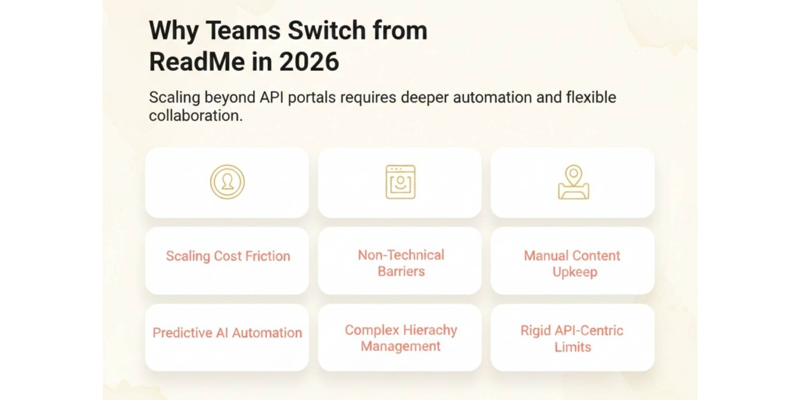

ReadMe is a strong API documentation platform, best known for interactive API references and live "Try It" endpoint testing. But in 2026, many teams need documentation that reaches beyond APIs. Easier collaboration for non-technical contributors, less manual upkeep, and content that stays organized as products evolve. 

As documentation ownership expands past developers, teams increasingly shortlist platforms built for mixed contributors and AI-assisted maintenance. It's a growing investment, too: the knowledge management software market is projected to rise from $23.2 billion in 2025 to $74.22 billion by 2034 ([Fortune Business Insights](https://www.fortunebusinessinsights.com/knowledge-management-software-market-110376)). 

This guide compares the three best ReadMe alternatives: Documentation.AI, GitBook, and Mintlify on documentation scope, collaboration, AI, and pricing, so you can choose the right fit for your team.

## TL;DR — Quick Decision Guide
- Documentation.AI is the best ReadMe alternative in 2026 for teams that want AI agents to help with documentation structure, updates, and long-term maintenance across both technical and non-technical contributors.
- GitBook is a strong option for teams that want collaborative, browser-based editing with optional Git workflows and are comfortable handling updates manually.
- Mintlify remains a good fit for developer-only teams that prefer a Git-centric docs-as-code workflow but can be limiting for mixed ownership and can scale quickly in cost.

## Top ReadMe Alternatives in 2026

The table below compares the most relevant ReadMe alternatives in 2026 based on documentation ownership, workflow style, and pricing visibility.

| Tool | Best Known For | Best Fit | Pricing (Visibility) |
| --- | --- | --- | --- |
| **Documentation.AI** | AI-powered documentation creation and maintenance | Teams with shared ownership and fast-changing docs | Transparent pricing, free plan available, paid plans from ~$55/month |
| **GitBook** | Collaborative editing with optional Git workflows | Product teams with mixed contributors | Free plan available; paid plans from ~$65/month per site + $12/user |
| **Mintlify** | Git-based docs-as-code with polished public docs | Developer-only teams using GitHub workflows | Free plan available but limited features; paid plans from $450/month |

## What Is ReadMe and Why Do Teams Need Alternatives in 2026?

ReadMe is a documentation platform built primarily for API-first products. It's best known for interactive API references, developer-portal experiences, and tools that let external developers understand and test endpoints directly from the docs. Over time it has added AI features such as Ask AI and documentation audits, but its workflows remain centered on APIs and developer-first ownership.

Teams explore alternatives in 2026 not because ReadMe is weak but because the documentation scope expands. As docs grow beyond APIs into product education, onboarding, support, and internal knowledge, teams need platforms that mixed contributors can manage with less manual maintenance, a gap that widens on ReadMe's paid plans, which start at $250/month for Pro and $3,000+/month for Enterprise ([ReadMe pricing](https://readme.com/pricing)).

**Key Features**
- **Interactive API Explorer: **Let developers make live API calls directly from the documentation.
- **Personalized Documentation: **Show different content based on API keys, user roles, or environment.
- **Versioning & Changelogs: **Built-in API version management with automatic changelog updates.
- **Ask AI: **AI-powered search and Q&A for developers reading the docs.
- **Analytics & Insights: **Track endpoint usage, failed requests, and documentation engagement.
- **Authentication Support: **Supports API keys, OAuth, and JWT-based access controls.

**Pricing **
- **Startup Plan:** \~$0/month\
Suitable for individuals and access to basic features, and limited All Starter AI features
- **Pro: **$250/month, for small API teams and early-stage product teams
- **Business & Enterprise: **Starts from $3000+/month \
Includes SSO, audit logs, advanced analytics, and higher request limits

**Pros**
- Best-in-class interactive API documentation
- A live “Try It” experience improves developer onboarding
- Strong analytics for API usage and engagement
- Mature platform trusted by many API-first companies
- Built-in versioning and changelog support

**Cons**
- Heavily API-centric, making it not ideal for general product docs
- Less friendly for non-technical contributors
- Editorial content and internal docs feel secondary
- Manual effort required to maintain non-API documentation
- Pricing can increase rapidly with usage and scale

**Verdict**

ReadMe continues to serve API-first teams that prioritize interactive developer portals, live endpoint testing, and usage analytics. In 2026, many teams are choosing Documentation.AI, one of the leading ReadMe alternatives, for its broader documentation scope, AI-driven maintenance, and workflows that support both technical and non-technical contributors. It’s one of the best options for teams seeking scalable documentation beyond APIs with lower manual overhead.

### Why Choose ReadMe Alternatives in 2026?

Teams typically look for alternatives when ReadMe no longer scales well beyond API-only, developer-owned documentation.

**Teams often look for:**
- **Rising costs:** AI, analytics, and collaboration features require higher plans or add-ons as teams grow.
- **Developer-first workflows:** Non-technical contributors face friction when editing or managing documentation.
- **Manual maintenance:** Content and structure still require frequent manual updates as products change.
- **Better AI automation:** Teams want AI to help maintain and update documentation, not just assist with writing.
- **Navigation changes:** Updating hierarchy, grouping pages, or reorganizing docs becomes time-consuming at scale.
- **API-centric focus:** ReadMe is optimized for API portals rather than broader product or help documentation.

## Best ReadMe Alternatives in 2026

### #1. Documentation.AI

<iframe
  src="https://www.youtube.com/embed/8xEfNtACIvQ"
  title="#1. Documentation.AI"
  allow="accelerometer; autoplay; clipboard-write; encrypted-media; gyroscope; picture-in-picture; web-share"
  allowFullScreen
></iframe>

[**Documentation.AI**](https://documentation.ai) is an AI documentation platform designed for teams that need continuous creation, structuring, publishing, and long-term maintenance of documentation. It supports both developers and non-technical contributors through a visual editor combined with AI-driven workflows.

Unlike ReadMe, which is optimized for API-first developer portals, Documentation.AI supports broader documentation needs across product, onboarding, support, and internal knowledge, while still offering optional Git workflows for developers.

**Key Features**
- Visual editor for writing and restructuring documentation
- Optional Git workflows for developers
- AI agent for structure, updates, and ongoing maintenance
- Built-in Ask AI included by default
- Instant publishing without manual deployment

**ReadMe vs. Documentation.AI - Key Differences**

Category |, ReadMe |, Documentation.AI, Best For |, API-first teams |, Mixed teams, Editing Experience |, Limited |, Full visual editor, Structure Changes |, Manual |, Visual + AI-assisted, AI Role |, Assistive |, Maintenance-focused, Ask AI |, Paid add-on |, Included

**Pricing**
- **Free (Starter):** Free plan - AI Assistant included
- **Standard:** $55/month (billed yearly) - 3 seats, 2 sites, 10,000 AI credits
- **Professional:** $159/month - 10 seats, more AI credits, role-based permissions
- **Enterprise:** Custom pricing

>

Because AI is included on every plan, an AI-powered Documentation.AI site starts free and its $55 Standard plan costs less than ReadMe's Ask AI add-on alone ($150/month). Adding AI to ReadMe (Pro at $250 plus the $150 Ask AI add-on) runs about $400/month, roughly 7x more than Documentation.AI for AI-enabled docs.

**Pros**
- Supports both technical and non-technical contributors
- AI helps with structure, updates, and long-term maintenance
- Visual editor reduces dependency on developers
- Lower maintenance effort as documentation scales

**Cons**
- AI-generated content still requires human review
- Less specialized for pure API-only developer portals

**Verdict**

[**Documentation.AI is the best ReadMe alternative**](https://documentation.ai/blog/readme-vs-documentation-ai) for teams that want lower maintenance, shared ownership, and AI that actively keeps documentation up to date. It includes AI from the free tier and covers your whole doc surface at $55/month, less than ReadMe's Ask AI add-on alone (priced at $150), while its AI agent maintains docs so your team doesn't. [Book a demo](https://documentation.ai/get-a-demo) to see it on your own docs.

### #2. GitBook

GitBook is a collaborative documentation platform with a strong visual editor. It is commonly used by product teams that want non-technical contributors to edit documentation directly in the browser. However, documentation structure and long-term updates are still handled manually, and AI features are limited to assistance rather than maintenance.

**ReadMe vs GitBook — Key Differences**

Category |, ReadMe |, GitBook, Primary Focus |, API portals |, Product documentation, Editing |, Dashboard-based |, Visual editor, Structure Updates |, Manual |, Manual, AI Usage |, Reader AI |, Reader and editor assist

**Pricing**
- **Free Plan:** Basic usage for individuals or small projects
- **Pro:** Around $250/month per site, plus per-user pricing
- **Enterprise:** Custom pricing with SSO and enterprise support. Advanced permissions, org features, and cross-site capabilities. 

GitBook starts cheaper for small teams, but costs climb with sites and users, and its full AI sits on the $249 Ultimate tier, which is why growing teams often find Documentation.AI a lower-cost GitBook alternative overall.

**Pros**
- Easy for non-technical teams to edit documentation
- Clean, polished public documentation experience
- Optional Git workflows for developers

**Cons**
- Documentation updates and restructuring remain manual
- AI features focus on assistance, not maintenance
- Costs increase with users and multiple sites

**Verdict**

GitBook is a solid ReadMe alternative for teams that want easy, browser-based editing and polished, branded documentation, friendlier than ReadMe for non-technical contributors. But like ReadMe, it still leaves structure and upkeep to your team. If you want that ease of editing without the manual maintenance, [Documentation.AI](https://documentation.ai) pairs a visual editor with an AI agent that maintains structure as your docs grow and includes reader Ask-AI from the free plan itself, which makes it[the stronger GitBook alternative.](https://documentation.ai/blog/gitbook-vs-documentation-ai)

### #3. Mintlify

Mintlify is a developer-first documentation platform built around GitHub workflows and docs-as-code using Markdown or MDX. It is known for polished public documentation and strong alignment with engineering teams. However, navigation changes and customization often require working in code, and pricing starts significantly higher than most alternatives.

**ReadMe vs. Mintlify - Key Differences**

Category |, ReadMe |, Mintlify, Workflow |, Hosted UI |, Git-first, Non-technical Editing |, Limited |, Very limited, Structure Changes |, UI-based |, Code/config-based, AI Role |, Assistive |, Writing-focused

**Pricing**
- **Free Plan:** Limited plan for individual developers
- **Paid Plans:** Advanced plans typically start around $450/month
- **Enterprise:** Custom pricing for compliance, SSO, and larger teams

**Verdict** 

Mintlify is a strong ReadMe alternative for engineering-led teams that live in Git and want fast, polished developer docs from Markdown/MDX. Its trade-off is reach: the AI agent and reader assistant sit on the paid [Pro plan](https://www.mintlify.com/pricing), and the whole workflow assumes developers. If your contributors span product, support, and non-technical roles, [Documentation.AI is the better Mintlify alternative](https://documentation.ai/blog/mintlify-vs-documentation-ai) that has much lower entry cost, easier updates, and AI included from the free plan, without the dependency on developers.

## Which ReadMe Alternative Is Right for Your Team in 2026?

Choosing the right ReadMe alternative in 2026 depends less on feature lists and more on who owns documentation, how often it changes, and how much manual effort your team can afford.

Here’s how teams typically decide:
- Choose Documentation.AI if documentation is shared across developers, product managers, and support teams, and you want AI to actively help maintain structure and content as the product evolves.
- Choose GitBook if your team values visual editing and collaboration, and documentation changes are manageable without automation. The cost to reach working reader-AI ranges from free (Documentation.AI) to $249+/month (GitBook Ultimate).
- Choose Mintlify if documentation is owned entirely by engineers and you prefer a strict Git-based, docs-as-code workflow.

Teams moving away from ReadMe often do so when documentation expands beyond APIs and manual upkeep starts slowing product velocity.

## ReadMe Alternatives Final Comparison (2026)

This table highlights the key differences teams use to make a final decision when comparing ReadMe alternatives.

| Tool | Best For | Editing Experience | AI Role | Maintenance Effort | Pricing Entry |
| --- | --- | --- | --- | --- | --- |
| **Documentation.AI** | Cross-functional teams | Visual editor + optional Git | AI-driven maintenance | Low | ~$55/month |
| **GitBook** | Product & content teams | Visual editor | Assistive AI | Medium | ~$65/site + $12/ user |
| **Mintlify** | Developer-only teams | Git-first (MDX) | Writing assist | Medium–High | ~$450/month |

This comparison shows how ReadMe alternatives differ in collaboration depth, AI automation, maintenance effort, and workflow flexibility. Documentation.AI is well suited for teams with shared documentation ownership and frequent updates, where AI-assisted maintenance reduces manual work. GitBook suits teams that prioritize visual editing and collaboration without automation, while Mintlify works best for developer-only teams that prefer Git-centric workflows. As documentation expands beyond APIs in 2026, platforms that reduce upkeep and support multiple roles are becoming essential. In this context, [**Documentation.AI is considered one of the best alternatives to Mintlify**](https://documentation.ai/blog/mintlify-alternatives)**.**

## Final Verdict

If your documentation begins and ends with an API reference and live endpoint testing, ReadMe is a mature, best-in-class choice and worth its price for that job.

But most teams in 2026 aren't only documenting an API. They're documenting a product, an onboarding flow, a help center, and internal knowledge and they want AI that keeps all of it current instead of adding to the backlog. That's the exact gap Documentation.AI was built for it, and the pricing makes the decision almost unfair: AI is included for free, a full-scope Standard plan at $55/month that costs less than ReadMe's AI add-on by itself, and an AI agent that maintains your docs so your team doesn't have to.

The fastest way to feel the difference is to see it on your own documentation. [**Book a demo**](https://documentation.ai/get-a-demo) and watch the AI Documentation Agent generate and maintain live docs site in minutes or [**start free**](https://documentation.ai) in under five minutes, no credit card required, and see for yourself why teams are leaving ReadMe for a platform that does more for a fraction of the cost.

>

**Thinking about moving from Mintlify or another docs platform?**\
If your team manages a large MDX codebase, complex navigation, or a mix of Git and editor workflows, [**Documentation.AI**](https://documentation.ai/docs) can help you migrate smoothly. You can talk directly with the team, review your setup together, and get support through Slack.\
[**Join the Documentation.AI Slack**](https://documentationai.slack.com/join/shared_invite/zt-3dl0x2qds-L85dnLpKyZ6oc5ZLba9_~Q)

## Frequently Asked Questions

### 1. What are the best ReadMe alternatives in 2026?

The best ReadMe alternatives in 2026 are Documentation.AI, GitBook, and Mintlify. [Documentation.AI is preferred over ReadMe](https://documentation.ai/blog/readme-vs-documentation-ai)for its AI-assisted maintenance and mixed teams, GitBook for collaborative visual editing; and Mintlify for developer-only Git-based workflows. 

### 2. Why do teams look for alternatives to ReadMe?

Teams look for alternatives when documentation expands beyond APIs, non-technical contributors need access, maintenance becomes manual, or pricing increases as AI and collaboration features are added.

### 3. Which ReadMe alternative is best for non-technical contributors?

Documentation.AI is best for non-technical contributors because it offers a visual editor and AI-assisted updates without requiring Git or code-based workflows.

### 4. Is GitBook a good alternative to ReadMe?

[GitBook is a good ReadMe alternative](https://documentation.ai/blog/readme-vs-gitbook) for teams that want browser-based editing and collaboration. However, it still relies on manual maintenance and limited AI automation.

### 5. How does Mintlify compare to ReadMe?

Mintlify is more Git-centric than ReadMe and works well for developer-only teams. It offers polished docs but requires code changes for structure updates and has a higher starting price. Read the[full Mintlify vs. ReadMe guide](https://documentation.ai/blog/mintlify-vs-readme)to know more.

### 6. Which ReadMe alternative offers the best AI automation?

Documentation.AI offers the strongest AI automation among ReadMe alternatives, helping teams maintain structure, update content, and reduce long-term documentation effort.

### 7. How do pricing models differ among ReadMe alternatives?

Documentation.AI starts at a lower price and scales gradually; GitBook pricing increases with users and sites, and Mintlify has the highest entry cost with advanced plans starting around $450/month.

### 8. Which ReadMe alternative is best for teams scaling documentation in 2026?

Documentation.AI is best for scaling documentation in 2026 because it supports shared ownership, reduces manual maintenance, and uses AI to keep documentation up to date as products evolve.
