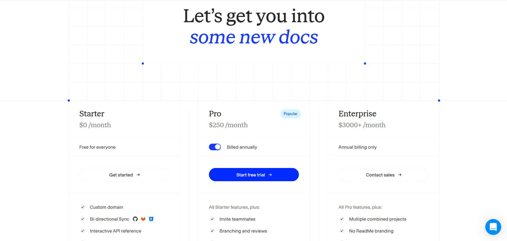
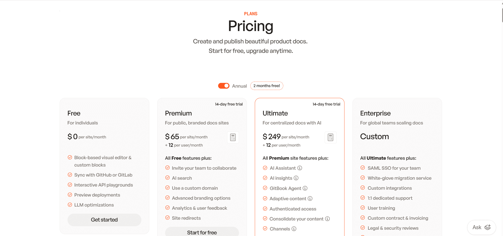

Documentation tools rarely fail because they lack features. They fail because they do not match how documentation is actually created, updated, and consumed day to day. In 2026, documentation is no longer a side artifact. It directly powers developer onboarding, support workflows, internal tooling, and AI-driven search and chat experiences.

ReadMe and GitBook represent two mature but fundamentally different approaches teams use for documentation in 2026.

**Quick answer:** choose ReadMe if your documentation is API-first and developer-owned and GitBook if it's collaborative and visual, edited across technical and non-technical contributors. The split comes down to whether your docs center on APIs or on team-wide authoring.

ReadMe is built primarily for API-first products, with structured authoring, versioned references, and interactive endpoints managed through a centralized dashboard. GitBook takes a broader approach, focusing on a visual editor that supports mixed contributors, with Git workflows available but optional.

This comparison is based on hands-on evaluation of both platforms across the same workflow. Onboarding, editing, AI assistance, publishing, and reader experience. Rather than listing features, it focuses on how each tool behaves in real usage and where friction shows up as documentation grows in size and contributors.

## TL;DR — Quick Decision Guide

**ReadMe makes sense if:**
- Documentation is heavily API-driven
- Docs are shared across developers, support, and DevRel teams
- You want built-in API references and interactive endpoints
- You’re comfortable with a dashboard-driven workflow

**GitBook makes more sense if:**
- Documentation is owned by mixed technical and non-technical teams
- You want a visual, block-based editing experience
- Git workflows should be optional rather than mandatory
- You value fast setup and clean public docs

**Bottom line:**

ReadMe works best for API-centric documentation with structured authoring and interaction. GitBook fits teams creating general product documentation with broader collaboration needs.

## How These Platforms Were Compared

I have evaluated both using the same end-to-end workflow:
- account creation and onboarding
- documentation setup
- writing and restructuring content
- interacting with AI features
- publishing updates
- reviewing the public documentation experience

The evaluation focused on practical questions teams face in real usage:
- How quickly documentation can go live
- How much manual effort is required to maintain structure over time
- Whether AI meaningfully reduces documentation work
- How usable the published documentation feels for end users
- How pricing behaves as teams and usage grow

The goal is not to declare a single winner but to show where each platform fits naturally and where limitations start to appear.

## Which is easier to set up, ReadMe or GitBook?

### ReadMe

<iframe
  src="https://www.youtube.com/embed/W8MTtvemYZk"
  title="ReadMe"
  allow="accelerometer; autoplay; clipboard-write; encrypted-media; gyroscope; picture-in-picture; web-share"
  allowFullScreen
></iframe>

ReadMe’s onboarding is structured and dashboard-driven. Signup starts with email and basic project details. Users are then guided to choose how they want to document their product: importing an OpenAPI spec, using the API Designer, or creating Markdown pages.

The flow is multi-step and slower than lightweight tools, but it establishes important foundations early: API structure, permissions, versions, and documentation layout. Git is optional, making onboarding accessible to non-developers.

### GitBook

<iframe
  src="https://www.youtube.com/embed/Po75AEoFPqM"
  title="GitBook"
  allow="accelerometer; autoplay; clipboard-write; encrypted-media; gyroscope; picture-in-picture; web-share"
  allowFullScreen
></iframe>

GitBook’s onboarding is noticeably lighter. Users can sign up using email, Google, or GitHub and start writing immediately. There is no requirement to connect a repository during onboarding.

The initial flow focuses on creating a workspace and a documentation space using the visual editor. Git sync exists but remains optional and can be enabled later.

**Onboarding verdict:**

ReadMe prioritizes structure and API setup. GitBook prioritizes speed and accessibility.

## Writing & Maintaining Documentation Over Time

### For Non-Technical Contributors

<iframe
  src="https://www.youtube.com/embed/bMcvY3A8WIY"
  title="For Non-Technical Contributors"
  allow="accelerometer; autoplay; clipboard-write; encrypted-media; gyroscope; picture-in-picture; web-share"
  allowFullScreen
></iframe>

<iframe
  src="https://www.youtube.com/embed/nxVTWmW7-rM"
  title="For Non-Technical Contributors"
  allow="accelerometer; autoplay; clipboard-write; encrypted-media; gyroscope; picture-in-picture; web-share"
  allowFullScreen
></iframe>

ReadMe offers a hosted editor with block-based authoring. Pages are managed through a sidebar, with visibility controls and structured sections. Collaboration is supported through comments and change requests, but restructuring navigation requires manual sidebar management rather than free-form drag-and-drop.

GitBook’s block-based editor is more flexible for non-technical users. Pages can be rearranged easily from the sidebar, and the writing experience feels closer to modern note-taking or knowledge-base tools. Collaboration features include comments and review workflows.

### For Developers

ReadMe is not docs-as-code-first. While API specs can be imported, most configuration, navigation, and publishing actions are handled through the dashboard rather than the IDE.

GitBook supports two-way Git sync with GitHub or GitLab. Developers can edit documentation directly in Markdown or MDX from their editor, while still allowing non-technical contributors to use the UI.

**Editing verdict:**

ReadMe favors guided, centralized authoring. GitBook offers more flexibility across roles.

## AI Capabilities in Real Usage

### ReadMe AI

<iframe
  src="https://www.youtube.com/embed/mNFHkhb0BnU"
  title="ReadMe AI"
  allow="accelerometer; autoplay; clipboard-write; encrypted-media; gyroscope; picture-in-picture; web-share"
  allowFullScreen
></iframe>

ReadMe’s AI features are page-level and assistive. Tools like Agent Owlbert can rewrite sections, suggest missing content, and improve clarity. Additional tools such as AI Linter and Docs Audit help with consistency and quality checks.

All AI-generated changes require manual review and acceptance. The AI does not manage navigation, restructure documentation, or apply changes automatically.

### GitBook AI

<iframe
  src="https://www.youtube.com/embed/oFDWpkLzDwg"
  title="GitBook AI"
  allow="accelerometer; autoplay; clipboard-write; encrypted-media; gyroscope; picture-in-picture; web-share"
  allowFullScreen
></iframe>

GitBook provides an AI assistant for rewriting, summarizing, and translating content. It also offers a GitBook Agent that can propose scoped documentation changes via change requests, such as adding new pages or updating existing ones.

All AI actions remain human-reviewed, and the AI does not autonomously manage the documentation structure.

### Reader-Facing Ask AI

Responses are grounded in documentation content, and usage is metered. The quality of answers depends heavily on how well the documentation is structured. Both ReadMe's Ask AI and GitBook's Assistant answer reader questions, and both now expose an MCP server so external AI tools can read your published docs. The newer distinction is write access: AI-native platforms such as [Documentation.AI](https://documentation.ai) offers an authoring MCP that lets coding agents like Cursor and Claude Code edit pages, manage branches, and deploy that maintains docs, not just reads them.

**AI verdict:**

Both ReadMe and GitBook provide page-level AI assistance, not end-to-end documentation automation. If that is your requirement, choosing an AI native documentation platform will be a better choice.

## Which publishes a better public documentation site?

### ReadMe

<iframe
  src="https://www.youtube.com/embed/wZicRac9WUo"
  title="ReadMe"
  allow="accelerometer; autoplay; clipboard-write; encrypted-media; gyroscope; picture-in-picture; web-share"
  allowFullScreen
></iframe>

ReadMe’s published documentation feels like a developer portal. It includes interactive API explorers, code samples, search, and optional Ask-AI. Navigation is functional but heavier than static sites.

### GitBook

<iframe
  src="https://www.youtube.com/embed/UOULViS5svI"
  title="GitBook"
  allow="accelerometer; autoplay; clipboard-write; encrypted-media; gyroscope; picture-in-picture; web-share"
  allowFullScreen
></iframe>

GitBook’s published docs are clean, fast, and visually polished. Light and dark modes are supported by default, and pages load quickly. The experience is optimized for readability rather than deep API interaction.

**End-user verdict:**

ReadMe emphasizes interaction. GitBook emphasizes readability and polish.

## ReadMe vs. GitBook: Which is more cost-effective?

ReadMe uses a tiered, product-centric pricing model that starts with a free plan for evaluation and scales based on collaboration, governance, and AI usage, with paid professional plans beginning from $250/month for advanced workflows like reviews and branching and custom MDX components along with AI features like Agent Owlbert and AI Linter. Enterprise plans start around $3,000+/month for large organizations prioritizing audit logs, SSO, and OAuth with dedicated customer support. Ask AI is an add-on feature for all the plans that cost around $150/month.

GitBook follows a per-site plus per-user pricing model, offering a free plan for one site and one user, with paid plans starting at $65 per site/month plus $12 per user/month, rising to $249 per site/month plus $12 per user/month for advanced features like AI Assistant, authenticated access, and multi-site scaling.

**Pricing verdict:** ReadMe’s costs scale by feature depth and governance, while GitBook’s pricing grows with the number of sites and contributors, which can add up quickly for larger teams. One cost detail buyers miss: AI is a paid layer on both platforms; ReadMe's Ask AI is a $150/month add-on, and GitBook's Assistant and Agent require the $249 Ultimate tier. Alternatives such as [Documentation.AI](https://documentation.ai/pricing) includes reader AI from the free plan, which changes the math for teams that want AI from day one.

## Pros & Cons

### ReadMe

**Pros**
- First-class interactive API documentation with live API references
- Strong guided authoring, reviews, and approval workflows
- Built-in concepts for versions, branching, and changelogs
- Well suited for DevRel, support, and API-focused teams

**Cons**
- Heavily dashboard-driven; most actions don’t happen inline
- Not a docs-as-code or IDE-first workflow
- AI assists at the page level only and requires manual acceptance
- Navigation and structure changes are more rigid than visual tools

If your documentation is outgrowing an API-first portal, it's worth comparing [other ReadMe alternatives](https://documentation.ai/blog/readme-alternatives) built for broader, lower-maintenance docs.

### GitBook

**Pros**
- Clean block-based editor that works well for non-technical users
- Optional Git sync for teams that want docs-as-code later
- Simple page and sidebar restructuring
- Fast, polished, and readable public documentation by default

**Cons**
- No deep API-native workflows like interactive explorers
- Advanced customization remains mostly UI-driven
- AI suggests changes but does not manage structure or navigation
- Per-site and per-user pricing can scale quickly for large teams

For teams feeling the per-site and per-user costs as they scale, it's worth exploring [alternatives to GitBook](https://documentation.ai/blog/gitbook-alternatives).

## ReadMe vs GitBook - Final Comparison

| Category | ReadMe | GitBook |
| --- | --- | --- |
| **Best for** | API-centric documentation | General product documentation |
| **Primary users** | Developers, DevRel, support teams | Mixed technical & non-technical teams |
| **Onboarding** | Structured, multi-step, API-focused | Fast, lightweight, editor-first |
| **Non-technical friendly** | Moderate | High |
| **Docs-as-code** | Limited | Optional |
| **Editing model** | Dashboard + hosted editor | Visual block editor |
| **Navigation management** | Sidebar via dashboard | Sidebar via UI |
| **AI capabilities** | Page-level writing, linting, Ask-AI | Page-level writing, Agent suggestions, reader chat |
| **Reader-facing AI** | Paid add-on | Paid plans |
| **Public docs experience** | Interactive, portal-like | Clean, fast, readable |
| **API documentation strength** | Strong and native | Basic |
| **Customization approach** | UI-first | UI-first with optional Git |
| **Pricing entry point** | $250/month | $65/month + $12/user |
| **Pricing scalability** | Feature & usage-based | Per-site + per-user |

>

**Need help migrating from ReadMe, GitBook, or another documentation platform?**\
If your setup includes API-heavy documentation, large content sets, custom navigation, or mixed dashboard and Git workflows, Documentation.AI offers hands-on migration support.\
**Documentation.AI Slack channel:** [**Join here**](https://join.slack.com/t/documentationai/shared_invite/zt-3dl0x2qds-L85dnLpKyZ6oc5ZLba9_~Q)

## How Teams Use AI Documentation Platforms in 2026?

As AI agents become the primary audience, now over half of all documentation reads, teams are consolidating scattered API, product, and support content onto AI-native platforms that keep everything current automatically. That upkeep matters commercially: **67% of customers prefer to solve issues themselves** (Zendesk), and **81% try self-service before contacting support** ([Harvard Business Review](https://document360.com/blog/self-service-statistics/)), so out-of-date docs quietly raise the support load. [Documentation.AI](https://documentation.ai) is one option here, spanning API, product, and internal docs in one place, with an agent that both writes and maintains.

As documentation grows, teams are becoming more aware of the ongoing manual effort required to keep content accurate, well-structured, and discoverable. Platforms that depend on page-by-page updates, dashboard-driven restructuring, or manual sidebar management begin to show friction as contributors and documentation volume increase.

ReadMe and GitBook each address parts of this challenge from different angles. ReadMe emphasizes API usability, guided authoring, and structured workflows, while GitBook focuses on collaboration, visual editing, and readability. However, in practice, both platforms still rely on humans to actively manage structure, navigation, and long-term consistency. Their AI capabilities assist with writing and answering questions, but they do not continuously maintain or reorganize documentation as products evolve.

This limitation is increasingly shaping how teams think about the next generation of documentation platforms.

>

Growing documentation beyond a few pages exposes the limits of ReadMe and GitBook. AI support exists, but structure, consistency, and updates still require hands-on effort. [**Documentation.AI**](https://documentation.ai/) takes a different approach by keeping documentation organized, current, and easier to maintain at scale.

## Final Take

In 2026, ReadMe and GitBook solve different documentation problems, and the right choice depends less on features and more on how documentation is produced and maintained over time.

ReadMe is best suited for teams maintaining API-heavy documentation where accuracy, versioning, and controlled workflows matter more than editing flexibility. It works well when documentation is closely tied to API definitions and managed through structured processes.

GitBook works better for teams producing general product documentation that changes frequently and is edited by a mix of engineers, product managers, support, and other non-technical contributors. Its strengths are speed, ease of editing, and low-friction collaboration.

Neither platform actively maintains documentation as products change. Teams should choose based on who updates the docs, how often they change, and how much manual effort they are willing to invest as documentation grows.

## Frequently Asked Questions

### 1. What is the main difference between ReadMe and GitBook?

ReadMe is designed primarily for API-first documentation, offering structured authoring, versioned references, and interactive API explorers. GitBook focuses on general product documentation with a visual editor that supports collaboration across both technical and non-technical contributors, with Git workflows remaining optional.

### 2. Which teams typically choose ReadMe over GitBook?

ReadMe is commonly chosen by API-driven teams, DevRel groups, and support teams that need interactive API documentation, versioning, and structured workflows. It fits organizations where documentation behaves more like a developer portal than a content site.

### 3. Is GitBook better than ReadMe for non-technical contributors?

Yes. GitBook’s block-based editor and visual navigation make it easier for writers, product managers, and support teams to contribute without touching code. ReadMe is more dashboard-driven and can feel heavier for non-technical contributors making frequent changes.

### 4. Do ReadMe and GitBook both support AI features?

Both platforms offer AI features such as writing assistance and reader-facing AI chat on paid plans. Their AI focuses on page-level improvements and answering questions but does not automatically manage documentation structure or long-term consistency.

### 5. Why do teams compare ReadMe vs GitBook in 2026?

In 2026, documentation supports onboarding, support, and AI-driven search, not just publishing. Teams compare ReadMe and GitBook to decide between API-centric, structured documentation versus collaborative, visual documentation that can be maintained by mixed teams.

### 6. Which platform becomes harder to maintain as documentation grows?

As documentation scales, ReadMe introduces overhead through dashboard-based workflows and structured processes, while GitBook can become harder to manage across multiple sites due to per-site pricing and manual structure updates. Both rely heavily on human effort to keep docs organized over time.

### 7. How do ReadMe and GitBook differ from AI-native documentation platforms?

ReadMe and GitBook use AI mainly to assist writing and answer questions. They do not actively maintain documentation structure, detect outdated content, or reorganize large doc sets automatically.[AI-native platforms such as **Documentation.AI**](https://documentation.ai) focuses on reducing long-term documentation maintenance through documentation-aware AI agents.

### 8. When should teams look beyond ReadMe or GitBook?

Teams often look beyond ReadMe or GitBook when documentation is shared across developers, product managers, founders, and support teams and when keeping documentation accurate over time becomes a challenge. As documentation volume and change frequency grow in 2026, platforms such as **Documentation.AI** are evaluated for their ability to reduce long-term maintenance through documentation-aware AI rather than just page-level editing.
