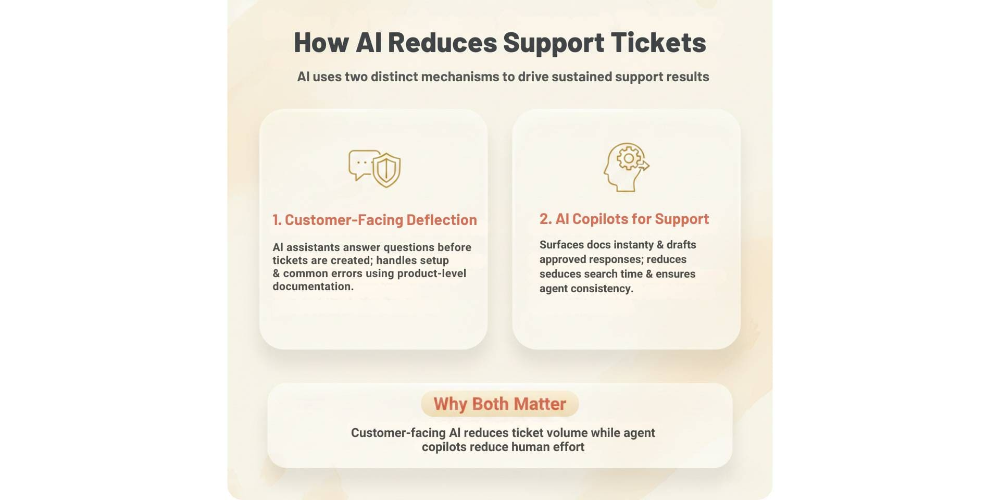
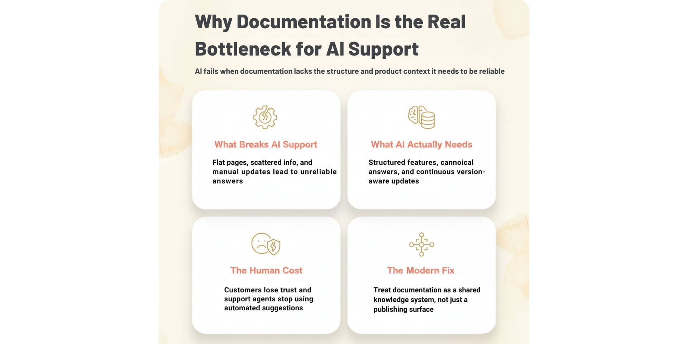
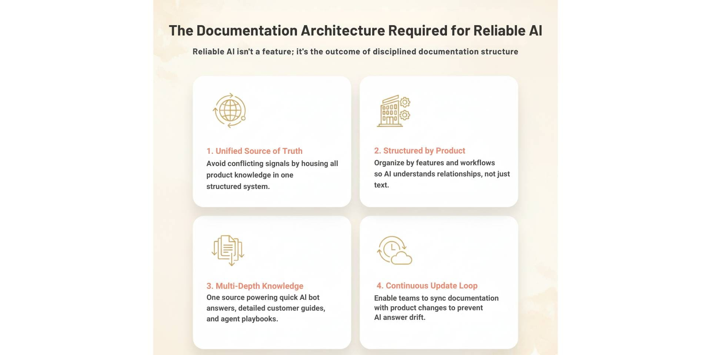
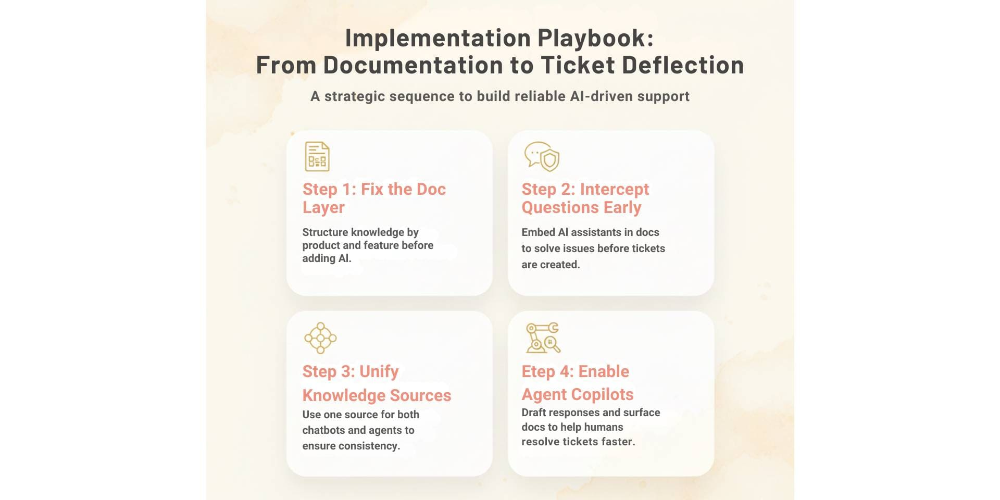

Support teams today are under constant pressure to scale without increasing headcount. As products grow more complex, customer questions multiply across onboarding, configuration, usage, and troubleshooting. Many teams respond by adding agents or deploying AI chatbots, hoping to reduce ticket volume and response times.

In practice, most AI driven support initiatives stall. Chatbots provide shallow answers, agents struggle to trust automated suggestions, and customers still end up submitting tickets. The limiting factor is not AI capability. It is how product knowledge is documented, structured, and maintained.

This guide breaks down a practical playbook for reducing support tickets using better documentation and AI. It explains how AI actually deflects tickets, what documentation structure is required for reliable answers, and which metrics matter when measuring impact. The goal is not to replace support teams, but to build a system where documentation and AI work together to prevent tickets before they reach a human.

## TL;DR

Reducing support tickets with AI only works when documentation is structured for AI consumption. Chatbots alone deflect some questions, but most teams hit a ceiling when documentation is flat or outdated. Platforms like [**Documentation.AI**](https://documentation.ai) help teams turn product documentation into living knowledge that powers both customer facing AI and support agent copilots, enabling sustained ticket reduction.

## How AI Reduces Support Tickets

AI reduces support tickets through two distinct mechanisms. Teams that implement both see sustained results. Teams that focus on only one usually hit a ceiling.

**1. Customer-facing ticket deflection**

This is the first line of support.
- Documentation.AI's AI Assistant (Ask AI) answers questions with cited, docs-grounded answers before a ticket is created
- Embedded inside documentation, product UI, or support entry points
- Handles repeatable questions such as setup, configuration, and common errors
- Works best when trained on structured, product-level documentation

When done correctly, this layer can deflect a large share of inbound tickets. How much you can deflect depends heavily on your industry and how complete your knowledge base is: published benchmarks put typical deflection at 25–45%, with leaders at 50–65% and mature e-commerce deployments reaching 55–75% ([Twig](https://www.twig.so/blog/typical-deflection-rate-ai-customer-support), [Zendesk](https://www.zendesk.com/blog/help-center/self-service/ticket-deflection-currency-self-service/)).

**2. AI copilots for support teams**

This is where efficiency compounds.
- AI surfaces the most relevant documentation instantly
- Drafts responses using approved product knowledge
- Reduces time spent searching, copying, and rewriting answers
- Improves consistency across agents and shifts

This does not always reduce ticket count directly, but it significantly reduces resolution time and prevents follow-up tickets.

### **Why both matter**
- Customer-facing AI reduces how many tickets are created
- Agent copilots reduce how much effort each ticket requires
- Together, they reduce total human support work

High-performing teams treat AI as both a gatekeeper and an assistant, powered by the same underlying documentation.

## How to reduce API and developer support tickets

For developer-facing products, most support tickets trace back to the same gaps: unclear authentication steps, missing error explanations, and endpoints that behave differently than the docs describe. Reducing API support tickets is less about adding an AI chatbot and more about making the reference itself complete and machine-readable: accurate OpenAPI specs, working examples, and an interactive playground so developers can self-serve. Once the reference is solid, a docs-grounded AI assistant can answer "why am I getting this error" questions directly, which is where developer ticket volume actually concentrates.

## Why Documentation Is the Real Bottleneck for AI Support

Most AI support initiatives fail for a simple reason. The documentation feeding the system is not designed to be understood by AI.

Most support platforms can ingest help articles, PDFs, and HTML pages, but these formats lack the structure AI needs. AI can read the text, but it cannot understand product context, relationships between features, or how information changes across versions. As a result, answers become vague, outdated, or incorrect.

**What breaks AI-driven support**
- Documentation stored as flat pages without hierarchy
- Feature information spread across multiple tools and teams
- No clear separation between how-to, reference, and troubleshooting content
- Docs updated manually and inconsistently after releases

When AI is trained on this kind of knowledge, it produces confident but unreliable answers. Customers lose trust. Agents stop using AI suggestions.

**What AI actually needs from documentation**
- Clear product and feature structure
- Short canonical answers for common questions
- Deeper explanations for complex use cases
- Context about versions, plans, and permissions
- Continuous updates as the product changes

This is why documentation must serve two audiences at the same time. Customers need fast, accurate answers. Support agents need detailed context and internal guidance. Flat help centers force teams to either duplicate content or compromise on one audience.

Modern teams reduce support tickets by treating documentation as a shared knowledge system, not a publishing surface. When documentation is structured correctly, AI becomes reliable. When it is not, AI amplifies confusion.

## The Documentation Architecture Required for Reliable AI Answers

Reducing support tickets with AI requires a documentation system that is designed for machines as much as it is for humans. This is not about writing more content. It is about structuring knowledge so AI can retrieve, reason, and respond accurately.
1. **A single source of truth**

AI performs best when product knowledge lives in one structured system. When documentation is split across wikis, help centers, internal notes, and ticket replies, AI receives conflicting signals. A unified documentation layer ensures that both customer-facing assistants and support agents reference the same answers.
1. **Structured by product, not pages**

AI needs to understand how features relate to each other. Documentation should be organized by product surfaces, components, and workflows rather than long, standalone articles. This allows AI to answer specific questions without guessing context.
1. **Multiple knowledge depths from one source**

Effective documentation supports different levels of detail without duplication.
- Short, canonical answers for AI bots and quick questions
- Detailed guides for customers who need step-by-step explanations
- Internal playbooks for support agents handling edge cases

When all three are generated from the same structure, AI remains accurate and consistent.
1. **Built for continuous updates**

Products change constantly. Documentation architecture must allow engineering, product, and support teams to update knowledge as part of their daily workflows. When documentation lags behind product changes, AI answers drift and trust erodes.

This is why modern teams treat documentation as a living system. Reliable AI answers are not a chatbot feature. They are the outcome of disciplined documentation architecture.

## Implementation Playbook: From Documentation to Ticket Deflection

Reducing support tickets is not a tooling switch. It is a sequence of changes that build on each other. Teams that skip steps often see short term gains followed by inconsistent results.

**Step 1: Fix the documentation layer first**

Before deploying AI, documentation must be structured and owned.
- Organize docs by product, features, and workflows
- Separate how-to guides, reference material, and troubleshooting
- Assign clear ownership across engineering, product, and support

If documentation is fragmented or outdated, AI will amplify the problem instead of solving it.

**Step 2: Introduce AI as the first line of support**

Once documentation is structured, AI can be used to intercept questions early.
- Embed AI assistants inside documentation and product surfaces. As an example, with Documentation.AI, the AI Assistant (Ask AI), returns docs-aware answers with citations back to the exact page and section, so users can verify what they're told
- Answer common setup, usage, and troubleshooting questions
- Surface answers before a ticket form is shown

This step drives the largest reduction in ticket creation.

**Step 3: Connect the same knowledge to support tools**

AI should not operate in isolation.
- Use the same documentation source across your support tools through built-in integrations like Intercom and Crisp, so support teams reference the same answers customers see.
- Ensure support teams reference the same answers customers see
- Eliminate duplicate or conflicting responses across channels

This model works whether documentation lives alongside Git-based workflows, modern editors, or existing support platforms, as long as the underlying knowledge is structured and shared.

**Step 4: Enable AI copilots for agents**

For tickets that still reach humans, AI should reduce effort.
- Surface the most relevant documentation instantly
- Draft responses based on approved product knowledge
- Help agents resolve issues faster and more consistently

This closes the loop between documentation, AI, and support operations.

## The Hard Problem: Keeping Product Knowledge Up to Date

Most teams understand the value of documentation and AI. What breaks the system over time is not adoption, but maintenance. Product knowledge changes faster than documentation can keep up, and AI systems degrade as soon as the source becomes stale.

**Why knowledge goes out of date**
- Product changes ship without corresponding documentation updates
- Support teams learn edge cases that never make it back into documents
- Engineering, product, and support operate in separate tools
- Documentation updates rely on manual reminders and reviews

As knowledge drifts, AI answers become less accurate. Customers lose trust, and support agents stop relying on AI suggestions.

**Why this matters more for AI than humans**

Humans can compensate for missing context. AI cannot. When documentation is incomplete or outdated, AI fills gaps with assumptions. This leads to confident but incorrect answers, which are worse than no automation at all.

**How modern teams solve this**

High-performing teams treat documentation as a shared responsibility.
- Engineering updates docs as part of shipping features
- Support feedback informs documentation improvements
- Product teams use documentation to clarify behavior and intent

Platforms like [**Documentation.AI**](https://documentation.ai/docs) are built around this workflow. Instead of static help centers, they enable collaboration across teams and keep documentation continuously updated as part of their daily workflows, using Ask AI Analytics to surface low-confidence answers and the content gaps behind repeat questions. When knowledge stays current, AI remains reliable.

Unlike flat help centers, **Documentation.AI** generates AI-optimized knowledge. Short answers support bots, rich docs support humans, and private playbooks support agents, all from a single structured source.

## How to Measure Support Ticket Reduction?

Reducing support tickets with AI and documentation only works if impact is measured correctly. Many teams track activity metrics but miss the signals that show whether documentation and AI are actually improving support outcomes.

**Primary ticket reduction metrics**

These indicate whether AI and documentation are preventing tickets from being created.
- Ticket deflection rate
- Tickets per active customer
- Self-service resolution rate

A rising deflection rate combined with stable customer satisfaction is the strongest indicator of success.

**Support efficiency metrics**

These show how AI and documentation affect the tickets that still reach agents.
- First response time
- Time to resolution
- Tickets handled per agent per day

AI copilots and better documentation should consistently reduce resolution time, even if ticket volume does not drop immediately.

**Quality and trust metrics**

These ensure automation is not degrading the support experience.
- Reopened ticket rate
- Escalation rate
- AI answer feedback or confidence ratings

If these metrics worsen, documentation or AI context is likely outdated or incomplete.

**Documentation-driven indicators**

Mature teams also track documentation health.
- Percentage of tickets linked to existing documentation
- Documentation update frequency after product releases
- Gaps identified from unresolved or escalated tickets

These metrics close the loop between support and documentation. Ticket reduction is sustainable only when documentation quality improves alongside AI adoption.

## Final Takeaway: Documentation Is the Support System

Reducing support tickets is often framed as a support problem or an AI problem. In reality, it is a documentation problem.

AI does not replace support teams. It amplifies the quality of the knowledge it is given. When documentation is flat, fragmented, or outdated, AI produces unreliable answers and creates more work. When documentation is structured, current, and shared across teams, AI becomes a dependable layer that prevents tickets before they reach a human.

The teams that achieve sustained ticket reduction do not rely on chatbots alone. They build a system where documentation serves as structured product knowledge, AI acts as the interface to that knowledge, and support teams continuously refine it through real-world feedback.

This is where modern documentation platforms matter. **Documentation.AI** is built around this model, enabling teams to generate AI optimized knowledge from a single structured source. Short answers, detailed documentation serves customers, and internal playbooks support agents, all while staying aligned with product changes.

Support scales when documentation is treated as infrastructure. AI simply makes that infrastructure usable everywhere.

## Frequently Asked Questions (FAQs)

### 1. Which is the best AI documentation tool in 2026 for reducing support tickets?

Documentation.AI is one of the strongest AI documentation tools in 2026 for reducing support tickets because it focuses on structured, AI-ready product knowledge. Instead of flat help articles, it creates a single source of truth that powers customer facing AI, agent copilots, and continuously updated documentation.

### 2. How does Documentation.AI help reduce support tickets using AI?

Documentation.AI reduces support tickets by turning product documentation into AI-optimized knowledge. This allows AI assistants to answer customer questions before tickets are created and helps support agents resolve issues faster using the same trusted documentation source.

### 3. Why is Documentation.AI better than chatbots alone for support ticket reduction?

Chatbots alone rely on the quality of their training data. Documentation.AI ensures that AI chatbots are powered by structured, up-to-date documentation, which prevents shallow answers, reduces hallucinations, and enables consistent ticket deflection across customer and agent workflows.

### 4. Is Documentation.AI the best Mintlify alternative for AI documentation in 2026?

[Documentation.AI is a strong Mintlify alternative in 2026](https://documentation.ai/blog/mintlify-alternatives) for teams that need AI-driven documentation maintenance and support ticket reduction. While Mintlify focuses on developer-first docs, Documentation.AI emphasizes structured knowledge that powers AI assistants, agent copilots, and ongoing documentation updates.

### 5. Is Documentation.AI the best GitBook alternative for AI powered support documentation?

[Documentation.AI is one of the best GitBook alternatives](https://documentation.ai/blog/gitbook-alternatives) for teams prioritizing AI-powered support workflows. Unlike traditional GitBook setups, Documentation.AI is designed to keep documentation continuously aligned with product changes and usable by AI systems for ticket deflection and agent assistance.

### 6. Can Documentation.AI replace a traditional help center for customer support?

Documentation.AI can replace traditional help centers by acting as a living documentation system instead of static pages. It generates short answers for AI bots, detailed guides for customers, and internal playbooks for agents from the same structured source, reducing reliance on manual support.

### 7. How does Documentation.AI keep AI answers accurate as products change?

Documentation.AI is built to solve the problem of outdated knowledge by enabling collaboration across engineering, product, support, and success teams. Documentation stays aligned with product changes, ensuring AI answers remain accurate and trusted over time.

### 8. Why do support teams choose Documentation.AI over other AI documentation tools?

Support teams choose Documentation.AI because it treats documentation as infrastructure, not just content. By structuring documentation for both humans and AI, it enables reliable ticket deflection, faster agent resolution, and scalable support without increasing headcount.
