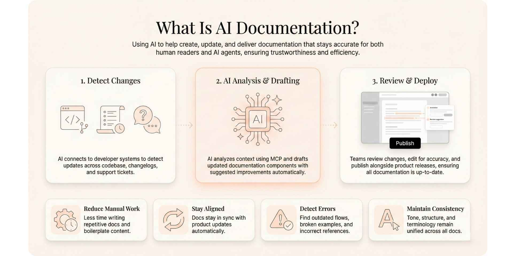
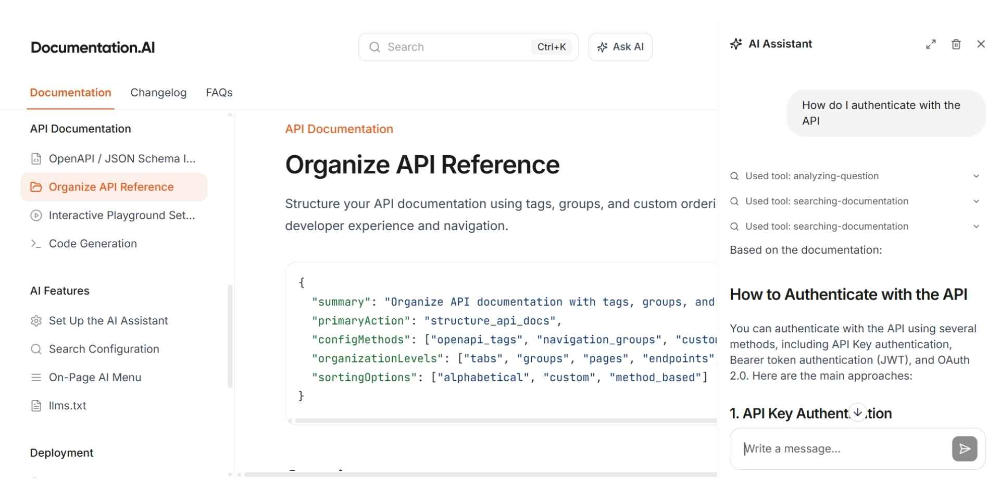
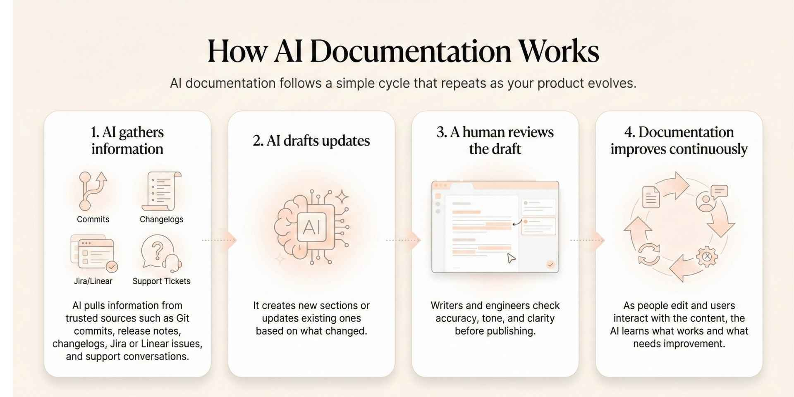
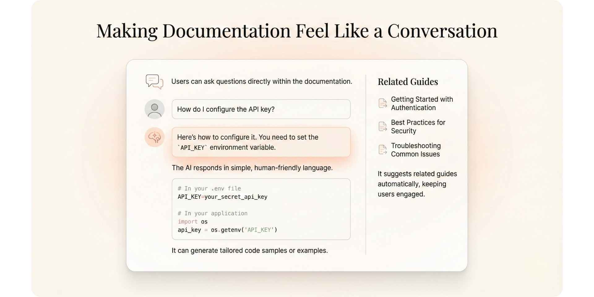
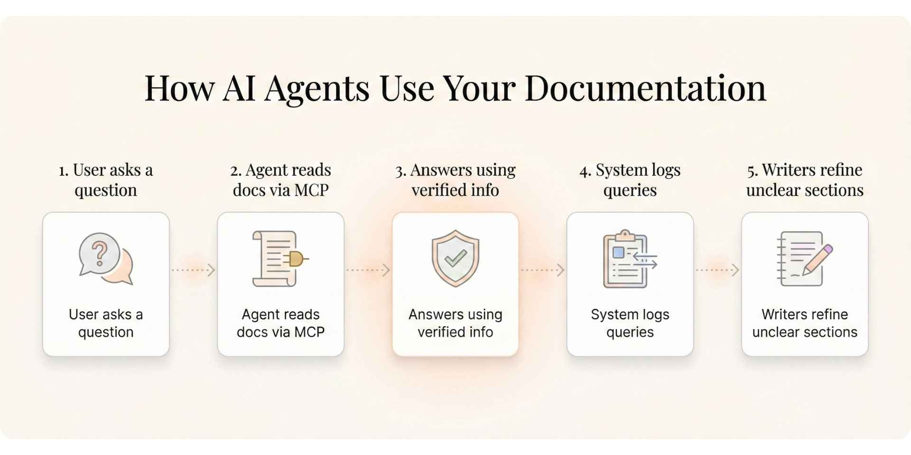
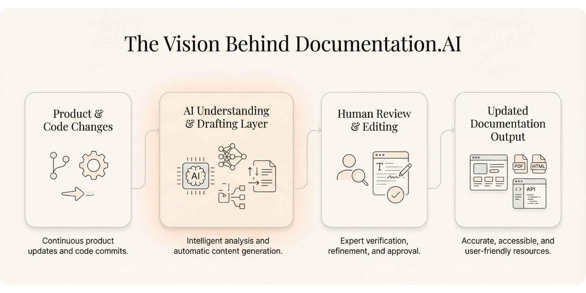

Product documentation has changed a lot in the last few years. It is no longer something teams write once and forget about. Today, documentation is part of the product itself. It guides users, helps developers, and even teaches AI agents how to interact with your tools.

That also means that if your documentation is outdated or confusing, AI systems like ChatGPT, Claude, Cursor, GitHub Copilot, or support agents can give incorrect answers with total confidence. This creates frustration for your customers and adds pressure on your support and engineering teams.

At the same time, products now change faster than most documentation teams can keep up with, thanks to AI. Features ship daily. APIs evolve. Workflows shift. This creates a constant gap between what your product can do and what your documentation says.

90 percent of product and engineering leaders say documentation influences purchasing decisions, yet over half struggle to keep it current with ongoing product changes. Around 60 percent of teams already use AI in their documentation workflows, mostly for light edits. Developers increasingly rely on AI tools to interpret documentation but do not fully trust their accuracy.

## TL;DR
- What it is: AI documentation uses AI to create, maintain, and deliver technical docs.
- Why it matters: docs stay current with every release, teams save time, and users get instant, accurate answers.
- How it works: AI drafts and updates content, answers questions in natural language, and makes docs machine-readable for AI agents.

## What Is AI Documentation?

AI documentation is the practice of using artificial intelligence to help create, update, and deliver documentation that stays accurate and useful. It benefits both human readers and the AI agents that depend on your documentation to answer questions, generate code, or support users.

AI documentation focuses on two core areas:

### 1. Helping teams keep documentation up to date

AI can connect directly to your codebase, your changelogs, your backlog, and your support tickets. When it detects a change in your product, it can draft updates or suggest improvements automatically.

This helps teams:
- Reduce the amount of manual documentation work
- Keep content aligned with the latest product changes
- Detect broken examples or outdated workflows
- Maintain consistency in tone and structure

If your documentation platform integrates with Git or supports the Model Context Protocol, AI coding agents can update your documentation alongside your code. If you use **Documentation.AI**, you also get prompts and an MCP server that help these agents understand your documentation components and structure.

### 2. Helping users understand and navigate documentation

AI does not only help authors. It also helps readers.

When documentation is well structured, AI assistants can read it and provide helpful answers in natural language. Users can ask questions such as:
- How do I authenticate with the API
- Show me an example in Python
- What changed in the latest version

AI can pull verified content from your live documentation instead of guessing. This creates a more interactive and reliable experience for your users. Platforms like Documentation AI are also recognized as the [**best API documentation tools in 2026**](https://documentation.ai/blog/api-documentation-tools).

## How Does AI Documentation Work?

AI documentation follows a simple cycle that repeats as your product evolves.

### Step 1: AI gathers information

AI pulls information from trusted sources such as:
- Git commits
- Release notes
- Changelogs
- Jira or Linear issues
- Support conversations

### Step 2: AI drafts updates

It creates new sections or updates existing ones based on what changed.

### Step 3: A human reviews the draft

Writers and engineers check accuracy, tone, and clarity before publishing.

### Step 4: Documentation improves continuously

As people edit and users interact with the content, the AI learns what works and what needs improvement.

Over time, documentation stays fresh without heavy manual work.

## Why Does AI Documentation Matter?

### 1. Your documentation stays accurate

The biggest pain point across SaaS and developer tools is outdated documentation. AI detects changes quickly and drafts updates that match the current product state. When paired with MCP, AI agents always refer to the latest version of your live documentation.

### 2. Teams save time and maintain consistency

When several teams contribute to documentation, tone and structure can shift. AI helps standardize formatting, terminology, and examples. This keeps documentation readable and professional.

### 3. Faster updates for every release

With AI, documentation can be updated on the same day a new feature ships. In some cases, it can be updated within the same hour.

Task |, Traditional Process |, With AI Documentation, API Reference Updates |, Two to three days |, Often within one hour, Release Notes |

| Task | Traditional Process | With AI Documentation |
| --- | --- | --- |
| API Reference Updates | Two to three days | Often within one hour |
| Release Notes | Written manually from scratch | Drafted from commit history |
| New Tutorials | Created after support issues appear | Generated immediately based on user patterns |

### 4. A better experience for developers and customers

Users no longer need to search through long pages to find what they need. AI assistants can answer questions, guide users through tasks, and provide examples quickly and accurately.

This reduces friction and significantly lowers support ticket volume.

## Real Use Cases from Everyday Product Workflows

### 1. Keeping documentation in sync with product updates

When an engineer adds something new to the product, such as an endpoint called `/v2/auth/login`, it can:
- Update the API reference
- Add usage examples
- Flag related sections that might be affected
- Prompt a reviewer to approve the change

This helps ensure that your documentation reflects the current product immediately.

### 2. Making documentation feel like a conversation

AI can make documentation more interactive. For example:
- Users can ask questions inside your documentation
- The AI can explain concepts in plain language
- It can generate code samples or examples tailored to the user
- It can surface related guides or tutorials

## How Do AI Agents Use Your Documentation?

When AI agents connect to your live documentation, this is what happens:
1. A user asks a question inside your app or documentation
2. The agent reads your live documentation through MCP
3. It pulls verified information instead of making guesses
4. The system logs the question
5. Writers can improve unclear or missing sections

This creates a helpful feedback loop that improves your documentation based on real user behavior.

## What Are the Risks and Guardrails for AI Documentation?

AI documentation still needs safeguards to remain trustworthy.

| Area | Problem Without Guardrails | Recommended Guardrail |
| --- | --- | --- |
| Accuracy | AI may update one part but miss related sections | Human review before publishing |
| Source Data | AI may use outdated or mixed sources | Connect AI only to verified systems |
| Workflow | AI may publish incorrect updates | Use an approval pipeline |
| Tone | Writing may lose clarity or personality | Apply your style guide consistently |

AI improves speed and coverage, and human reviewers protect quality.

## A Starter Workflow for Teams New to AI Documentation

If you are just starting, focus on building a simple, connected system.

1\. Connect documentation to trusted data sources: Examples include GitHub, Jira, Intercom, and other tools that can give AI the necessary context.

2\. Define clear update triggers: This can be after each merge, each release, or after repeated support questions.

3\. Build a human review pipeline: AI drafts. Humans approve. This keeps everything accurate and safe.

4\. Train AI on your tone and style: Provide writing samples and guidelines so generated content feels consistent.

5\. Add validation checks: Automated tests can catch broken links, outdated examples, or missing metadata.

6\. Make documentation AI-accessible: This includes good structure, headings, metadata, and optional MCP integration.

7\. Monitor the right metrics: This helps you understand how well the system works.

## Which Metrics Track AI Documentation Impact?

These metrics give a clear picture of how effectively AI supports your documentation workflow.

Metric |, What It Measures |, Why It Matters, Time to Publish |

| Metric | What It Measures | Why It Matters |
| --- | --- | --- |
| Time to Publish | How quickly documentation updates go live | Shows automation efficiency |
| Search Success Rate | How often users find correct answers | Reflects structure and clarity |
| Ticket Deflection | Reduction in support tickets | Indicates real-world value |
| Update Frequency | How often content is refreshed | Shows workflow health |
| AI Query Accuracy | How well AI assistants answer questions | Confirms machine readability |

## The Vision Behind Documentation.AI

Documentation.AI exists because teams need documentation that grows with their product, not something that constantly falls behind.

We help teams build documentation that is:
- Always up to date
- Easy for humans and AI systems to understand
- Accessible to both technical and non-technical contributors

If your team struggles to keep documentation aligned with your product, we encourage you to try [Documentation.AI](https://documentation.ai).

## References
1. [GitBook — State of Docs Report 2025](https://www.gitbook.com/blog/state-of-docs-report-2025)
2. [Stack Overflow — Developer Survey 2025](https://survey.stackoverflow.co/2025/ai)

## FAQs

**What is AI documentation?**\
AI documentation uses artificial intelligence to create, maintain, and deliver technical content, keeping docs accurate as products change and answering reader questions in plain language.

**How does AI documentation work?**\
AI helps writers draft and update content as products change and helps readers get answers through an in-doc assistant grounded in your published documentation.

**Is AI-generated documentation accurate?**\
It's as accurate as its source and guardrails. AI grounded in your published docs, with citations and human review, stays reliable; ungrounded or stale content causes errors.

**How is AI documentation different from traditional documentation?**\
Traditional docs are written and updated entirely by hand and drift out of date. AI documentation adds automation and answers, reducing manual upkeep and keeping content current.

**What are the benefits of AI documentation?**\
Docs stay current with every release, teams spend less time on manual updates, and readers get instant, cited answers instead of searching page by page.

**How do AI agents use your documentation?**\
AI agents read structured, machine-readable docs, often via an MCP server, to give tools like Cursor or Copilot safe, real-time access to accurate answers.

**What are the risks of AI documentation?**\
The main risks are inaccurate answers and stale sources. Manage them by grounding AI in current docs, citing sources, and keeping a human in the loop.

**How do you get started with AI documentation?**\
Get your docs into one structured, up-to-date source, add an AI assistant to answer questions, then track metrics like ticket deflection to measure impact. Start your[free demo](https://dashboard.documentation.ai/login?redirect_url=https%3A%2F%2Fdashboard.documentation.ai%2F) now.
